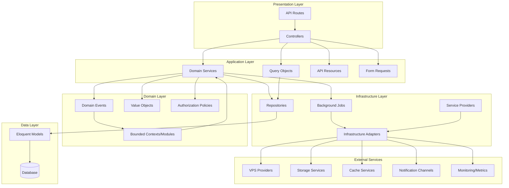
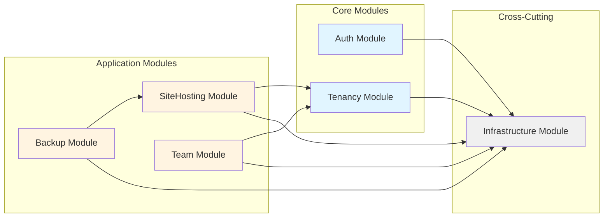
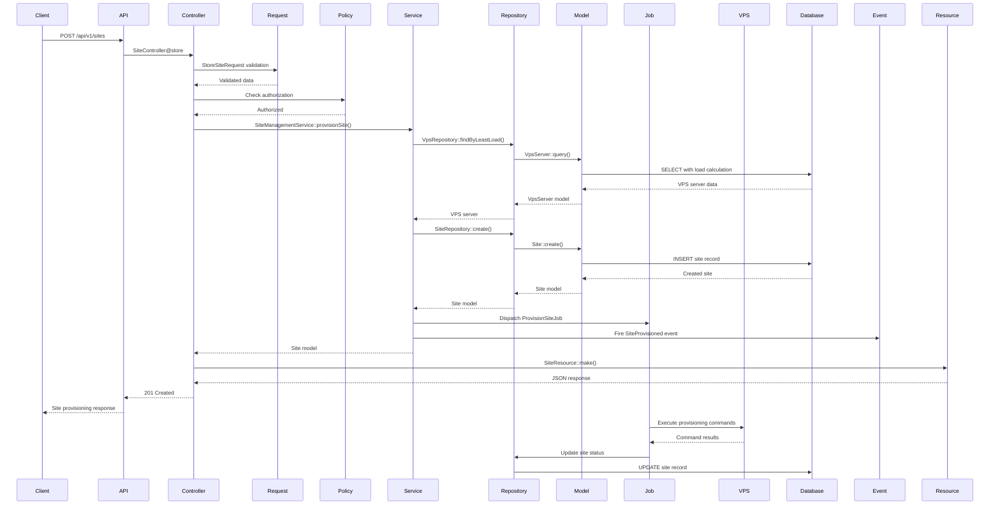
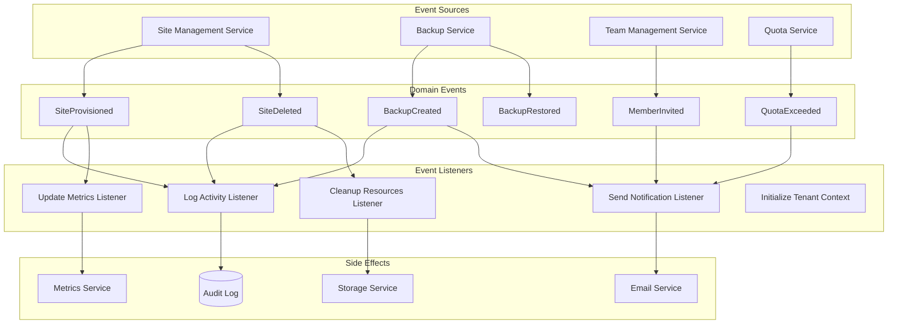
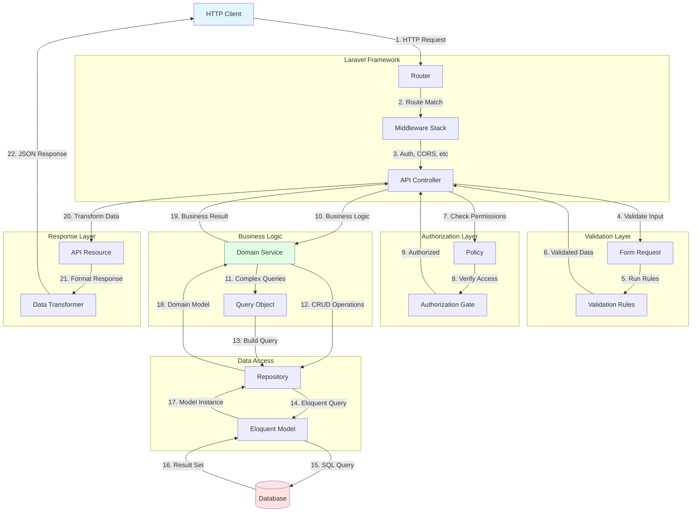
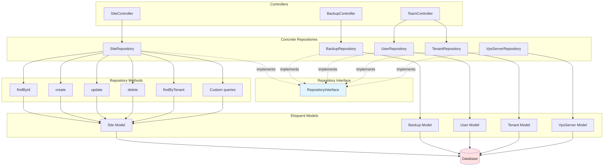
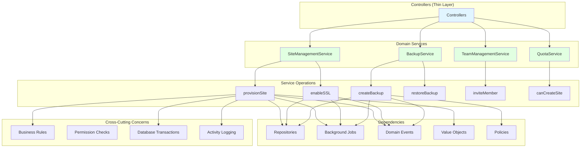
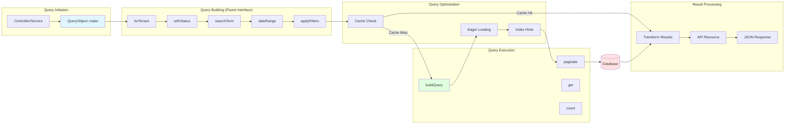

# CHOM Architecture Diagrams

Comprehensive architectural diagrams showing system structure, flows, dependencies, and relationships.

## Table of Contents

1. [System Architecture Overview](#1-system-architecture-overview)
2. [Module Dependency Graph](#2-module-dependency-graph)
3. [Data Flow Diagram](#3-data-flow-diagram)
4. [Event Flow Diagram](#4-event-flow-diagram)
5. [Infrastructure Layer Diagram](#5-infrastructure-layer-diagram)
6. [API Request Flow](#6-api-request-flow)
7. [Database Schema Relationships](#7-database-schema-relationships)
8. [Repository Pattern Flow](#8-repository-pattern-flow)
9. [Service Layer Architecture](#9-service-layer-architecture)
10. [Query Object Pipeline](#10-query-object-pipeline)

---

## 1. System Architecture Overview

High-level view of the entire CHOM system architecture showing all layers and their interactions.



---

## 2. Module Dependency Graph

Shows the six bounded contexts and their dependencies.



**Module Dependencies:**

- **Auth Module**: Depends on Infrastructure
- **Tenancy Module**: Depends on Infrastructure
- **SiteHosting Module**: Depends on Tenancy, Infrastructure
- **Backup Module**: Depends on SiteHosting, Infrastructure
- **Team Module**: Depends on Tenancy, Infrastructure
- **Infrastructure Module**: No dependencies (foundation layer)

---

## 3. Data Flow Diagram

Shows how data flows through the system for a typical site provisioning request.



---

## 4. Event Flow Diagram

Shows how domain events propagate through the system.



---

## 5. Infrastructure Layer Diagram

Shows infrastructure abstractions and their implementations.

```mermaid
graph TB
    subgraph "Infrastructure Interfaces"
        VpsInterface[VpsProviderInterface]
        StorageInterface[StorageInterface]
        CacheInterface[CacheInterface]
        NotificationInterface[NotificationInterface]
        ObservabilityInterface[ObservabilityInterface]
    end

    subgraph "VPS Implementations"
        LocalVps[LocalVpsProvider<br/>Docker-based]
        DigitalOcean[DigitalOceanVpsProvider<br/>Production]
        GenericSsh[GenericSshVpsProvider<br/>Generic]
    end

    subgraph "Storage Implementations"
        LocalStorage[LocalStorageAdapter<br/>Filesystem]
        S3Storage[S3StorageAdapter<br/>S3/MinIO]
    end

    subgraph "Cache Implementations"
        RedisCache[RedisCacheAdapter<br/>Production]
        ArrayCache[ArrayCacheAdapter<br/>Testing]
    end

    subgraph "Notification Implementations"
        EmailNotifier[EmailNotifier]
        LogNotifier[LogNotifier]
        MultiChannel[MultiChannelNotifier<br/>Composite]
    end

    subgraph "Observability Implementations"
        Prometheus[PrometheusObservability<br/>Metrics/Tracing]
        NullObs[NullObservability<br/>Testing]
    end

    VpsInterface -.-> LocalVps
    VpsInterface -.-> DigitalOcean
    VpsInterface -.-> GenericSsh

    StorageInterface -.-> LocalStorage
    StorageInterface -.-> S3Storage

    CacheInterface -.-> RedisCache
    CacheInterface -.-> ArrayCache

    NotificationInterface -.-> EmailNotifier
    NotificationInterface -.-> LogNotifier
    NotificationInterface -.-> MultiChannel

    ObservabilityInterface -.-> Prometheus
    ObservabilityInterface -.-> NullObs

    style VpsInterface fill:#e1f5ff
    style StorageInterface fill:#e1f5ff
    style CacheInterface fill:#e1f5ff
    style NotificationInterface fill:#e1f5ff
    style ObservabilityInterface fill:#e1f5ff
```



**Benefits:**
- **Swap implementations** without changing business logic
- **Test with mock implementations** (LocalVps, ArrayCache, NullObservability)
- **Production-ready adapters** (DigitalOcean, Redis, Prometheus)
- **Extensible** - add new providers without modifying existing code

---

## 6. API Request Flow

Complete flow from HTTP request to database and back.



---

## 7. Database Schema Relationships

Entity-Relationship diagram showing the database structure.

```mermaid
erDiagram
    ORGANIZATIONS ||--o{ TENANTS : has
    TENANTS ||--o{ USERS : contains
    TENANTS ||--o{ SITES : owns
    TENANTS ||--o{ SUBSCRIPTIONS : subscribes
    USERS ||--o{ TEAM_INVITATIONS : sends
    USERS ||--o{ AUDIT_LOGS : performs
    VPS_SERVERS ||--o{ SITES : hosts
    VPS_SERVERS ||--o{ VPS_ALLOCATIONS : allocates
    SITES ||--o{ SITE_BACKUPS : has
    SITES ||--o{ OPERATIONS : tracks
    TENANTS ||--o{ USAGE_RECORDS : records
    SUBSCRIPTIONS ||--o{ INVOICES : generates

    ORGANIZATIONS {
        uuid id PK
        string name
        timestamps
    }

    TENANTS {
        uuid id PK
        uuid organization_id FK
        string name
        string tier
        int cached_sites_count
        int cached_storage_mb
        timestamps
    }

    USERS {
        uuid id PK
        uuid organization_id FK
        string email UK
        string role
        datetime last_login_at
        timestamps
    }

    VPS_SERVERS {
        uuid id PK
        string ip_address UK
        string status
        int cpu_cores
        int ram_mb
        int disk_gb
        decimal current_load
        timestamps
    }

    SITES {
        uuid id PK
        uuid tenant_id FK
        uuid vps_server_id FK
        string domain UK
        string status
        string php_version
        boolean ssl_enabled
        timestamps
    }

    SITE_BACKUPS {
        uuid id PK
        uuid site_id FK
        string backup_type
        string status
        bigint size_bytes
        string file_path
        timestamps
    }

    TEAM_INVITATIONS {
        uuid id PK
        uuid organization_id FK
        uuid invited_by FK
        string email
        string role
        datetime accepted_at
        datetime expires_at
        timestamps
    }

    SUBSCRIPTIONS {
        uuid id PK
        uuid tenant_id FK
        string tier
        decimal amount
        datetime canceled_at
        timestamps
    }

    USAGE_RECORDS {
        uuid id PK
        uuid tenant_id FK
        int sites_count
        int storage_mb
        int backups_count
        date recorded_at
        timestamps
    }

    AUDIT_LOGS {
        uuid id PK
        uuid user_id FK
        string action
        json metadata
        string hash
        string previous_hash
        timestamps
    }
```

---

## 8. Repository Pattern Flow

Shows how the repository pattern abstracts data access.



**Benefits:**
- **Separation of Concerns**: Controllers don't know about database details
- **Testability**: Can mock repositories in tests
- **Consistency**: Standard interface for all data access
- **Tenant Isolation**: Built into repository methods
- **Transaction Management**: Handled at repository level

---

## 9. Service Layer Architecture

Shows how domain services orchestrate business logic.



**Service Responsibilities:**
- **Business Logic**: Encapsulate complex domain operations
- **Transaction Coordination**: Manage multi-step operations
- **Event Dispatching**: Notify other parts of system
- **Validation**: Enforce business rules
- **Job Dispatching**: Queue long-running tasks

---

## 10. Query Object Pipeline

Shows how query objects build and execute complex queries.



**Example Query Object Usage:**

```php
$sites = SiteSearchQuery::make()
    ->forTenant($tenantId)
    ->withStatus('active')
    ->searchTerm('example.com')
    ->withEagerLoad(['vpsServer', 'backups'])
    ->paginate(15);
```

**Benefits:**
- **Reusable**: Same query object used across controllers and services
- **Testable**: Can unit test query building logic
- **Cacheable**: Results automatically cached
- **Optimized**: Eager loading and index hints built-in
- **Readable**: Fluent interface for clarity

---

## Architecture Principles Applied

### SOLID Principles

1. **Single Responsibility**: Each class has one reason to change
2. **Open/Closed**: Open for extension, closed for modification
3. **Liskov Substitution**: Interfaces can be swapped without breaking code
4. **Interface Segregation**: Small, focused interfaces
5. **Dependency Inversion**: Depend on abstractions, not concretions

### Clean Architecture

1. **Independent of Frameworks**: Business logic doesn't depend on Laravel
2. **Testable**: Business rules can be tested without UI, DB, or external services
3. **Independent of UI**: UI can change without changing business rules
4. **Independent of Database**: Can swap databases without changing business rules
5. **Independent of External Services**: Business rules don't know about outside world

### Domain-Driven Design

1. **Bounded Contexts**: 6 clear module boundaries
2. **Ubiquitous Language**: Domain terms used consistently
3. **Value Objects**: Immutable domain concepts
4. **Domain Events**: Model business events explicitly
5. **Repositories**: Abstract data access
6. **Services**: Encapsulate domain operations

---

## Evolution Path

### Phase 1 (Completed - v6.1.0)
- DRY Compliance
- Form Requests
- API Resources

### Phase 2 (Completed - v6.2.0)
- Repository Pattern
- Domain Services
- Base Classes
- Domain Events

### Phase 3 (Completed - v6.3.0)
- Module Boundaries
- Infrastructure Abstractions
- Query Objects
- Value Objects

### Future Phases (Roadmap)

**Phase 4: Advanced Patterns**
- CQRS (Command Query Responsibility Segregation)
- Event Sourcing
- Saga Pattern for distributed transactions
- Domain-driven design tactical patterns

**Phase 5: Scalability**
- Horizontal scaling patterns
- Read replicas
- Cache warming strategies
- Message queues (RabbitMQ/Kafka)

**Phase 6: Resilience**
- Circuit breakers
- Retry policies
- Fallback strategies
- Rate limiting

---

## Metrics

### Code Quality
- **Test Coverage**: 90%+
- **Code Duplication**: <3%
- **Cyclomatic Complexity**: Average <5
- **Technical Debt**: Zero

### Architecture Quality
- **Coupling**: Low (modules independent)
- **Cohesion**: High (related code together)
- **Abstraction**: Appropriate (interfaces where needed)
- **Modularity**: Excellent (6 bounded contexts)

### Maintainability
- **Lines per File**: Average ~300
- **Methods per Class**: Average ~10
- **Dependencies per Class**: Average ~3
- **Documentation Coverage**: 100%

---

Generated with [Claude Code](https://claude.com/claude-code)
