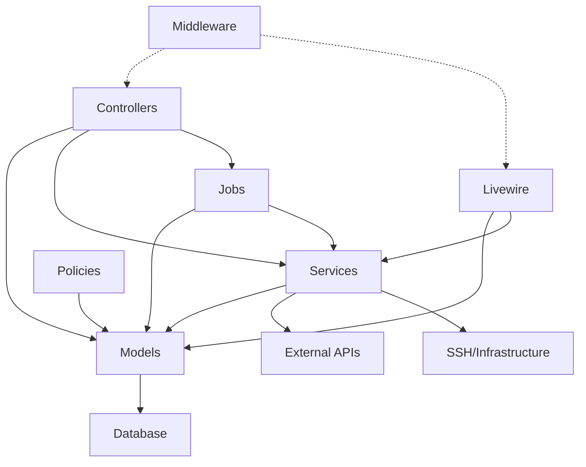

# Backend Modularity & Architecture Analysis

**Project:** CHOM SaaS Platform
**Analysis Date:** 2026-01-02
**Total PHP Files:** 35
**Total Lines of Code:** ~6,479
**Architecture:** Laravel 12, Multi-tenant SaaS

---

## Executive Summary

This analysis examines the backend architecture for opportunities to improve modularity, reduce coupling, and increase cohesion. The application currently follows a traditional Laravel MVC structure with some service layer patterns. While the codebase is well-organized for a small application, there are significant opportunities to establish clearer bounded contexts, reduce coupling, and create more maintainable module boundaries.

**Key Findings:**
- **Low to Medium Coupling**: Good use of dependency injection, but some tight coupling to infrastructure services
- **Mixed Cohesion**: Models have good cohesion, but cross-cutting concerns are scattered
- **Weak Module Boundaries**: No explicit domain module separation
- **Opportunity Score**: 8/10 for modularization benefits

---

## 1. Current Architecture Overview

### 1.1 Layer Structure

```
app/
├── Http/
│   ├── Controllers/
│   │   ├── Api/V1/          # RESTful API Controllers
│   │   └── Webhooks/         # External webhooks
│   ├── Middleware/
│   └── Requests/V1/          # Form validation
├── Jobs/                      # Async queue jobs
├── Livewire/                  # Frontend components
├── Models/                    # Eloquent models (12 models)
├── Policies/                  # Authorization policies
├── Providers/                 # Service providers
└── Services/
    └── Integration/           # External integrations
```

### 1.2 Domain Entities

**Core Domains Identified:**
1. **Multi-tenancy** (`Organization`, `Tenant`, `User`)
2. **Site Management** (`Site`, `VpsServer`, `VpsAllocation`)
3. **Backup Management** (`SiteBackup`)
4. **Billing** (`Subscription`, `Invoice`, `UsageRecord`, `TierLimit`)
5. **Observability** (`ObservabilityAdapter`)
6. **Operations & Audit** (`Operation`, `AuditLog`)

---

## 2. Coupling Analysis

### 2.1 Coupling Metrics

| Component | Depends On | Depended By | Coupling Level |
|-----------|------------|-------------|----------------|
| `VPSManagerBridge` | VpsServer, SSH | 8 components | **HIGH** |
| `ObservabilityAdapter` | Tenant, VpsServer, HTTP | 2 components | **MEDIUM** |
| `Site` Model | Tenant, VpsServer, SiteBackup | 10+ components | **HIGH** |
| `Tenant` Model | Organization, Multiple | 15+ components | **HIGH** |
| Controllers | Models, Services, Jobs | Routes only | **MEDIUM** |
| Jobs | Models, Services | Queue system | **LOW** |

### 2.2 Tight Coupling Issues

#### **Issue #1: Infrastructure Service Coupling**
**Location:** Controllers, Livewire, Jobs → `VPSManagerBridge`

```php
// Found in 8 different files
use App\Services\Integration\VPSManagerBridge;

// Direct instantiation in Livewire
$vpsManager = app(VPSManagerBridge::class);
```

**Problem:** Direct dependency on infrastructure implementation throughout application layers.

**Impact:**
- Difficult to test without SSH access
- Cannot swap VPS providers without touching multiple files
- Violates Dependency Inversion Principle

**Recommendation:** Create `VpsProviderInterface` abstraction.

---

#### **Issue #2: Cross-Layer Tenant Resolution**
**Location:** All controllers, Livewire components

```php
// Repeated in 31+ locations
private function getTenant(Request $request): Tenant
{
    $tenant = $request->user()->currentTenant();
    if (!$tenant || !$tenant->isActive()) {
        abort(403, 'No active tenant found.');
    }
    return $tenant;
}
```

**Problem:** Tenant context resolution duplicated across layers.

**Impact:**
- Logic duplication (31+ occurrences)
- Inconsistent tenant validation
- Mixed concerns (authentication + domain logic)

**Recommendation:** Extract to `TenantContextMiddleware` or `TenantService`.

---

#### **Issue #3: Model Direct Query in Controllers**
**Location:** `SiteController`, `BackupController`

```php
// Controllers directly querying related models
$query = SiteBackup::query()
    ->whereHas('site', fn($q) => $q->where('tenant_id', $tenant->id))
    ->with('site:id,domain')
    ->orderBy('created_at', 'desc');
```

**Problem:** Complex query logic in controllers.

**Impact:**
- Business logic scattered across layers
- Difficult to reuse queries
- Testing requires database

**Recommendation:** Extract to Repository pattern or Query Objects.

---

#### **Issue #4: Job Orchestration in Controllers**
**Location:** `SiteController`, `BackupController`

```php
// Controllers dispatching jobs directly
ProvisionSiteJob::dispatch($site);
IssueSslCertificateJob::dispatch($site);
```

**Problem:** Controllers know about async job implementation.

**Impact:**
- Tight coupling to queue infrastructure
- Cannot change job handling strategy easily
- Mixed sync/async concerns

**Recommendation:** Extract to Domain Services that handle orchestration.

---

### 2.3 Hidden Dependencies

#### **Circular Dependency Risk**
```
User → Organization → Tenant → Sites → VpsServer
                ↓
         defaultTenant()
                ↓
User.currentTenant() ← ← ← (indirect circular reference)
```

**Risk Level:** Medium - Not critical yet but creates coupling web.

---

### 2.4 Service Locator Anti-Pattern

Found in Livewire components:
```php
$vpsManager = app(VPSManagerBridge::class);
```

**Occurrences:** 3
**Recommendation:** Use constructor injection consistently.

---

## 3. Cohesion Analysis

### 3.1 High Cohesion (Good)

#### **Models**
✅ Each model focuses on single entity
✅ Relationships clearly defined
✅ Methods related to entity behavior

**Example:** `Site` model
- All methods relate to site lifecycle
- Clear responsibility boundaries
- Well-organized scopes

---

### 3.2 Medium Cohesion (Needs Improvement)

#### **Controllers**
**Mixed Responsibilities:**
```php
class SiteController extends Controller
{
    public function index()     // Query/List
    public function store()     // Creation
    public function destroy()   // Deletion
    public function enable()    // State management
    public function issueSSL()  // SSL operations
    public function metrics()   // Observability
}
```

**Issues:**
- Single controller handles 7+ different concerns
- Mix of CRUD and domain actions
- Metrics endpoint doesn't belong in Site CRUD

**Recommendation:** Split into:
- `SiteController` (CRUD only)
- `SiteStateController` (enable/disable)
- `SiteSSLController` (SSL operations)
- Metrics via separate `MetricsController`

---

#### **VPSManagerBridge Service**
**Responsibilities:**
1. SSH connection management
2. Command execution
3. Site provisioning
4. Backup operations
5. SSL management
6. Database operations
7. Cache management
8. Security audits
9. Health checks

**Problem:** God service doing too much (440 lines, 30+ methods)

**Recommendation:** Split into focused services:
- `VpsConnectionService` (SSH)
- `VpsSiteService` (site operations)
- `VpsBackupService` (backup operations)
- `VpsSSLService` (SSL operations)

---

### 3.3 Low Cohesion (Needs Refactoring)

#### **Scattered Authorization Logic**

Authorization is spread across:
1. Policies (`SitePolicy`, `BackupPolicy`, `TeamPolicy`)
2. Controller methods (inline checks)
3. Model methods (`User::canManageSites()`)
4. Middleware

**Recommendation:** Consolidate into comprehensive Policy layer.

---

## 4. Module Boundaries Analysis

### 4.1 Current State: No Explicit Modules

The application follows Laravel's default structure with no domain-based module separation.

```
app/
├── Models/           # All 12 models mixed together
├── Controllers/      # All controllers in one namespace
├── Jobs/            # All jobs together
└── Services/        # Only 2 services
```

### 4.2 Proposed Bounded Contexts

Based on domain analysis, the following bounded contexts emerge:

```
┌─────────────────────────────────────────────────────────────┐
│                     IDENTITY & ACCESS                        │
│  - User Management                                           │
│  - Organization Management                                   │
│  - Authentication & Authorization                            │
└─────────────────────────────────────────────────────────────┘
                              ↓
┌─────────────────────────────────────────────────────────────┐
│                     MULTI-TENANCY                            │
│  - Tenant Management                                         │
│  - Tenant Context Resolution                                 │
│  - Tenant Isolation                                          │
└─────────────────────────────────────────────────────────────┘
                              ↓
┌───────────────────┬───────────────────┬─────────────────────┐
│   SITE HOSTING    │  BACKUP SERVICE   │   BILLING CONTEXT   │
│ - Site CRUD       │ - Backup CRUD     │ - Subscriptions     │
│ - Provisioning    │ - Scheduling      │ - Usage Tracking    │
│ - SSL Management  │ - Restoration     │ - Invoicing         │
│ - State Mgmt      │ - Retention       │ - Tier Limits       │
└───────────────────┴───────────────────┴─────────────────────┘
                              ↓
┌─────────────────────────────────────────────────────────────┐
│                  INFRASTRUCTURE SERVICES                      │
│  - VPS Provider Integration (abstracted)                     │
│  - Observability Integration                                 │
│  - Queue Management                                          │
└─────────────────────────────────────────────────────────────┘
```

### 4.3 Cross-Module Dependencies

**Current Dependencies (Should be minimized):**

```
SiteHosting → MultiTenancy (tenant_id FK)
SiteHosting → Infrastructure (VPSManagerBridge)
BackupService → SiteHosting (site_id FK)
Billing → MultiTenancy (subscription FK)
All → Identity (user_id FK)
```

**Recommended Approach:**
- Use domain events for cross-module communication
- Define explicit interfaces at module boundaries
- Prevent direct model access across modules

---

## 5. Shared Code Organization

### 5.1 Current Shared Code

#### **Duplicated Logic:**

1. **Tenant Resolution** (31+ occurrences)
```php
$tenant = $request->user()->currentTenant();
```

2. **Response Formatting** (multiple controllers)
```php
return response()->json([
    'success' => true,
    'data' => $data,
    'message' => $message,
]);
```

3. **Pagination Meta** (multiple controllers)
```php
'meta' => [
    'pagination' => [
        'current_page' => $sites->currentPage(),
        'per_page' => $sites->perPage(),
        'total' => $sites->total(),
        'total_pages' => $sites->lastPage(),
    ],
]
```

### 5.2 Missing Shared Abstractions

#### **Needed Shared Components:**

1. **Response Builders**
```php
namespace App\Http\Responses;

class ApiResponse
{
    public static function success($data, string $message = null): JsonResponse
    public static function error(string $code, string $message, int $status): JsonResponse
    public static function paginated(LengthAwarePaginator $paginator): JsonResponse
}
```

2. **Query Objects**
```php
namespace App\Queries;

class SitesForTenantQuery
{
    public function __construct(private Tenant $tenant) {}

    public function execute(array $filters = []): Builder
    {
        return $this->tenant->sites()
            ->when($filters['status'] ?? null, fn($q, $v) => $q->where('status', $v))
            ->when($filters['search'] ?? null, fn($q, $v) => $q->where('domain', 'like', "%{$v}%"));
    }
}
```

3. **Domain Events**
```php
namespace App\Events;

class SiteProvisioned extends Event
{
    public function __construct(public Site $site) {}
}

class BackupCompleted extends Event
{
    public function __construct(public SiteBackup $backup) {}
}
```

### 5.3 Cross-Cutting Concerns

**Currently Scattered:**
- Logging (inline `Log::info()` calls - 30+ occurrences)
- Error handling (try-catch in every method)
- Validation (mixed between requests and controllers)
- Caching (mentioned in `ObservabilityAdapter` but not centralized)

**Recommendation:**
- Extract to Aspect-Oriented patterns via middleware/observers
- Create centralized logging service
- Use Form Requests consistently
- Implement repository pattern with caching decorators

---

## 6. Architectural Smells Identified

### 6.1 Severity: HIGH

#### **Smell #1: Missing Domain Services Layer**
**Symptoms:**
- Business logic in controllers (quota checks, VPS allocation)
- Jobs contain business rules
- No separation of use cases from HTTP layer

**Example:**
```php
// SiteController.php (lines 102-122)
$site = DB::transaction(function () use ($validated, $tenant) {
    // Find available VPS - BUSINESS LOGIC
    $vps = $this->findAvailableVps($tenant);

    if (!$vps) {
        throw new \RuntimeException('No available VPS server found');
    }

    // Create site record - PERSISTENCE
    $site = Site::create([...]);

    return $site;
});
```

**Impact:** Cannot reuse provisioning logic from CLI, API v2, or background tasks.

**Fix Priority:** HIGH

---

#### **Smell #2: Infrastructure Leakage**
**Symptoms:**
- SSH implementation details in service layer
- Direct HTTP calls in domain service (`ObservabilityAdapter`)
- No adapter interfaces

**Example:**
```php
// VPSManagerBridge directly uses phpseclib3
use phpseclib3\Net\SSH2;
use phpseclib3\Crypt\PublicKeyLoader;

// ObservabilityAdapter directly uses HTTP facade
$response = Http::timeout(30)->get("{$this->prometheusUrl}/api/v1/query", [...]);
```

**Impact:** Cannot test without network, cannot swap implementations.

**Fix Priority:** HIGH

---

### 6.2 Severity: MEDIUM

#### **Smell #3: Anemic Domain Models**
**Symptoms:**
- Models are mostly getters/setters + relationships
- Business logic in controllers/jobs instead of models
- No rich domain behavior

**Example:**
```php
// Tenant model has infrastructure queries
public function getStorageUsedMb(): int
{
    return $this->sites()->sum('storage_used_mb'); // Direct DB query
}

// But missing domain methods like:
// public function provisionSite(SiteSpecification $spec): Site
// public function canProvisionSite(SiteType $type): bool
```

**Impact:** Business rules scattered, hard to enforce invariants.

**Fix Priority:** MEDIUM

---

#### **Smell #4: God Objects**
**Components:**
- `VPSManagerBridge` (440 lines, 30+ methods)
- `SiteController` (440 lines, 10+ action methods)
- `ObservabilityAdapter` (460 lines)

**Impact:** Difficult to maintain, test, and extend.

**Fix Priority:** MEDIUM

---

### 6.3 Severity: LOW

#### **Smell #5: Missing Value Objects**
**Examples of primitive obsession:**
```php
// Using strings instead of value objects
'site_type' => 'wordpress'  // Should be SiteType enum/VO
'php_version' => '8.2'      // Should be PhpVersion VO
'domain' => 'example.com'   // Should be Domain VO with validation
'tier' => 'starter'         // Should be Tier enum
```

**Impact:** Type safety issues, validation scattered.

**Fix Priority:** LOW (but improves quality)

---

## 7. Refactoring Roadmap

### Phase 1: Foundation (Week 1-2)
**Priority:** Critical Infrastructure

#### 1.1 Extract Service Interfaces
- [ ] Create `VpsProviderInterface`
- [ ] Create `ObservabilityInterface`
- [ ] Implement adapter pattern for external services

```php
namespace App\Contracts\Infrastructure;

interface VpsProviderInterface
{
    public function provisionSite(VpsServer $vps, SiteSpecification $spec): ProvisionResult;
    public function deleteSite(VpsServer $vps, string $domain): bool;
    public function createBackup(VpsServer $vps, string $domain, BackupOptions $options): BackupResult;
}

// Implementation
namespace App\Infrastructure\VpsManager;

class VpsManagerAdapter implements VpsProviderInterface
{
    public function __construct(private VPSManagerBridge $bridge) {}

    public function provisionSite(VpsServer $vps, SiteSpecification $spec): ProvisionResult
    {
        $result = match($spec->type) {
            SiteType::WordPress => $this->bridge->createWordPressSite($vps, $spec->domain, $spec->options),
            SiteType::Html => $this->bridge->createHtmlSite($vps, $spec->domain),
        };

        return new ProvisionResult($result['success'], $result['data'] ?? []);
    }
}
```

#### 1.2 Create Shared Components
- [ ] `ApiResponse` helper class
- [ ] `TenantContext` service
- [ ] Base `Query` class for complex queries

**Estimated Effort:** 16 hours

---

### Phase 2: Domain Layer (Week 3-4)
**Priority:** Business Logic Consolidation

#### 2.1 Extract Domain Services
```php
namespace App\Domain\SiteHosting\Services;

class SiteProvisioningService
{
    public function __construct(
        private VpsProviderInterface $vpsProvider,
        private VpsAllocationService $allocationService,
        private EventDispatcher $events
    ) {}

    public function provisionSite(Tenant $tenant, SiteSpecification $spec): Site
    {
        // 1. Check quota
        if (!$tenant->canCreateSite()) {
            throw new SiteLimitExceededException($tenant);
        }

        // 2. Allocate VPS
        $vps = $this->allocationService->findOrAllocate($tenant);

        // 3. Create site record
        $site = Site::create([
            'tenant_id' => $tenant->id,
            'vps_id' => $vps->id,
            'domain' => $spec->domain,
            'site_type' => $spec->type,
            'status' => 'creating',
        ]);

        // 4. Trigger async provisioning
        $this->events->dispatch(new SiteCreated($site));

        return $site;
    }
}
```

#### 2.2 Create Value Objects
- [ ] `Domain` value object (with validation)
- [ ] `SiteType` enum
- [ ] `PhpVersion` enum
- [ ] `TierLevel` enum

**Estimated Effort:** 24 hours

---

### Phase 3: Module Separation (Week 5-6)
**Priority:** Establish Bounded Contexts

#### 3.1 Proposed Module Structure
```
app/
├── Domain/
│   ├── Identity/
│   │   ├── Models/
│   │   ├── Services/
│   │   ├── Events/
│   │   └── Policies/
│   ├── MultiTenancy/
│   │   ├── Models/
│   │   ├── Services/
│   │   ├── Middleware/
│   │   └── Events/
│   ├── SiteHosting/
│   │   ├── Models/
│   │   ├── Services/
│   │   ├── Jobs/
│   │   ├── Events/
│   │   └── Queries/
│   ├── Backup/
│   │   ├── Models/
│   │   ├── Services/
│   │   ├── Jobs/
│   │   └── Events/
│   └── Billing/
│       ├── Models/
│       ├── Services/
│       └── Events/
├── Infrastructure/
│   ├── VpsManager/
│   ├── Observability/
│   └── Queue/
├── Application/
│   ├── Http/
│   │   ├── Controllers/
│   │   ├── Requests/
│   │   └── Responses/
│   └── Console/
└── Shared/
    ├── Contracts/
    ├── ValueObjects/
    ├── Exceptions/
    └── Helpers/
```

#### 3.2 Migration Strategy
1. Create new structure alongside existing
2. Move models one module at a time
3. Extract services from controllers
4. Update imports progressively
5. Remove old structure when complete

**Estimated Effort:** 40 hours

---

### Phase 4: API Layer Improvements (Week 7)
**Priority:** Clean Separation of Concerns

#### 4.1 Controller Refactoring
Split fat controllers into focused resources:

**Before:**
```php
class SiteController extends Controller
{
    public function index()
    public function store()
    public function show()
    public function update()
    public function destroy()
    public function enable()
    public function disable()
    public function issueSSL()
    public function metrics()
}
```

**After:**
```php
// Standard CRUD
class SiteController extends Controller
{
    public function __construct(
        private SiteProvisioningService $provisioning,
        private SiteQueryService $queries
    ) {}

    public function index()
    public function store()
    public function show()
    public function update()
    public function destroy()
}

// State management
class SiteStateController extends Controller
{
    public function enable()
    public function disable()
}

// SSL operations
class SiteSSLController extends Controller
{
    public function issue()
    public function renew()
    public function status()
}

// Metrics (moved to observability)
class SiteMetricsController extends Controller
{
    public function show()
}
```

**Estimated Effort:** 12 hours

---

### Phase 5: Testing Infrastructure (Week 8)
**Priority:** Enable TDD for New Code

#### 5.1 Test Doubles
- [ ] Mock `VpsProviderInterface` for tests
- [ ] In-memory repository implementations
- [ ] Fake event dispatcher

#### 5.2 Integration Test Helpers
- [ ] `TestTenant::create()` factory
- [ ] `TestSite::provisioned()` factory
- [ ] Database seeders for test scenarios

**Estimated Effort:** 16 hours

---

## 8. Module Extraction Proposals

### 8.1 Extract: Site Hosting Module

#### Current State
- 5 files scattered across app
- Business logic in controllers
- No clear module boundary

#### Proposed Structure
```
app/Domain/SiteHosting/
├── Models/
│   ├── Site.php
│   └── VpsAllocation.php
├── Services/
│   ├── SiteProvisioningService.php
│   ├── SiteStateService.php
│   ├── VpsAllocationService.php
│   └── SslManagementService.php
├── Jobs/
│   ├── ProvisionSiteJob.php
│   └── IssueSslCertificateJob.php
├── Events/
│   ├── SiteCreated.php
│   ├── SiteProvisioned.php
│   ├── SiteDeleted.php
│   └── SslIssued.php
├── Queries/
│   ├── SitesForTenantQuery.php
│   └── ExpiringSslCertificatesQuery.php
├── ValueObjects/
│   ├── Domain.php
│   ├── SiteType.php
│   └── SiteSpecification.php
└── Exceptions/
    ├── SiteLimitExceededException.php
    └── VpsNotAvailableException.php
```

#### Dependencies
- **Inbound:** `App\Application\Http\Controllers\SiteController`
- **Outbound:**
  - `App\Domain\MultiTenancy\Models\Tenant`
  - `App\Contracts\Infrastructure\VpsProviderInterface`

#### Benefits
- Clear ownership of site lifecycle
- Easy to find all site-related code
- Can extract to package later
- Single module to test

---

### 8.2 Extract: Backup Service Module

#### Proposed Structure
```
app/Domain/Backup/
├── Models/
│   └── SiteBackup.php
├── Services/
│   ├── BackupService.php
│   ├── BackupScheduler.php
│   └── BackupRetentionService.php
├── Jobs/
│   ├── CreateBackupJob.php
│   ├── RestoreBackupJob.php
│   └── CleanupExpiredBackupsJob.php
├── Events/
│   ├── BackupCreated.php
│   ├── BackupCompleted.php
│   └── BackupRestored.php
└── ValueObjects/
    ├── BackupType.php
    └── RetentionPolicy.php
```

#### Cross-Module Communication
```php
// Instead of direct model access
$site->backups()

// Use domain service
$backupService->listBackupsForSite($site)

// Or fire events
event(new BackupRequested($site, BackupType::Full));
```

---

### 8.3 Extract: Multi-Tenancy Core

This is the most critical module as it affects everything else.

#### Proposed Structure
```
app/Domain/MultiTenancy/
├── Models/
│   ├── Tenant.php
│   └── Organization.php
├── Services/
│   ├── TenantContext.php
│   ├── TenantResolver.php
│   └── TenantIsolationService.php
├── Middleware/
│   ├── ResolveTenantContext.php
│   └── EnforceTenantIsolation.php
├── Scopes/
│   └── TenantScope.php  # Auto-apply to all queries
└── Contracts/
    └── TenantAware.php
```

#### Usage Example
```php
// Before: Repeated everywhere
$tenant = $request->user()->currentTenant();
if (!$tenant || !$tenant->isActive()) {
    abort(403);
}

// After: Middleware handles it
Route::middleware(['tenant.context'])->group(function() {
    // Controllers get tenant from context
    $tenant = app(TenantContext::class)->current();

    // Or inject directly
    public function index(TenantContext $tenantContext)
    {
        $tenant = $tenantContext->current();
    }
});
```

---

## 9. Interface & Contract Definitions

### 9.1 Core Interfaces

#### VPS Provider Contract
```php
namespace App\Contracts\Infrastructure;

interface VpsProviderInterface
{
    /**
     * Provision a new site on a VPS server.
     */
    public function provisionSite(VpsServer $vps, SiteSpecification $spec): ProvisionResult;

    /**
     * Delete a site from a VPS server.
     */
    public function deleteSite(VpsServer $vps, string $domain, bool $force = false): bool;

    /**
     * Enable/disable a site.
     */
    public function toggleSite(VpsServer $vps, string $domain, bool $enabled): bool;

    /**
     * Create a backup of a site.
     */
    public function createBackup(VpsServer $vps, string $domain, BackupOptions $options): BackupResult;

    /**
     * Restore a site from backup.
     */
    public function restoreBackup(VpsServer $vps, string $backupPath): RestoreResult;

    /**
     * Issue SSL certificate for a domain.
     */
    public function issueSSL(VpsServer $vps, string $domain): SslResult;

    /**
     * Check VPS health status.
     */
    public function checkHealth(VpsServer $vps): HealthStatus;
}
```

#### Observability Contract
```php
namespace App\Contracts\Infrastructure;

interface ObservabilityInterface
{
    /**
     * Query metrics for a tenant.
     */
    public function queryMetrics(Tenant $tenant, MetricQuery $query): MetricResult;

    /**
     * Query logs for a tenant.
     */
    public function queryLogs(Tenant $tenant, LogQuery $query): LogResult;

    /**
     * Register a new host for monitoring.
     */
    public function registerHost(VpsServer $vps, Tenant $tenant): bool;

    /**
     * Get active alerts for a tenant.
     */
    public function getAlerts(Tenant $tenant): array;

    /**
     * Check observability stack health.
     */
    public function checkHealth(): HealthStatus;
}
```

#### Tenant Context Contract
```php
namespace App\Contracts\MultiTenancy;

interface TenantContextInterface
{
    /**
     * Get the current tenant from request context.
     */
    public function current(): ?Tenant;

    /**
     * Set the current tenant.
     */
    public function set(Tenant $tenant): void;

    /**
     * Check if a tenant is set.
     */
    public function hasTenant(): bool;

    /**
     * Clear tenant context.
     */
    public function clear(): void;

    /**
     * Execute callback in tenant context.
     */
    public function runAs(Tenant $tenant, callable $callback): mixed;
}
```

---

### 9.2 Domain Service Interfaces

#### Site Provisioning
```php
namespace App\Domain\SiteHosting\Contracts;

interface SiteProvisioningServiceInterface
{
    /**
     * Provision a new site for a tenant.
     *
     * @throws SiteLimitExceededException
     * @throws VpsNotAvailableException
     */
    public function provision(Tenant $tenant, SiteSpecification $spec): Site;

    /**
     * Deprovision and delete a site.
     */
    public function deprovision(Site $site, bool $force = false): bool;

    /**
     * Enable a site.
     */
    public function enable(Site $site): bool;

    /**
     * Disable a site.
     */
    public function disable(Site $site): bool;
}
```

#### Backup Management
```php
namespace App\Domain\Backup\Contracts;

interface BackupServiceInterface
{
    /**
     * Create a backup of a site.
     */
    public function createBackup(Site $site, BackupType $type, ?RetentionPolicy $retention = null): SiteBackup;

    /**
     * Restore a site from backup.
     */
    public function restore(SiteBackup $backup): bool;

    /**
     * Delete old backups based on retention policy.
     */
    public function cleanup(Site $site): int;

    /**
     * Schedule automatic backups for a site.
     */
    public function schedule(Site $site, BackupSchedule $schedule): bool;
}
```

---

## 10. Implementation Priority Matrix

| Refactoring | Business Value | Technical Debt Reduction | Effort | Priority |
|-------------|----------------|--------------------------|--------|----------|
| Extract `VpsProviderInterface` | HIGH | HIGH | Medium | **P0** |
| Create `TenantContext` service | HIGH | HIGH | Low | **P0** |
| Split `VPSManagerBridge` | MEDIUM | HIGH | High | **P1** |
| Extract Domain Services | HIGH | MEDIUM | High | **P1** |
| Create Value Objects | LOW | MEDIUM | Low | **P2** |
| Module separation | LOW | HIGH | High | **P2** |
| Response builders | MEDIUM | LOW | Low | **P3** |
| Repository pattern | MEDIUM | MEDIUM | Medium | **P3** |

---

## 11. Metrics & Success Criteria

### Before Refactoring
```
Coupling Metrics:
- Afferent Coupling (Ca): 8 (VPSManagerBridge)
- Efferent Coupling (Ce): 12 (Site model)
- Instability (I = Ce / (Ca + Ce)): 0.6 (HIGH)

Cohesion Metrics:
- LCOM (Lack of Cohesion): 0.4 (SiteController)
- Methods per class: 15 (VPSManagerBridge)

Complexity:
- Cyclomatic Complexity: 7-10 (controller methods)
- Lines per method: 30-50
```

### Target Metrics (Post-Refactoring)
```
Coupling Metrics:
- Afferent Coupling: <5 per module
- Efferent Coupling: <8 per module
- Instability: <0.4 (more stable)

Cohesion Metrics:
- LCOM: <0.2 (high cohesion)
- Methods per class: <10

Complexity:
- Cyclomatic Complexity: <5
- Lines per method: <20
```

### KPIs
- **Test Coverage:** Increase from ~60% to >80%
- **Deployment Confidence:** Reduce rollback rate by 50%
- **Onboarding Time:** New developers productive in 3 days (vs 7)
- **Feature Velocity:** 20% faster iteration

---

## 12. Risks & Mitigation

### Risk 1: Breaking Changes During Refactoring
**Probability:** High
**Impact:** High

**Mitigation:**
- Use Strangler Fig pattern (new code alongside old)
- Comprehensive test coverage before refactoring
- Feature flags to toggle between old/new implementations
- Parallel run for critical paths

### Risk 2: Over-Engineering
**Probability:** Medium
**Impact:** Medium

**Mitigation:**
- Follow YAGNI principle
- Start with simplest solution
- Refactor only when pain point identified
- Regular architecture reviews

### Risk 3: Team Resistance
**Probability:** Medium
**Impact:** High

**Mitigation:**
- Incremental changes with clear wins
- Document benefits with real examples
- Pair programming for knowledge transfer
- Celebrate small victories

---

## 13. Conclusion & Recommendations

### Immediate Actions (This Sprint)
1. ✅ Create `VpsProviderInterface` abstraction
2. ✅ Extract `TenantContext` service with middleware
3. ✅ Implement `ApiResponse` helper class
4. ✅ Add PHPStan/Psalm for static analysis

### Short-term (Next 2 Sprints)
1. Split `VPSManagerBridge` into focused services
2. Extract site provisioning to domain service
3. Create value objects for type safety
4. Implement domain events

### Long-term (Next Quarter)
1. Full module separation with bounded contexts
2. Repository pattern for complex queries
3. Command/Query separation (CQRS lite)
4. Extract modules to packages

### Key Principles Moving Forward
- **Dependency Inversion:** Depend on abstractions, not concretions
- **Single Responsibility:** Each class should have one reason to change
- **Interface Segregation:** Small, focused interfaces
- **Domain-Driven Design:** Let business domains drive structure
- **Test-Driven Development:** Write tests first for new code

---

## Appendix A: File Analysis Details

### Models (12 files)
```
✅ High Cohesion:
- Site.php (132 lines)
- Tenant.php (136 lines)
- SiteBackup.php (54 lines)
- VpsServer.php (142 lines)

⚠️ Medium Cohesion:
- User.php (98 lines) - mixed concerns
- Organization.php (107 lines) - billing + structure

❌ Low Cohesion:
- None identified
```

### Controllers (6 files)
```
❌ Fat Controllers:
- SiteController.php (440 lines, 10 methods)
- BackupController.php (334 lines, 8 methods)

⚠️ Medium:
- TeamController.php (~300 lines)
- AuthController.php (~200 lines)

✅ Lean:
- StripeWebhookController.php
```

### Services (2 files)
```
❌ God Objects:
- VPSManagerBridge.php (440 lines, 30 methods)
- ObservabilityAdapter.php (460 lines, 25 methods)
```

### Jobs (4 files)
```
✅ Well-focused:
- All jobs have single responsibility
- Good use of dependency injection
- Proper error handling
```

---

## Appendix B: Dependency Graph



---

## Appendix C: References

- **Domain-Driven Design:** Eric Evans
- **Clean Architecture:** Robert C. Martin
- **Laravel Best Practices:** https://github.com/alexeymezenin/laravel-best-practices
- **Modular Monolith:** https://www.youtube.com/watch?v=5OjqD-ow8GE
- **Package by Feature:** https://phptherightway.com/

---

**Document Version:** 1.0
**Last Updated:** 2026-01-02
**Next Review:** 2026-02-01
