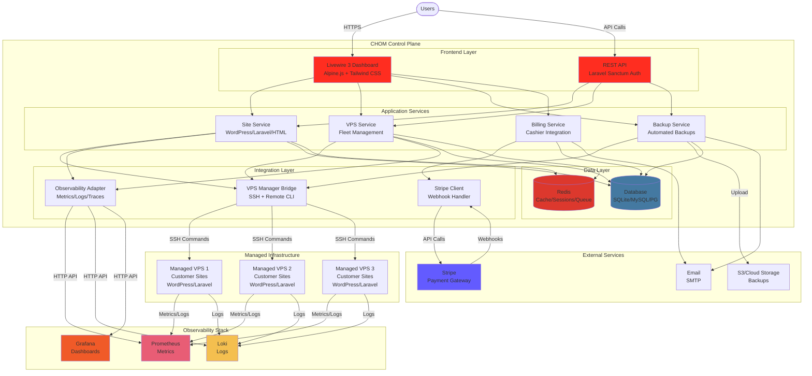

# CHOM - Cloud Hosting & Observability Manager

**A modern multi-tenant SaaS platform for WordPress hosting with integrated observability.**

CHOM provides a complete hosting control panel that manages customer sites, VPS servers, backups, and billing—all while integrating seamlessly with the Mentat observability stack for comprehensive monitoring.

## 🎯 What is CHOM?

CHOM (Cloud Hosting & Observability Manager) is a Laravel-based hosting platform designed for:
- **Hosting Providers** - Manage customer WordPress/Laravel sites across multiple VPS servers
- **Agencies** - Centralized management of client websites with built-in monitoring
- **SaaS Operators** - Multi-tenant architecture with Stripe billing integration

## ✨ Features

### 🏗️ Site Management
- **WordPress Sites**: One-click deployment with automatic SSL
- **Laravel Apps**: Full LEMP stack provisioning
- **HTML Sites**: Static site hosting
- **SSL Certificates**: Automatic Let's Encrypt integration
- **Staging Environments**: Test changes before production

### 🖥️ VPS Fleet Management
- **Auto-Allocation**: Intelligent server selection based on capacity
- **Health Monitoring**: Real-time server status and metrics
- **Resource Tracking**: CPU, memory, disk usage per VPS
- **Multi-Provider**: Support for any VPS provider (DigitalOcean, Linode, Vultr, etc.)

### 💾 Backup System
- **Automated Backups**: Scheduled backups with configurable retention
- **One-Click Restore**: Restore sites to any point in time
- **Off-Site Storage**: Optional S3/cloud storage integration
- **Retention Policies**: Hourly, daily, weekly, monthly retention options

### 📊 Integrated Observability
- **Metrics**: Prometheus metrics from all managed sites
- **Logs**: Centralized log aggregation via Loki
- **Traces**: Distributed tracing for Laravel applications
- **Dashboards**: Pre-built Grafana dashboards per site
- **Alerts**: Automatic alerting for site issues

### 💳 Billing & Subscriptions
- **Stripe Integration**: Full subscription lifecycle management
- **Tiered Pricing**: Starter, Pro, Enterprise plans
- **Usage Tracking**: Monitor resource consumption
- **Invoicing**: Automatic invoice generation
- **Webhook Handlers**: Real-time billing events

### 👥 Team Collaboration
- **Organizations**: Multi-team support
- **Role-Based Access**: Owner, Admin, Member, Viewer roles
- **Team Invitations**: Email-based team member onboarding
- **Audit Logs**: Track all team actions

## 🏛️ Architecture



**Architecture Layers:**

1. **Frontend Layer**: Livewire dashboards and REST API with Sanctum authentication
2. **Application Services**: Core business logic for sites, VPS, backups, and billing
3. **Integration Layer**: Bridges to external systems (VPS via SSH, Observability via HTTP, Stripe webhooks)
4. **Data Layer**: Database and Redis for persistence and caching

**Key Data Flows:**

- **Site Deployment**: User → Dashboard → Site Service → VPS Bridge → SSH to Managed VPS
- **Metrics Viewing**: User → Dashboard → Observability Adapter → HTTP to Prometheus/Loki/Grafana
- **Billing Events**: Stripe → Webhook → Stripe Client → Billing Service → Database
- **Backups**: Scheduled Job → Backup Service → VPS Bridge → SSH Backup → S3 Upload

## 🚀 Quick Start

### Prerequisites

- **PHP** 8.2 or higher
- **Composer** 2.x
- **Node.js** 18+ and npm
- **Database**: SQLite, MySQL, or PostgreSQL
- **Observability Stack** (optional but recommended)

### Installation (~10-15 minutes)

```bash
# Clone repository (~1 minute)
git clone https://github.com/calounx/mentat.git
cd mentat/chom

# Install PHP dependencies (~3-5 minutes)
composer install

# Install JavaScript dependencies (~2-3 minutes)
npm install

# Configure environment (~1 minute)
cp .env.example .env
php artisan key:generate

# Setup database (~1 minute)
php artisan migrate

# Build frontend assets (~2-3 minutes)
npm run build

# Start development server (~10 seconds)
php artisan serve
```

Access at: http://localhost:8000

**Total setup time:** 10-15 minutes depending on network speed and system performance

### Production Deployment

See [deploy/README.md](deploy/README.md) for detailed production deployment instructions.

## 📖 Documentation

### Getting Started
- [Installation Guide](deploy/README.md) - Production deployment
- [Configuration](docs/configuration.md) - Environment variables and settings
- [API Documentation](docs/api.md) - REST API reference

### Development
- [Development Setup](docs/development.md) - Local development environment
- [Testing](docs/testing.md) - Running tests and coverage
- [Contributing](../CONTRIBUTING.md) - Contribution guidelines

### Operations
- [Backup & Restore](docs/backups.md) - Backup procedures
- [Monitoring](docs/monitoring.md) - Integration with observability stack
- [Security](../SECURITY.md) - Security best practices

## 🛠️ Tech Stack

| Layer | Technology |
|-------|------------|
| **Backend** | Laravel 12, PHP 8.2+ |
| **Frontend** | Livewire 3, Alpine.js 3, Tailwind CSS 4 |
| **Build** | Vite 7 |
| **Database** | SQLite / MySQL / PostgreSQL |
| **API Auth** | Laravel Sanctum 4.2 |
| **Billing** | Stripe (Laravel Cashier 16.1) |
| **SSH/CLI** | phpseclib 3.0 |
| **Observability** | Prometheus, Loki, Grafana (via Mentat) |

## 📊 Pricing Tiers

| Tier | Price | Sites | Storage | Backups | Support |
|------|-------|-------|---------|---------|---------|
| **Starter** | $29/mo | 5 | 10GB | Daily | Email |
| **Pro** | $79/mo | 25 | 100GB | Hourly | Priority |
| **Enterprise** | $249/mo | Unlimited | Unlimited | Real-time | Dedicated |

## 🔌 API Overview

### Authentication

```bash
# Register organization
POST /api/v1/auth/register
{
  "name": "Acme Corp",
  "email": "admin@acme.com",
  "password": "secure123"
}

# Login
POST /api/v1/auth/login
{
  "email": "admin@acme.com",
  "password": "secure123"
}
```

### Site Management

```bash
# Create site
POST /api/v1/sites
{
  "domain": "example.com",
  "type": "wordpress",
  "php_version": "8.2"
}

# Get site details
GET /api/v1/sites/{id}

# Issue SSL certificate
POST /api/v1/sites/{id}/ssl
```

### Backups

```bash
# Create backup
POST /api/v1/sites/{id}/backups
{
  "type": "full",
  "description": "Pre-update backup"
}

# Restore backup
POST /api/v1/backups/{id}/restore
```

Full API documentation: [docs/api.md](docs/api.md)

## 🧪 Development

### Running Tests

```bash
# All tests
php artisan test

# With coverage
php artisan test --coverage

# Specific test
php artisan test --filter=SiteControllerTest
```

### Watch Frontend Assets

```bash
# Development mode (hot reload)
npm run dev

# Build for production
npm run build
```

### Code Quality

```bash
# Run Laravel Pint (code style)
./vendor/bin/pint

# Static analysis
./vendor/bin/phpstan analyse
```

## 🔐 Security

### Key Security Features
- **API Authentication**: Laravel Sanctum token-based auth
- **Rate Limiting**: 5 req/min (auth), 60 req/min (API)
- **SSH Key Management**: Secure key storage with proper permissions
- **Tenant Isolation**: Data segregation by organization
- **CSRF Protection**: Enabled for all web routes

### Reporting Vulnerabilities

See [SECURITY.md](../SECURITY.md) for security policy and reporting instructions.

## 🤝 Contributing

We welcome contributions! See [CONTRIBUTING.md](../CONTRIBUTING.md) for:
- Development setup
- Code style guidelines
- Pull request process
- Testing requirements

## 📝 Changelog

See [CHANGELOG.md](CHANGELOG.md) for version history and release notes.

## 📄 License

MIT License - see [LICENSE](../LICENSE) for details.

## 🆘 Support

- **Documentation**: https://github.com/calounx/mentat/tree/master/chom
- **Issues**: https://github.com/calounx/mentat/issues
- **Email**: support@chom.io

## 🙏 Acknowledgments

CHOM integrates with the **Mentat Observability Stack** - a production-ready monitoring platform providing Prometheus, Loki, Grafana, and more. See [../observability-stack/README.md](../observability-stack/README.md) for details.

---

**Version**: 1.1.0 (November 2025)
**Status**: Production Ready ✅
