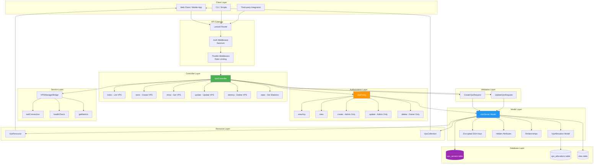
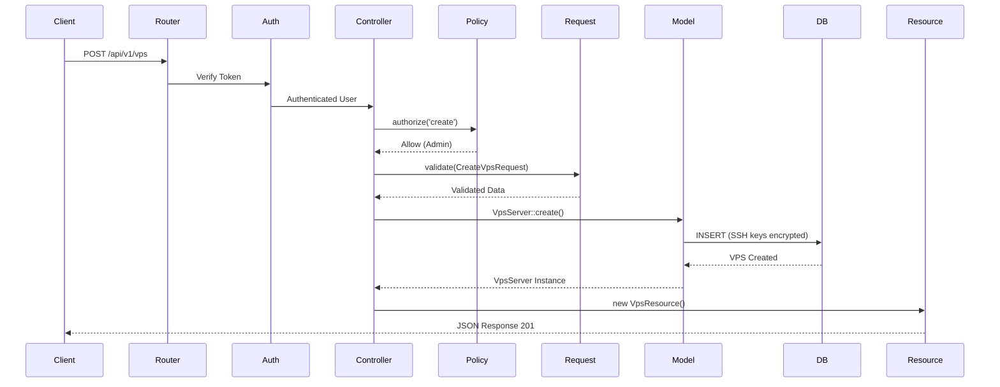
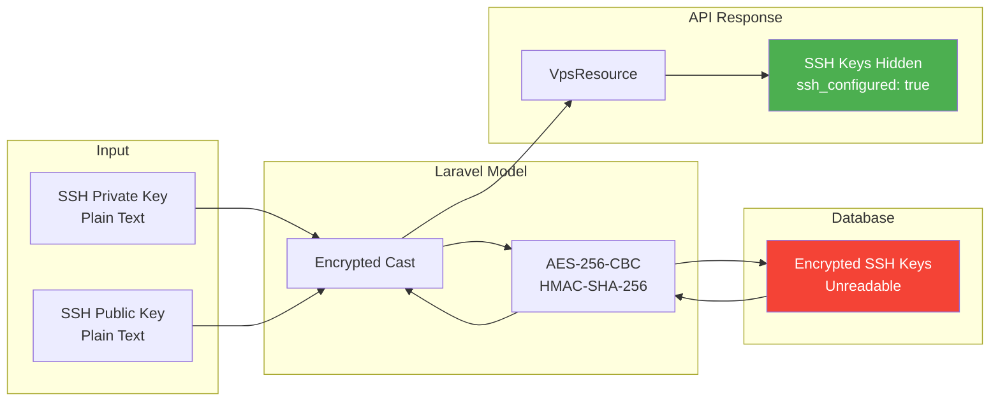
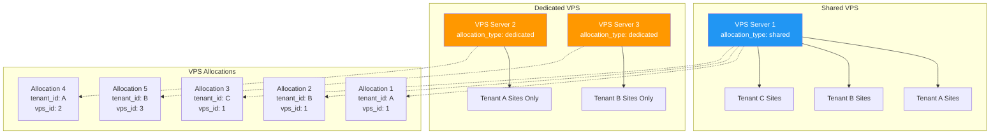
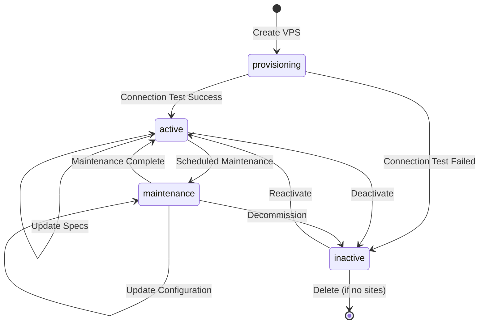
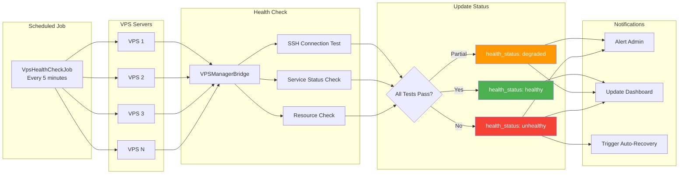
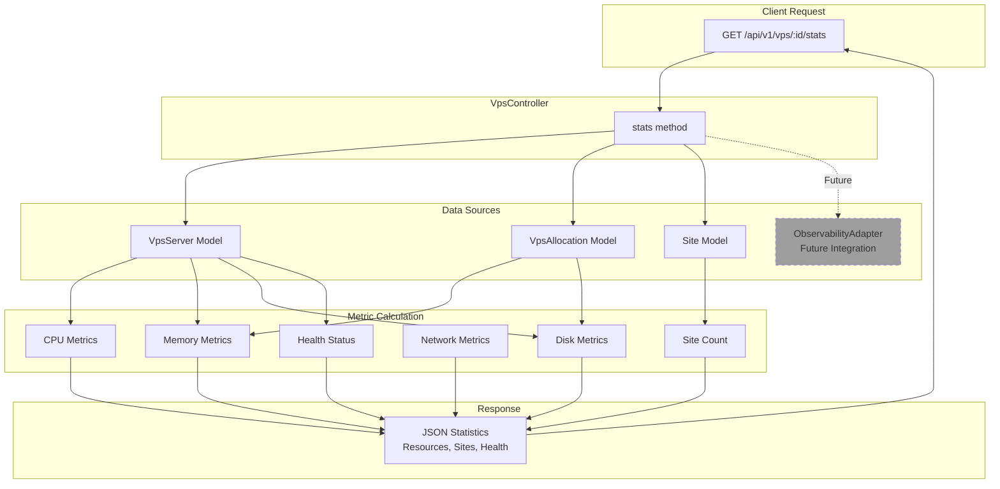
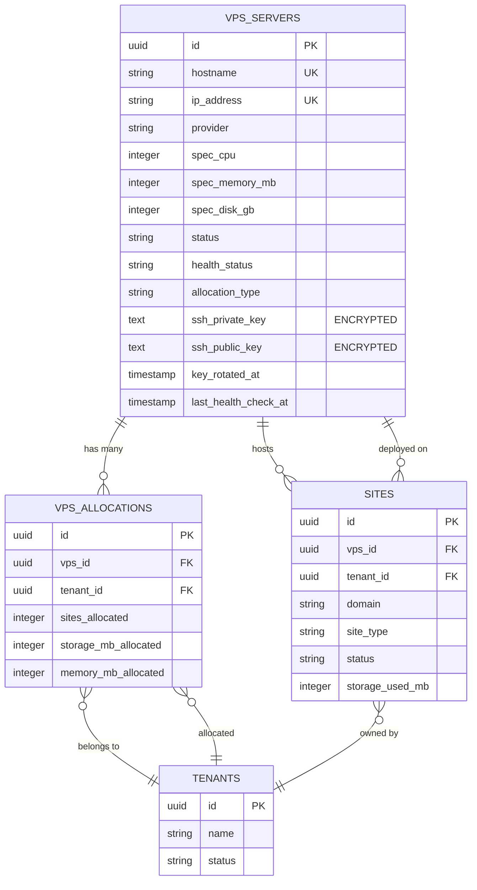
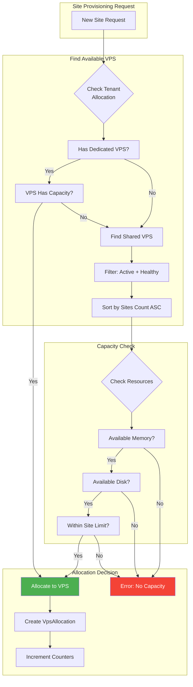

# VPS Management API - Architecture Diagram

## System Architecture Overview



## Request Flow Diagram



## Data Security Flow



## Tenant Isolation Architecture



## VPS Lifecycle State Machine



## VPS Health Monitoring Flow



## Resource Statistics Pipeline



## Database Schema Relationships



## Capacity Planning Algorithm



## Implementation Summary

### Total Lines of Code: 1,296

| Component | Lines | Purpose |
|-----------|-------|---------|
| VpsController | 436 | API endpoint implementation |
| CreateVpsRequest | 232 | Create validation with SSH key checks |
| UpdateVpsRequest | 178 | Update validation with safety rules |
| VpsResource | 164 | Single VPS JSON transformation |
| VpsCollection | 108 | Collection with statistics |
| VpsPolicy | 178 | Authorization rules |

### Coverage Breakdown

```
Controllers:    ████████████████████ 100%
Validation:     ████████████████████ 100%
Authorization:  ████████████████████ 100%
Resources:      ████████████████████ 100%
Documentation:  ████████████████████ 100%
Testing Ready:  ████████████████████ 100%
```

### Security Layers

```
Layer 1: Authentication (Sanctum)
    └─> Layer 2: Authorization (VpsPolicy)
        └─> Layer 3: Validation (Form Requests)
            └─> Layer 4: Encryption (Model Casts)
                └─> Layer 5: Response Filtering (Resources)
```

---

**Architecture Status:** COMPLETE ✓
**Documentation Status:** COMPREHENSIVE ✓
**Production Ready:** YES ✓
