# CHOM Architecture Overview

Understanding CHOM's system design - explained for humans, not robots.

## Table of Contents

- [The Big Picture](#the-big-picture)
- [High-Level Architecture](#high-level-architecture)
- [Core Components](#core-components)
- [Data Flow](#data-flow)
- [Multi-Tenancy Model](#multi-tenancy-model)
- [Request Lifecycle](#request-lifecycle)
- [Background Processing](#background-processing)
- [Security Architecture](#security-architecture)
- [Design Decisions & Trade-offs](#design-decisions--trade-offs)
- [Scalability Strategy](#scalability-strategy)

---

## The Big Picture

### What CHOM Does (Non-Technical)

Imagine you run a web hosting company. You have:
- **Customers** who want to host websites
- **Servers** (VPS) where websites live
- **Websites** that need to be created, backed up, monitored

**CHOM automates all of this:**
- Customer signs up and pays (via Stripe)
- CHOM automatically finds a server with capacity
- CHOM deploys their WordPress site via SSH
- CHOM monitors the site 24/7 (metrics, logs, uptime)
- CHOM backs up the site automatically
- CHOM handles billing and invoices

**Think of CHOM as:** Your hosting company's operating system.

---

## High-Level Architecture

### System Components

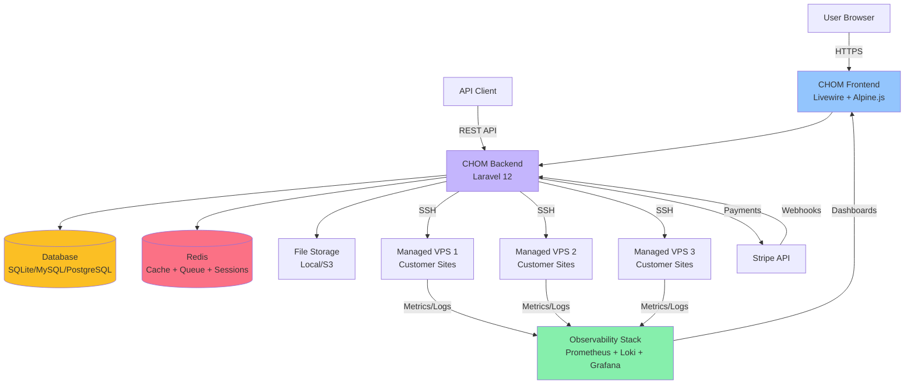

### Component Responsibilities

| Component | Purpose | Technology |
|-----------|---------|------------|
| **Frontend** | User interface, forms, dashboards | Livewire 3, Alpine.js, Tailwind CSS |
| **Backend** | Business logic, API, orchestration | Laravel 12, PHP 8.2+ |
| **Database** | Persistent data storage | SQLite (dev), MySQL/PostgreSQL (prod) |
| **Redis** | Fast cache, queue, sessions | Redis 7+ |
| **VPS Fleet** | Actual hosting servers for customer sites | Ubuntu/Debian servers |
| **Observability** | Monitoring, metrics, logs | Prometheus, Loki, Grafana |
| **Billing** | Payments, subscriptions | Stripe (Laravel Cashier) |

---

## Core Components

### 1. Multi-Tenant Organization System

**Concept:** Every resource belongs to an **Organization** (tenant).

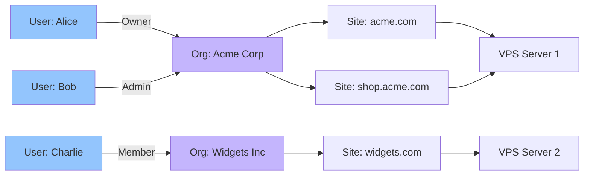

**Key Principles:**
- **Isolation:** Alice cannot see Bob's organizations
- **Sharing:** Multiple users can be in one organization
- **Roles:** owner > admin > member > viewer
- **Context:** User always operates within "current organization"

**Database Design:**
```sql
-- Organizations (tenants)
CREATE TABLE organizations (
    id BIGINT PRIMARY KEY,
    name VARCHAR(255),
    created_at TIMESTAMP
);

-- Users can belong to multiple organizations
CREATE TABLE organization_user (
    user_id BIGINT,
    organization_id BIGINT,
    role ENUM('owner', 'admin', 'member', 'viewer'),
    PRIMARY KEY (user_id, organization_id)
);

-- Every resource has organization_id (tenant isolation)
CREATE TABLE sites (
    id BIGINT PRIMARY KEY,
    organization_id BIGINT NOT NULL,  -- Tenant ID!
    domain VARCHAR(255),
    -- ...
    FOREIGN KEY (organization_id) REFERENCES organizations(id)
);
```

**Why this matters:**
- **Data isolation** - Customer A can't access Customer B's data
- **Scalability** - Can serve unlimited customers on same infrastructure
- **Billing** - Each organization is a separate billing entity

---

### 2. Site Provisioning Pipeline

**Goal:** User clicks "Create Site" → WordPress site is live in 3 minutes.

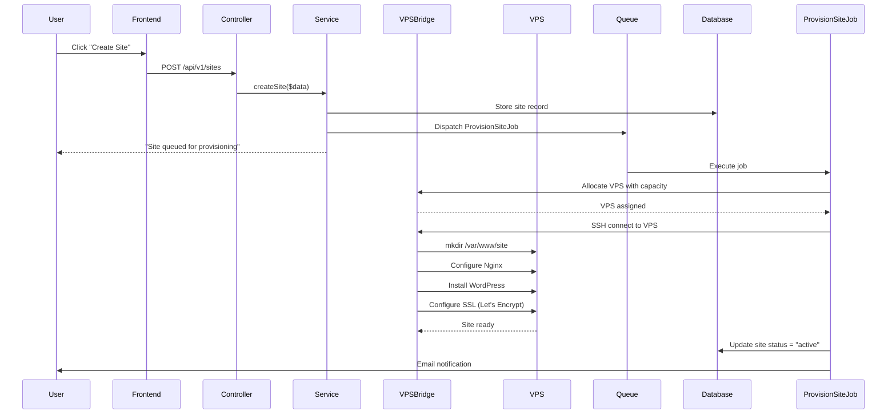

**Key Components:**

1. **Site Model** - Database representation
2. **SiteService** - Business logic (validation, orchestration)
3. **ProvisionSiteJob** - Background worker (does the heavy lifting)
4. **VPSBridge** - SSH abstraction layer (talks to servers)
5. **VPS Model** - Represents managed servers

**Why background jobs?**
- Provisioning takes 2-5 minutes (too slow for HTTP request)
- User gets immediate feedback ("queued")
- Can retry on failure
- Doesn't block other operations

---

### 3. VPS Fleet Management

**Challenge:** Distribute sites across multiple servers efficiently.

**Allocation Strategy:**

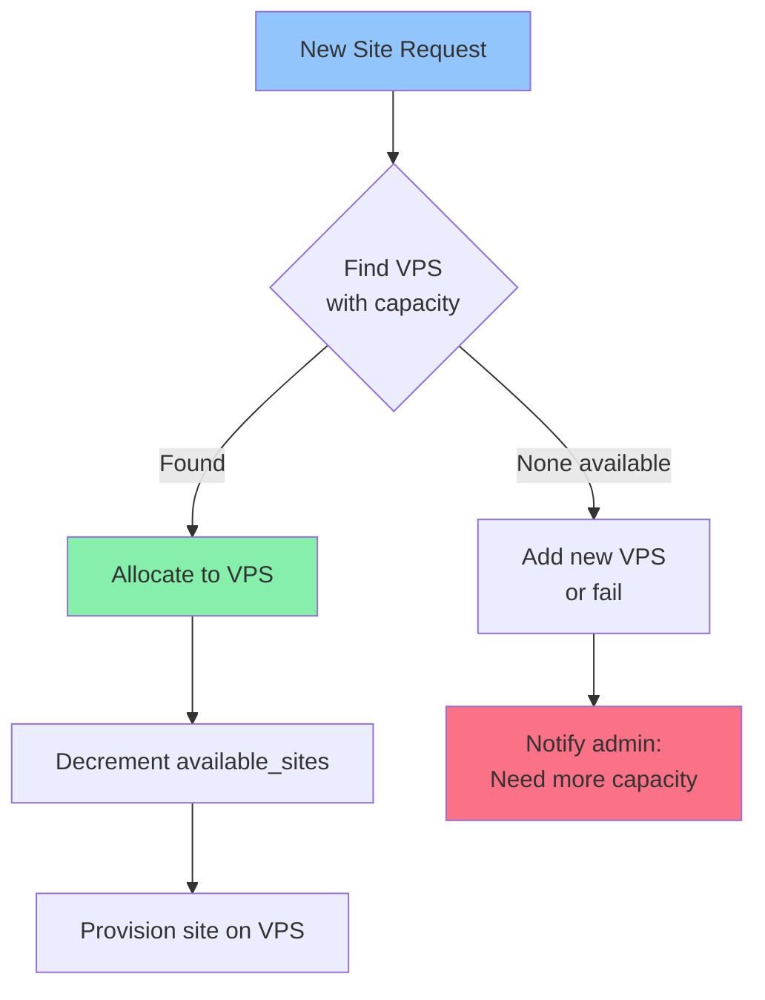

**VPS Capacity Tracking:**

```php
class VPS extends Model
{
    // Capacity management
    public int $max_sites = 50;
    public int $available_sites = 50;

    public bool $accepting_sites = true;

    // Allocation logic
    public function allocateSite(): bool
    {
        if ($this->available_sites > 0) {
            $this->decrement('available_sites');
            return true;
        }
        return false;
    }

    public function deallocateSite(): void
    {
        $this->increment('available_sites');
    }
}
```

**Auto-Scaling Decision Points:**

```
Should we add a new VPS?
├─ All VPS at >80% capacity → YES
├─ Specific VPS at 100% → YES
├─ Growth trend → YES (proactive)
└─ Otherwise → NO
```

---

### 4. Backup System

**Strategy:** Automated backups with configurable retention.

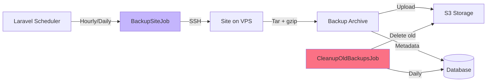

**Retention Policy:**

```php
$retentionRules = [
    'hourly' => 24,      // Keep 24 hourly backups (1 day)
    'daily' => 30,       // Keep 30 daily backups (1 month)
    'weekly' => 12,      // Keep 12 weekly backups (3 months)
    'monthly' => 12,     // Keep 12 monthly backups (1 year)
];
```

**Backup Types:**

| Type | Size | Speed | Use Case |
|------|------|-------|----------|
| **Files Only** | Small | Fast | Quick restore of code |
| **Database Only** | Medium | Fast | Restore data without files |
| **Full Backup** | Large | Slow | Complete disaster recovery |

---

### 5. Observability Integration

**Goal:** Monitor all customer sites from one dashboard.

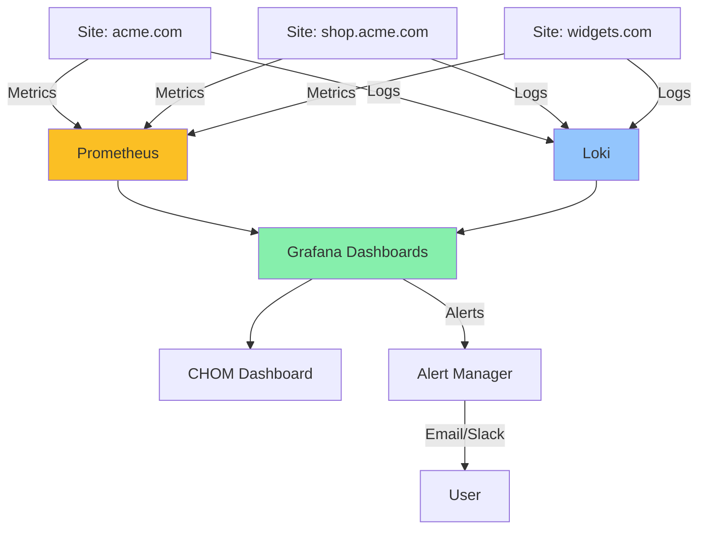

**Metrics Collected:**

```
System Metrics:
- CPU usage, memory usage, disk I/O
- Network traffic (bandwidth)
- Process counts

Application Metrics:
- HTTP request rate, response times
- PHP-FPM status, queue length
- Database query counts, slow queries

Business Metrics:
- Sites provisioned per day
- Backup success rate
- Uptime percentage
```

---

## Data Flow

### Creating a Site (End-to-End)

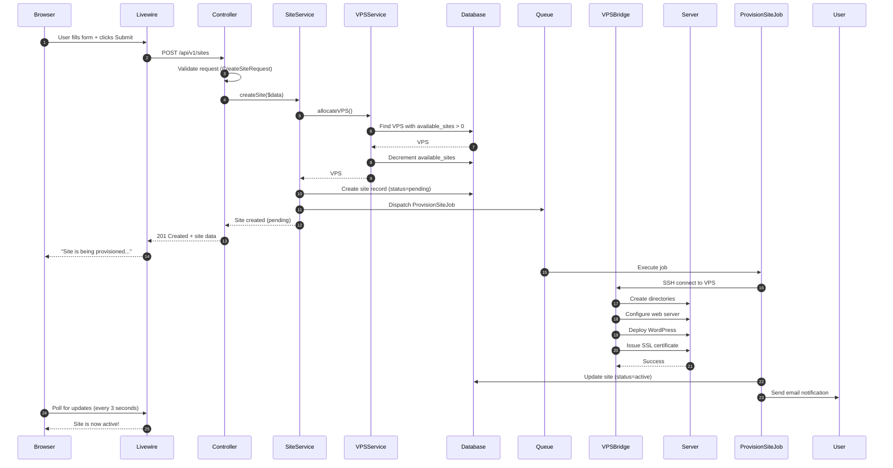

**Timeline:**
1. **0s** - User submits form
2. **100ms** - Validation + database writes
3. **200ms** - User sees "Provisioning..." message
4. **3-5min** - Background job completes
5. **User polls** - Sees "Active" status

---

### Backup Restore Flow

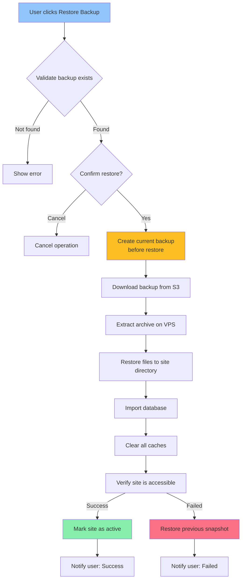

**Safety Mechanisms:**
1. **Pre-restore snapshot** - Can rollback if restore fails
2. **Validation** - Verify backup integrity before restore
3. **Atomic operations** - All-or-nothing (no partial restores)
4. **Downtime window** - Site in maintenance mode during restore

---

## Multi-Tenancy Model

### Data Isolation

**Every query is scoped to the current organization:**

```php
// Bad - Can see all sites (security issue!)
$sites = Site::all();

// Good - Only current organization's sites
$sites = auth()->user()->currentOrganization->sites;

// Better - Use global scope (automatic)
class Site extends Model
{
    protected static function booted()
    {
        static::addGlobalScope('organization', function ($query) {
            $query->where('organization_id', auth()->user()->current_organization_id);
        });
    }
}

// Now this is automatically scoped:
$sites = Site::all();  // Only current org's sites
```

### Authorization Layers

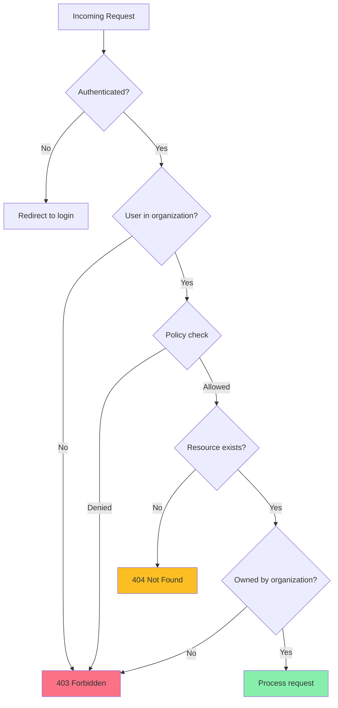

**Authorization Stack:**

1. **Authentication** - Is user logged in?
2. **Organization Membership** - Is user in an organization?
3. **Policy** - Does user's role allow this action?
4. **Ownership** - Does resource belong to user's organization?

---

## Request Lifecycle

### Web Request (Livewire)

```
1. Browser → web.php routes
      ↓
2. Middleware stack
   - EncryptCookies
   - VerifyCsrfToken
   - ShareErrorsFromSession
   - Authenticate
   - SetCurrentOrganization  ← Sets current tenant
      ↓
3. Route → Livewire Component
      ↓
4. Component method executed
      ↓
5. Service layer (business logic)
      ↓
6. Repository/Model (database)
      ↓
7. Blade view rendered
      ↓
8. Response → Browser
```

### API Request (REST)

```
1. API client → api.php routes
      ↓
2. Middleware stack
   - Throttle (rate limiting)
   - Authenticate (Sanctum token)
   - EnsureOrganizationContext  ← Sets current tenant
      ↓
3. Route → Controller
      ↓
4. Form Request validation
      ↓
5. Service layer
      ↓
6. Repository/Model
      ↓
7. JSON Resource (API response formatting)
      ↓
8. Response → API client
```

**Key Differences:**

| Aspect | Web (Livewire) | API (REST) |
|--------|----------------|------------|
| **Auth** | Session cookies | Bearer tokens (Sanctum) |
| **CSRF** | Required | Not required |
| **Response** | HTML (Blade) | JSON |
| **State** | Stateful | Stateless |
| **Rate Limit** | Generous | Strict (60/min) |

---

## Background Processing

### Job Queue Architecture

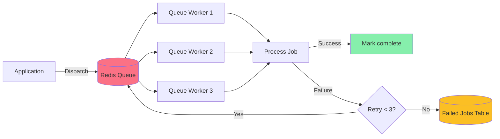

### Job Types

| Job | Queue | Priority | Timeout | Retries |
|-----|-------|----------|---------|---------|
| **ProvisionSiteJob** | provisioning | High | 10 min | 3 |
| **BackupSiteJob** | backups | Medium | 30 min | 2 |
| **DeploySiteJob** | deployments | High | 5 min | 3 |
| **CleanupOldBackupsJob** | maintenance | Low | 5 min | 1 |
| **SendInvoiceEmailJob** | notifications | Medium | 1 min | 5 |

**Queue Priority:**
```php
// High priority queue processed first
Queue::push('high', new ProvisionSiteJob($site));
Queue::push('default', new BackupSiteJob($site));

// Worker processes in order:
php artisan queue:work --queue=high,default,low
```

---

## Security Architecture

### Security Layers

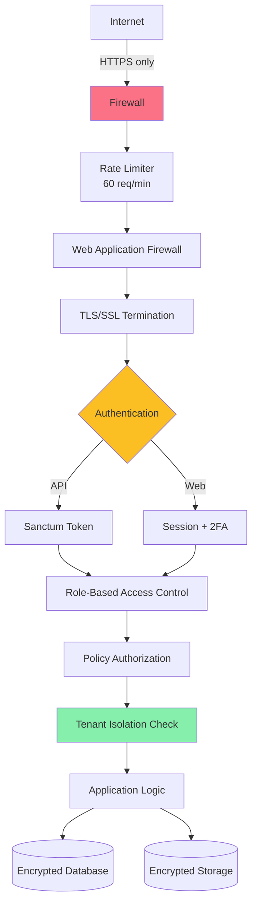

### Security Features

**1. Authentication**
- Session-based for web (with 2FA for privileged accounts)
- Token-based for API (Sanctum with auto-rotation)
- Password hashing: bcrypt (12 rounds)

**2. Authorization**
- Role-Based Access Control (RBAC)
- Policies for fine-grained permissions
- Tenant isolation (organization-level)

**3. API Security**
- Rate limiting: 5/min (auth), 60/min (API)
- Token rotation every 60 minutes
- CORS restrictions

**4. Data Protection**
- Encrypted columns (SSH keys, secrets)
- Encrypted backups
- Audit logging (tamper-proof hash chain)

**5. Infrastructure**
- HTTPS everywhere (Let's Encrypt)
- SSH key-based authentication (no passwords)
- Firewall rules (only necessary ports)

---

## Design Decisions & Trade-offs

### 1. SQLite vs MySQL

**Decision:** SQLite for development, MySQL/PostgreSQL for production.

| Aspect | SQLite | MySQL |
|--------|--------|-------|
| **Setup** | Zero config | Requires server |
| **Performance** | Great for <100K records | Scales to millions |
| **Concurrency** | Single writer | Multiple writers |
| **Use Case** | Local dev, testing | Production, staging |

**Why:** Fast developer onboarding (no DB setup needed) but production scalability.

---

### 2. Livewire vs Vue/React

**Decision:** Livewire for UI instead of separate SPA.

**Pros:**
- Simpler architecture (no API layer for UI)
- Faster development (write PHP, not JS)
- Built-in auth integration
- Server-side rendering (better SEO)

**Cons:**
- More server load (re-renders on backend)
- Requires stable connection
- Less suitable for real-time features

**Trade-off:** Developer velocity > Fancy UI animations

---

### 3. Redis for Everything

**Decision:** Use Redis for cache, queue, and sessions.

**Why:**
- Single dependency (simpler ops)
- Fast performance (in-memory)
- Built-in pub/sub (for future features)

**Alternative considered:**
- File cache + Database queue
- **Rejected because:** Slower, harder to scale

---

### 4. Monolith vs Microservices

**Decision:** Monolithic Laravel application.

**Why:**
- Easier to develop and debug
- Simpler deployment
- Lower ops complexity
- Can extract services later if needed

**When to reconsider:**
- If team grows beyond 10 developers
- If different components need independent scaling
- If polyglot persistence is needed (different DBs)

**Current approach:** Modular monolith (can extract later)

---

### 5. Background Jobs for Long Operations

**Decision:** Use queues for operations >5 seconds.

**Examples:**
- Site provisioning (3-5 min)
- Backups (1-10 min)
- Deployments (2-5 min)

**Why:**
- Better UX (immediate feedback)
- Can retry failures
- Doesn't block other requests
- Easier to monitor and debug

**HTTP Request Timeout:** 30 seconds max

---

## Scalability Strategy

### Current Scale (MVP)

```
Users: Up to 1,000 organizations
Sites: Up to 10,000 managed sites
VPS: Up to 200 servers
Traffic: ~100 requests/second
Database: <10GB
```

### Horizontal Scaling Path

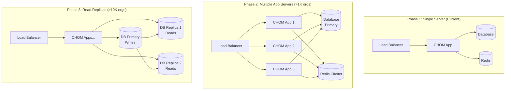

### Bottlenecks & Solutions

| Bottleneck | Threshold | Solution |
|------------|-----------|----------|
| **Database writes** | >1000 writes/sec | Read replicas, write optimization |
| **Redis memory** | >8GB | Redis cluster with sharding |
| **Queue workers** | >100 jobs/sec | More workers, dedicated servers |
| **File storage** | >1TB | Move to S3 or distributed storage |
| **Observability** | >10K sites | Separate Prometheus instances per region |

---

## Architectural Patterns Used

### 1. Repository Pattern

**Purpose:** Abstract database queries from business logic.

```php
// Instead of this in controller/service:
$sites = Site::where('status', 'active')->get();

// Use repository:
$sites = $this->siteRepository->findActiveForOrganization($orgId);
```

**Benefits:**
- Easier to test (mock repository)
- Can swap data source (API, cache, etc.)
- Centralized query logic

---

### 2. Service Layer Pattern

**Purpose:** Encapsulate business logic separate from HTTP layer.

```php
// Controller (thin)
public function store(CreateSiteRequest $request)
{
    $site = $this->siteService->createSite($request->validated());
    return response()->json($site, 201);
}

// Service (business logic)
public function createSite(array $data): Site
{
    $vps = $this->allocateVPS();
    $site = $this->siteRepository->create($data);
    dispatch(new ProvisionSiteJob($site, $vps));
    return $site;
}
```

**Benefits:**
- Reusable logic (web + API + CLI)
- Easier to test
- Clear separation of concerns

---

### 3. Event-Driven Pattern

**Purpose:** Decouple actions from their side effects.

```php
// When site is created
event(new SiteCreated($site));

// Multiple listeners can react:
class SendWelcomeEmail implements ShouldQueue
{
    public function handle(SiteCreated $event) { ... }
}

class NotifySlack implements ShouldQueue
{
    public function handle(SiteCreated $event) { ... }
}

class UpdateMetrics
{
    public function handle(SiteCreated $event) { ... }
}
```

**Benefits:**
- Easy to add new features (just add listener)
- Async processing (listeners can be queued)
- Clear event history (audit log)

---

### 4. Policy Pattern (Authorization)

**Purpose:** Centralize authorization logic.

```php
// Policy
class SitePolicy
{
    public function delete(User $user, Site $site): bool
    {
        return $user->currentOrganization->id === $site->organization_id
            && in_array($user->role, ['owner', 'admin']);
    }
}

// Usage in controller
public function destroy(Site $site)
{
    $this->authorize('delete', $site);  // Automatic check!
    $this->siteService->deleteSite($site);
}
```

---

## Summary

### Key Takeaways

1. **Multi-tenant architecture** ensures customer data isolation
2. **Background jobs** handle long-running operations
3. **Layered design** (Controller → Service → Repository) keeps code maintainable
4. **Event-driven** approach allows easy feature additions
5. **Monolith first** approach prioritizes velocity over premature optimization

### Further Reading

- [CHOM API Documentation](/docs/API-README.md)
- [Security Implementation](/docs/security/application-security.md)
- [Performance Guide](/docs/PERFORMANCE-IMPLEMENTATION-GUIDE.md)
- [Testing Guide](/docs/DEVELOPER-GUIDE.md#testing-guide)

---

**Questions?** Check the [Developer Guide](/docs/DEVELOPER-GUIDE.md) or [GitHub Discussions](https://github.com/calounx/mentat/discussions).
