# CHOM Developer Onboarding Guide

Welcome to CHOM! This guide will get you from zero to your first contribution in under 30 minutes.

## Table of Contents

- [Before You Start](#before-you-start)
- [Environment Setup](#environment-setup)
- [Understanding the Codebase](#understanding-the-codebase)
- [Your First Contribution](#your-first-contribution)
- [Development Workflow](#development-workflow)
- [Testing Your Changes](#testing-your-changes)
- [Getting Help](#getting-help)

---

## Before You Start

### What is CHOM?

CHOM (Cloud Hosting & Observability Manager) is a **multi-tenant SaaS platform** for managing WordPress and Laravel sites with integrated monitoring. Think of it as:

- **Hosting Control Panel** (like cPanel, but modern)
- **Site Manager** (deploy, manage, monitor sites across VPS servers)
- **Observability Platform** (metrics, logs, traces for all managed sites)

### Who Should Use This Guide?

- New developers joining the CHOM team
- Open source contributors making their first PR
- Anyone wanting to understand the CHOM codebase

### Time Commitment

- Setup: 15-20 minutes
- Understanding codebase: 30-45 minutes
- First contribution: 1-2 hours

---

## Environment Setup

### Step 1: Check Prerequisites

Before starting, ensure you have:

```bash
# Check PHP version (need 8.2+)
php -v

# Check Composer (need 2.x)
composer --version

# Check Node.js (need 18+)
node -v

# Check npm
npm -v

# Check Git
git --version
```

**Missing something?** See installation guides:

<details>
<summary>Ubuntu/Debian</summary>

```bash
# PHP 8.2+ with extensions
sudo apt-get update
sudo apt-get install -y php8.2 php8.2-cli php8.2-fpm php8.2-mysql \
  php8.2-sqlite3 php8.2-xml php8.2-mbstring php8.2-curl \
  php8.2-zip php8.2-gd php8.2-redis

# Composer
curl -sS https://getcomposer.org/installer | php
sudo mv composer.phar /usr/local/bin/composer

# Node.js 18+
curl -fsSL https://deb.nodesource.com/setup_18.x | sudo -E bash -
sudo apt-get install -y nodejs

# Redis (optional but recommended)
sudo apt-get install -y redis-server
sudo systemctl start redis
```
</details>

<details>
<summary>macOS</summary>

```bash
# Using Homebrew
brew install php@8.2
brew install composer
brew install node@18
brew install redis

# Start Redis
brew services start redis
```
</details>

### Step 2: Clone and Setup

```bash
# 1. Clone the repository
git clone https://github.com/calounx/mentat.git
cd mentat/chom

# 2. Run the automated setup (does everything!)
composer run setup

# This command:
# - Installs PHP dependencies (composer install)
# - Copies .env.example to .env
# - Generates application key
# - Creates SQLite database
# - Runs migrations
# - Installs JavaScript dependencies (npm install)
# - Builds frontend assets (npm run build)
```

Expected output:
```
Installing dependencies...
Generating app key...
Running migrations...
Building assets...

Setup complete! You can now run: composer run dev
```

### Step 3: Start Development Environment

```bash
# Start all services at once
composer run dev
```

This single command starts:
- **Web server** - http://localhost:8000
- **Vite dev server** - Hot module replacement for frontend
- **Queue worker** - Processes background jobs
- **Log viewer** - Real-time log streaming (Laravel Pail)

You should see colored output like:
```
[server] | Starting Laravel development server
[vite]   | VITE ready in 1234ms
[queue]  | Processing jobs on queue: default
[logs]   | Watching logs...
```

### Step 4: Verify Installation

Open http://localhost:8000 in your browser. You should see the CHOM login page.

**Create your first user:**

```bash
# Open a new terminal (keep composer run dev running)
php artisan tinker

# In Tinker, create an admin user:
>>> $user = \App\Models\User::create([
...   'name' => 'Admin',
...   'email' => 'admin@test.com',
...   'password' => bcrypt('password'),
...   'role' => 'owner'
... ]);
>>> exit
```

Now login at http://localhost:8000 with:
- Email: `admin@test.com`
- Password: `password`

### Troubleshooting Setup

**Port 8000 already in use?**
```bash
# Find what's using it
lsof -ti:8000

# Kill it (macOS/Linux)
kill -9 $(lsof -ti:8000)

# Or run on different port
php artisan serve --port=8001
```

**Database errors?**
```bash
# Reset and retry
rm database/database.sqlite
touch database/database.sqlite
php artisan migrate:fresh
```

**Redis connection errors?**
```bash
# Check Redis is running
redis-cli ping
# Should return: PONG

# If not running
sudo systemctl start redis  # Linux
brew services start redis   # macOS

# Or disable Redis in .env for now
CACHE_STORE=file
QUEUE_CONNECTION=sync
SESSION_DRIVER=file
```

**Asset build failures?**
```bash
# Clear npm cache and retry
rm -rf node_modules package-lock.json
npm cache clean --force
npm install
```

---

## Understanding the Codebase

### Architecture in 5 Minutes

CHOM uses a **layered architecture** following Laravel best practices:

```
User Request
    ↓
Controller (HTTP layer - handles requests)
    ↓
Service (Business logic - what to do)
    ↓
Repository (Data layer - how to store)
    ↓
Model (Database representation)
```

**Real example - Creating a site:**

```php
// 1. Controller receives request
SiteController@store(CreateSiteRequest $request)
    ↓
// 2. Service handles business logic
SiteService->createSite($data)
    ↓
// 3. Repository interacts with database
SiteRepository->create($data)
    ↓
// 4. Model represents the data
Site::create($data)
    ↓
// 5. Job provisions the site (background)
ProvisionSiteJob is dispatched
```

### Project Structure

```
chom/
├── app/
│   ├── Http/
│   │   ├── Controllers/      # Handle web/API requests
│   │   │   ├── Api/          # API endpoints (v1, v2)
│   │   │   └── Web/          # Web routes
│   │   ├── Middleware/       # Request filtering (auth, cors, etc)
│   │   └── Requests/         # Form validation
│   │
│   ├── Livewire/             # Interactive UI components
│   │   ├── Sites/            # Site management UI
│   │   ├── Team/             # Team management UI
│   │   └── Dashboard/        # Dashboard components
│   │
│   ├── Models/               # Database models (Eloquent ORM)
│   │   ├── User.php
│   │   ├── Organization.php
│   │   ├── Site.php
│   │   └── VPS.php
│   │
│   ├── Services/             # Business logic layer
│   │   ├── SiteService.php
│   │   ├── VPSService.php
│   │   └── BackupService.php
│   │
│   ├── Jobs/                 # Background tasks (queues)
│   │   ├── ProvisionSiteJob.php
│   │   └── BackupSiteJob.php
│   │
│   ├── Events/               # Domain events
│   ├── Listeners/            # Event handlers
│   ├── Policies/             # Authorization rules
│   └── Rules/                # Custom validation rules
│
├── config/                   # Application configuration
│   ├── chom.php             # CHOM-specific settings
│   ├── database.php         # Database connections
│   └── sanctum.php          # API authentication
│
├── database/
│   ├── migrations/          # Database schema changes
│   ├── factories/           # Test data generators
│   └── seeders/             # Sample data
│
├── resources/
│   ├── views/               # Blade templates
│   │   ├── livewire/        # Livewire component views
│   │   └── layouts/         # Layout templates
│   ├── css/                 # Tailwind CSS
│   └── js/                  # Alpine.js & JavaScript
│
├── routes/
│   ├── web.php              # Web routes (browser UI)
│   ├── api.php              # API routes (REST API)
│   ├── console.php          # Artisan commands
│   └── health.php           # Health check endpoint
│
└── tests/
    ├── Unit/                # Unit tests (isolated)
    ├── Feature/             # Feature tests (integration)
    ├── Integration/         # Full workflow tests
    └── Api/                 # API contract tests
```

### Key Components Explained

#### 1. Multi-Tenancy (Organizations)

Every resource belongs to an **Organization** (tenant):

```php
// Every user belongs to organizations
User -> belongsToMany(Organization)

// Every site belongs to an organization
Site -> belongsTo(Organization)

// Authorization checks organization membership
Policy: 'Can this user access this site?'
```

**Data isolation** is critical - users can only see their organization's data.

#### 2. Site Provisioning Flow

```mermaid
graph LR
    A[User creates site] --> B[Validation]
    B --> C[Find available VPS]
    C --> D[Dispatch ProvisionSiteJob]
    D --> E[SSH to VPS]
    E --> F[Create directories]
    F --> G[Configure web server]
    G --> H[Deploy code]
    H --> I[Configure DNS]
    I --> J[Issue SSL certificate]
    J --> K[Mark site active]
```



Implementation:
- Controller: `SiteController@store`
- Service: `SiteService->createSite()`
- Job: `ProvisionSiteJob`
- VPS Bridge: `VPSBridge->executeCommand()`

#### 3. Frontend Stack

**Livewire 3** - Build reactive interfaces without JavaScript:

```php
// Example Livewire component
class SiteList extends Component
{
    public function render()
    {
        return view('livewire.sites.list', [
            'sites' => auth()->user()->currentOrganization->sites
        ]);
    }

    public function deleteSite($siteId)
    {
        $this->authorize('delete', Site::find($siteId));
        Site::find($siteId)->delete();

        session()->flash('success', 'Site deleted!');
    }
}
```

**Alpine.js** - Sprinkle interactivity on Livewire:

```html
<!-- Dropdown menu with Alpine -->
<div x-data="{ open: false }">
    <button @click="open = !open">Menu</button>
    <div x-show="open" x-cloak>
        <!-- Menu items -->
    </div>
</div>
```

**Tailwind CSS 4** - Utility-first styling:

```html
<button class="bg-blue-600 hover:bg-blue-700 text-white px-4 py-2 rounded">
    Create Site
</button>
```

#### 4. API Structure

All API routes are **versioned** and use **Sanctum** for authentication:

```php
// routes/api.php
Route::prefix('v1')->middleware(['auth:sanctum'])->group(function () {
    Route::apiResource('sites', SiteController::class);
    Route::post('sites/{site}/ssl', [SiteController::class, 'issueSsl']);
});
```

**API versioning** allows us to maintain backward compatibility:
- `/api/v1/sites` - Current stable API
- `/api/v2/sites` - Future breaking changes

### Data Flow Example

Let's trace a **site backup** request through the system:

```
1. User clicks "Backup Now" button
   └─> Livewire component: BackupButton
       └─> Calls: $this->createBackup()

2. Livewire component validates and dispatches
   └─> BackupService->createBackup($site)

3. Service creates database record
   └─> Backup::create([...])
   └─> Dispatches: BackupSiteJob

4. Job runs in background (queue worker)
   └─> BackupSiteJob->handle()
   └─> VPSBridge->executeCommand('mysqldump ...')
   └─> Stores backup on S3 or local storage

5. Job completes and fires event
   └─> BackupCompleted event
   └─> Listener sends notification email
   └─> Livewire component auto-updates (polling)

6. User sees "Backup complete!" notification
```

### Common Patterns

#### Pattern 1: Form Validation

```php
// Use Form Requests for validation
class CreateSiteRequest extends FormRequest
{
    public function rules()
    {
        return [
            'domain' => ['required', 'string', 'max:255', new ValidDomain],
            'type' => ['required', 'in:wordpress,laravel,html'],
            'php_version' => ['required', 'in:8.2,8.4'],
        ];
    }
}

// Controller uses it automatically
public function store(CreateSiteRequest $request)
{
    // $request->validated() contains only validated data
    $site = $this->siteService->createSite($request->validated());
}
```

#### Pattern 2: Authorization

```php
// Define in Policy
class SitePolicy
{
    public function delete(User $user, Site $site)
    {
        return $user->currentOrganization->id === $site->organization_id
            && $user->role !== 'viewer';
    }
}

// Use in Controller
public function destroy(Site $site)
{
    $this->authorize('delete', $site);

    $this->siteService->deleteSite($site);
}
```

#### Pattern 3: Background Jobs

```php
// Dispatch a job
dispatch(new ProvisionSiteJob($site));

// With delay
ProvisionSiteJob::dispatch($site)->delay(now()->addMinutes(5));

// On specific queue
ProvisionSiteJob::dispatch($site)->onQueue('provisioning');
```

---

## Your First Contribution

### Choose a Good First Issue

Look for issues labeled `good-first-issue` on GitHub. These are:
- Well-defined scope
- Don't require deep domain knowledge
- Have clear acceptance criteria

**Example good first issues:**
- Add validation for SSH key format
- Improve error message for failed backups
- Add unit tests for VPS allocation logic
- Update documentation for API endpoints

### Making Your First Change

Let's walk through adding a feature: **"Show site creation date in dashboard"**

#### Step 1: Create a Branch

```bash
# Always branch from latest main/master
git checkout master
git pull origin master

# Create feature branch (use descriptive names)
git checkout -b feature/show-site-creation-date
```

#### Step 2: Make the Change

**File: `resources/views/livewire/sites/list.blade.php`**

```diff
<td class="px-6 py-4">
    {{ $site->domain }}
</td>
+<td class="px-6 py-4 text-sm text-gray-500">
+    Created {{ $site->created_at->diffForHumans() }}
+</td>
```

#### Step 3: Test Your Change

```bash
# 1. Check it works in browser
# Visit http://localhost:8000/sites

# 2. Run automated tests
php artisan test

# 3. Check code style
./vendor/bin/pint
```

#### Step 4: Commit Your Changes

```bash
# Stage your changes
git add resources/views/livewire/sites/list.blade.php

# Write a good commit message
git commit -m "Add site creation date to sites list

- Display created_at timestamp in sites dashboard
- Use diffForHumans() for readable format (e.g., '2 days ago')
- Improves user awareness of site age

Closes #123"
```

**Good commit messages:**
- Start with imperative verb (Add, Fix, Update, Remove)
- Explain WHY, not just WHAT
- Reference issue numbers

#### Step 5: Push and Create PR

```bash
# Push to your fork
git push origin feature/show-site-creation-date

# Then on GitHub:
# 1. Click "Compare & pull request"
# 2. Fill in PR template
# 3. Request review
```

### PR Checklist

Before submitting your PR, verify:

- [ ] Tests pass: `php artisan test`
- [ ] Code formatted: `./vendor/bin/pint`
- [ ] No new security issues: `composer audit`
- [ ] Documentation updated (if needed)
- [ ] Migration tested (if database change)
- [ ] Commit messages are clear
- [ ] PR description explains the change

---

## Development Workflow

### Daily Development

```bash
# Morning: Update codebase
git checkout master
git pull origin master

# Create feature branch
git checkout -b feature/my-feature

# Start dev environment
composer run dev

# Make changes...
# Test changes...

# Run tests frequently
php artisan test --filter=MyNewFeature

# Format code before committing
./vendor/bin/pint

# Commit and push
git add .
git commit -m "Add my feature"
git push origin feature/my-feature
```

### Working with Migrations

```bash
# Create a migration
php artisan make:migration add_status_to_sites_table

# Edit the migration file in database/migrations/

# Run migration
php artisan migrate

# Rollback if needed
php artisan migrate:rollback

# Reset database completely (WARNING: deletes all data)
php artisan migrate:fresh

# Reset and seed with test data
php artisan migrate:fresh --seed
```

### Working with Models

```bash
# Create a model with migration and factory
php artisan make:model Backup -mf

# This creates:
# - app/Models/Backup.php (model)
# - database/migrations/2024_01_01_000000_create_backups_table.php (migration)
# - database/factories/BackupFactory.php (test factory)

# Add controller too
php artisan make:model Backup -mfc
```

### Using Tinker (Interactive Console)

```bash
php artisan tinker

# Try things out interactively
>>> $user = User::first();
>>> $user->sites()->count();
>>> $site = Site::factory()->create();
>>> exit
```

---

## Testing Your Changes

### Running Tests

```bash
# Run all tests
php artisan test

# Run specific test suite
php artisan test --testsuite=Feature
php artisan test --testsuite=Unit

# Run specific test file
php artisan test --filter=SiteControllerTest

# Run with coverage (need Xdebug)
php artisan test --coverage --min=80

# Parallel testing (faster!)
php artisan test --parallel
```

### Writing Tests

**Feature Test Example:**

```php
// tests/Feature/SiteControllerTest.php
class SiteControllerTest extends TestCase
{
    use RefreshDatabase;

    public function test_user_can_create_site()
    {
        // Arrange: Set up test data
        $user = User::factory()->create();
        $organization = Organization::factory()->create();
        $user->organizations()->attach($organization);

        // Act: Perform the action
        $response = $this->actingAs($user)->post('/api/v1/sites', [
            'domain' => 'example.com',
            'type' => 'wordpress',
            'php_version' => '8.2',
        ]);

        // Assert: Verify results
        $response->assertStatus(201);
        $this->assertDatabaseHas('sites', [
            'domain' => 'example.com',
        ]);
    }
}
```

**Unit Test Example:**

```php
// tests/Unit/Services/SiteServiceTest.php
class SiteServiceTest extends TestCase
{
    public function test_allocates_vps_with_most_capacity()
    {
        // Arrange
        $vps1 = VPS::factory()->create(['available_sites' => 5]);
        $vps2 = VPS::factory()->create(['available_sites' => 10]);

        $service = new SiteService();

        // Act
        $allocated = $service->allocateVPS();

        // Assert
        $this->assertEquals($vps2->id, $allocated->id);
    }
}
```

### Debugging Tests

```bash
# Run single test with verbose output
php artisan test --filter=test_user_can_create_site -vvv

# Use dump() and dd() in tests
public function test_something()
{
    $result = $this->service->doThing();
    dump($result);  // Print and continue
    dd($result);    // Print and stop
}
```

---

## Getting Help

### When You're Stuck

**Try these in order:**

1. **Search existing docs**
   - Check `/docs` directory
   - Search GitHub issues
   - Read Laravel docs: https://laravel.com/docs

2. **Debug yourself**
   - Use `dd()` to inspect variables
   - Check Laravel logs: `storage/logs/laravel.log`
   - Use browser DevTools

3. **Ask for help**
   - GitHub Discussions: https://github.com/calounx/mentat/discussions
   - Team Slack (for team members)
   - Create an issue with minimal reproducible example

### Useful Commands for Debugging

```bash
# View logs in real-time
php artisan pail

# Clear all caches (fixes many weird issues)
php artisan optimize:clear

# Check routes
php artisan route:list

# Check configuration
php artisan config:show

# Check database connection
php artisan db:show

# Interactive console
php artisan tinker
```

### Common Gotchas

**1. Changes not appearing?**
- Clear cache: `php artisan optimize:clear`
- Restart dev server: Stop `composer run dev` and start again
- Hard refresh browser: Ctrl+Shift+R / Cmd+Shift+R

**2. Database errors?**
- Make sure migrations ran: `php artisan migrate:status`
- Reset if needed: `php artisan migrate:fresh`

**3. Test failures?**
- Run single test first: `php artisan test --filter=MyTest`
- Check test database: Uses `:memory:` SQLite by default
- Clear config: `php artisan config:clear`

---

## Next Steps

### You're ready when you can:

- [ ] Setup the dev environment
- [ ] Start the application and create a test user
- [ ] Navigate the codebase confidently
- [ ] Understand the request lifecycle
- [ ] Write and run tests
- [ ] Make a small change and test it

### Continue Learning

1. **Read architectural docs:**
   - [Architecture Overview](ARCHITECTURE-OVERVIEW.md)
   - [Architecture Patterns](/docs/ARCHITECTURE-PATTERNS.md)

2. **Explore APIs:**
   - [API Documentation](/docs/API-README.md)
   - [API Quickstart](/docs/API-QUICKSTART.md)

3. **Deep dive into testing:**
   - [Testing Guide](/docs/DEVELOPER-GUIDE.md#testing-guide)
   - Check `/tests` directory

4. **Master the tools:**
   - [Cheat Sheets](CHEAT-SHEETS.md)
   - [Troubleshooting Guide](TROUBLESHOOTING.md)

### Make Your First Contribution!

Find a `good-first-issue` and go for it! The team is here to help.

**Remember:** Every expert was once a beginner. Don't be afraid to ask questions!

---

## Quick Reference

### Essential Commands

```bash
# Development
composer run dev              # Start all dev services
php artisan serve            # Just web server
npm run dev                  # Just frontend HMR

# Database
php artisan migrate          # Run migrations
php artisan migrate:fresh    # Reset database
php artisan db:seed          # Seed test data

# Testing
php artisan test             # Run all tests
./vendor/bin/pint            # Format code

# Debugging
php artisan pail             # View logs
php artisan tinker           # Interactive console
php artisan route:list       # List all routes
```

### Project Resources

- Main README: `/README.md`
- Developer Guide: `/docs/DEVELOPER-GUIDE.md`
- API Docs: `/docs/API-README.md`
- Contributing: `/CONTRIBUTING.md`
- Code Style: `/CODE-STYLE.md`

---

**Welcome to CHOM! Happy coding!**
