# CHOM System Architecture

This diagram shows the overall system architecture of the CHOM platform, including all major components and their interactions.

```mermaid
graph TB
    subgraph "Client Layer"
        WEB[Web Browser]
        API_CLIENT[API Clients<br/>CLI/Mobile/3rd Party]
    end

    subgraph "CHOM Control Plane - Laravel 12 Application"
        subgraph "Frontend Layer"
            LIVEWIRE[Livewire 3 Dashboard<br/>Real-time UI Components]
            REST_API[REST API v1<br/>Sanctum Auth]
        end

        subgraph "Middleware Stack"
            AUTH_MW[Authentication<br/>Sanctum]
            TENANT_MW[Tenant Context<br/>Isolation Layer]
            SECURITY_MW[Security Headers<br/>CORS/CSRF]
            RATE_MW[Rate Limiting<br/>5-60 req/min]
            PERF_MW[Performance Monitor<br/>Metrics Collection]
        end

        subgraph "Business Services"
            SITE_SVC[Site Service<br/>WordPress/Laravel/HTML]
            VPS_SVC[VPS Service<br/>Fleet Management]
            BACKUP_SVC[Backup Service<br/>Automated Backups]
            BILLING_SVC[Billing Service<br/>Cashier + Stripe]
            TEAM_SVC[Team Service<br/>Collaboration]
            SECURITY_SVC[Security Service<br/>2FA/Audit/Key Rotation]
        end

        subgraph "Integration Layer"
            VPS_BRIDGE[VPS Manager Bridge<br/>SSH Connection Pool<br/>Command Executor]
            OBS_CLIENT[Observability Client<br/>Prometheus/Loki/Grafana]
            STRIPE_CLIENT[Stripe Client<br/>Webhook Handler]
            SECRET_MGR[Secret Manager<br/>Encrypted Storage]
        end

        subgraph "Data Layer"
            ELOQUENT[Eloquent ORM<br/>Global Scopes]
            REPO[Repository Layer<br/>Data Access]
            CACHE_SVC[Cache Service<br/>Query/Session Cache]
        end

        subgraph "Storage"
            DB[(Primary Database<br/>SQLite/MySQL/PostgreSQL)]
            REDIS[(Redis Cache<br/>Sessions/Queue/Cache)]
            FILE_STORAGE[File Storage<br/>Backups/SSH Keys/Uploads]
        end

        subgraph "Background Processing"
            QUEUE[Queue Workers<br/>Async Jobs]
            SCHEDULER[Task Scheduler<br/>Backups/Health Checks]
            JOBS[Job Classes<br/>DeploySite/BackupSite<br/>HealthCheck/SslRenew]
        end
    end

    subgraph "Managed Infrastructure"
        subgraph "VPS Fleet"
            VPS1[Managed VPS 1<br/>Shared/Dedicated<br/>Customer Sites]
            VPS2[Managed VPS 2<br/>Shared/Dedicated<br/>Customer Sites]
            VPS3[Managed VPS 3<br/>Shared/Dedicated<br/>Customer Sites]
        end

        subgraph "Site Stack on Each VPS"
            NGINX[Nginx<br/>Web Server]
            PHP_FPM[PHP-FPM<br/>8.2/8.4]
            MYSQL[MySQL/MariaDB<br/>Site Databases]
            WP[WordPress<br/>Installations]
            LARAVEL[Laravel<br/>Applications]
        end
    end

    subgraph "Observability Stack - Mentat Integration"
        PROMETHEUS[Prometheus<br/>Metrics Collection<br/>Time-series DB]
        LOKI[Loki<br/>Log Aggregation<br/>Query Engine]
        GRAFANA[Grafana<br/>Dashboards<br/>Visualization]
        ALERTMANAGER[AlertManager<br/>Alert Routing<br/>Notifications]
        EXPORTERS[Node Exporters<br/>VPS Metrics]
    end

    subgraph "External Services"
        STRIPE[Stripe API<br/>Payment Processing<br/>Subscriptions]
        EMAIL[SMTP Service<br/>Transactional Email<br/>Notifications]
        S3[S3/Cloud Storage<br/>Off-site Backups<br/>Asset Storage]
        DNS[DNS Provider<br/>Domain Management]
    end

    %% Client to Frontend
    WEB -->|HTTPS| LIVEWIRE
    API_CLIENT -->|HTTPS + Bearer Token| REST_API

    %% Frontend to Middleware
    LIVEWIRE --> AUTH_MW
    REST_API --> AUTH_MW
    AUTH_MW --> TENANT_MW
    TENANT_MW --> SECURITY_MW
    SECURITY_MW --> RATE_MW
    RATE_MW --> PERF_MW

    %% Middleware to Services
    PERF_MW --> SITE_SVC
    PERF_MW --> VPS_SVC
    PERF_MW --> BACKUP_SVC
    PERF_MW --> BILLING_SVC
    PERF_MW --> TEAM_SVC
    PERF_MW --> SECURITY_SVC

    %% Services to Integration
    SITE_SVC --> VPS_BRIDGE
    SITE_SVC --> OBS_CLIENT
    SITE_SVC --> SECRET_MGR
    VPS_SVC --> VPS_BRIDGE
    VPS_SVC --> OBS_CLIENT
    BACKUP_SVC --> VPS_BRIDGE
    BACKUP_SVC --> S3
    BILLING_SVC --> STRIPE_CLIENT
    SECURITY_SVC --> SECRET_MGR

    %% Services to Data Layer
    SITE_SVC --> ELOQUENT
    VPS_SVC --> ELOQUENT
    BACKUP_SVC --> ELOQUENT
    BILLING_SVC --> ELOQUENT
    TEAM_SVC --> ELOQUENT
    SECURITY_SVC --> ELOQUENT
    ELOQUENT --> REPO
    REPO --> CACHE_SVC

    %% Data Layer to Storage
    CACHE_SVC --> DB
    CACHE_SVC --> REDIS
    SECRET_MGR --> FILE_STORAGE
    BACKUP_SVC --> FILE_STORAGE

    %% Background Processing
    SITE_SVC -.->|Dispatch| QUEUE
    VPS_SVC -.->|Dispatch| QUEUE
    BACKUP_SVC -.->|Dispatch| QUEUE
    SCHEDULER -.->|Schedule| JOBS
    JOBS --> QUEUE
    QUEUE -->|Process| VPS_BRIDGE
    QUEUE -->|Process| OBS_CLIENT

    %% Integration to Infrastructure
    VPS_BRIDGE -->|SSH + VPS Manager CLI| VPS1
    VPS_BRIDGE -->|SSH + VPS Manager CLI| VPS2
    VPS_BRIDGE -->|SSH + VPS Manager CLI| VPS3

    %% VPS Components
    VPS1 --> NGINX
    VPS2 --> NGINX
    VPS3 --> NGINX
    NGINX --> PHP_FPM
    PHP_FPM --> WP
    PHP_FPM --> LARAVEL
    PHP_FPM --> MYSQL

    %% Observability Integration
    OBS_CLIENT -->|Query Metrics| PROMETHEUS
    OBS_CLIENT -->|Query Logs| LOKI
    OBS_CLIENT -->|Create Dashboards| GRAFANA
    EXPORTERS -->|Expose Metrics| PROMETHEUS
    VPS1 -.->|Node Exporter| EXPORTERS
    VPS2 -.->|Node Exporter| EXPORTERS
    VPS3 -.->|Node Exporter| EXPORTERS
    VPS1 -.->|Logs| LOKI
    VPS2 -.->|Logs| LOKI
    VPS3 -.->|Logs| LOKI
    PROMETHEUS --> ALERTMANAGER
    ALERTMANAGER -->|Notifications| EMAIL

    %% External Services
    STRIPE_CLIENT <-->|API + Webhooks| STRIPE
    TEAM_SVC --> EMAIL
    BACKUP_SVC --> EMAIL
    BILLING_SVC --> EMAIL
    SITE_SVC -.->|SSL/ACME| DNS

    %% Styling
    classDef frontend fill:#ff2d20,stroke:#333,stroke-width:2px,color:#fff
    classDef service fill:#4f46e5,stroke:#333,stroke-width:2px,color:#fff
    classDef integration fill:#059669,stroke:#333,stroke-width:2px,color:#fff
    classDef storage fill:#dc2626,stroke:#333,stroke-width:2px,color:#fff
    classDef observability fill:#ea580c,stroke:#333,stroke-width:2px,color:#fff
    classDef external fill:#7c3aed,stroke:#333,stroke-width:2px,color:#fff
    classDef infrastructure fill:#0891b2,stroke:#333,stroke-width:2px,color:#fff

    class LIVEWIRE,REST_API frontend
    class SITE_SVC,VPS_SVC,BACKUP_SVC,BILLING_SVC,TEAM_SVC,SECURITY_SVC service
    class VPS_BRIDGE,OBS_CLIENT,STRIPE_CLIENT,SECRET_MGR integration
    class DB,REDIS,FILE_STORAGE storage
    class PROMETHEUS,LOKI,GRAFANA,ALERTMANAGER,EXPORTERS observability
    class STRIPE,EMAIL,S3,DNS external
    class VPS1,VPS2,VPS3,NGINX,PHP_FPM,MYSQL,WP,LARAVEL infrastructure
```



## Architecture Overview

### Control Plane (Laravel Application)
The CHOM control plane is built on Laravel 12 and provides:
- **Frontend**: Livewire 3 for reactive UI components
- **API**: RESTful API with Sanctum token authentication
- **Services**: Modular business logic services
- **Integration**: Bridges to external systems

### Managed Infrastructure
- **VPS Fleet**: Multiple VPS servers managed via SSH
- **Auto-allocation**: Intelligent server selection based on capacity
- **LEMP Stack**: Nginx, PHP-FPM, MySQL on each VPS
- **Application Support**: WordPress, Laravel, static HTML sites

### Observability Stack
Integration with Mentat observability platform:
- **Metrics**: Prometheus for time-series metrics
- **Logs**: Loki for centralized log aggregation
- **Dashboards**: Grafana for visualization
- **Alerts**: AlertManager for notification routing

### Key Data Flows

1. **Site Deployment Flow**:
   ```
   User → Livewire → Site Service → VPS Bridge → SSH → VPS → Deploy
   ```

2. **Metrics Query Flow**:
   ```
   User → API → Observability Client → Prometheus → Return Data
   ```

3. **Billing Flow**:
   ```
   Stripe Webhook → Stripe Client → Billing Service → Database → Email Notification
   ```

4. **Backup Flow**:
   ```
   Scheduler → Backup Job → VPS Bridge → SSH Backup → S3 Upload → Email Notification
   ```

### Security Layers

- **Authentication**: Laravel Sanctum with token rotation
- **Authorization**: Role-based access control (Owner, Admin, Member, Viewer)
- **Tenant Isolation**: Global scopes ensure data segregation
- **Encryption**: SSH keys and secrets encrypted at rest
- **Rate Limiting**: Multiple tiers (auth: 5/min, API: 60/min, sensitive: 2/min)

### Performance Optimizations

- **Caching**: Redis for sessions, queries, and API responses
- **Queue**: Background job processing for long-running tasks
- **Connection Pooling**: SSH connection reuse across requests
- **Cached Aggregates**: Pre-calculated statistics to avoid expensive queries
