# CHOM Security Architecture

This diagram illustrates the comprehensive security architecture including authentication, authorization, tenant isolation, and encryption layers.

```mermaid
graph TB
    subgraph "Client Layer"
        BROWSER[Web Browser]
        API_CLIENT[API Client<br/>CLI/Mobile App]
    end

    subgraph "Edge Security Layer"
        subgraph "TLS Termination"
            TLS[HTTPS/TLS 1.3<br/>Certificate Validation]
        end

        subgraph "Rate Limiting"
            RATE_AUTH[Auth Endpoints<br/>5 req/min]
            RATE_API[API Endpoints<br/>60 req/min]
            RATE_2FA[2FA Endpoints<br/>10 req/min]
            RATE_SENSITIVE[Sensitive Ops<br/>2 req/min]
        end

        subgraph "Request Validation"
            CORS[CORS Validation<br/>Allowed Origins]
            CSRF[CSRF Protection<br/>Token Validation]
            SIGNATURE[Request Signature<br/>HMAC Verification]
        end
    end

    subgraph "Authentication Layer"
        subgraph "Session Management"
            SANCTUM[Laravel Sanctum<br/>Token Authentication]
            TOKEN_ROTATION[Token Rotation<br/>60min expiry<br/>15min threshold]
            SESSION_STORE[Session Store<br/>Redis + Encryption]
        end

        subgraph "Two-Factor Authentication"
            2FA_SETUP[2FA Setup<br/>TOTP Generation<br/>QR Code Display]
            2FA_VERIFY[2FA Verification<br/>Code Validation<br/>Session Marking]
            2FA_BACKUP[Backup Codes<br/>Encrypted Storage<br/>One-time Use]
            2FA_GRACE[Grace Period<br/>7 days for setup<br/>Required for Admin/Owner]
        end

        subgraph "Password Security"
            HASH[Password Hashing<br/>bcrypt + salt]
            CONFIRM[Password Confirmation<br/>Step-up Auth<br/>10min validity]
            ROTATION[Password Policy<br/>Complexity Rules]
        end
    end

    subgraph "Authorization Layer"
        subgraph "Role-Based Access Control"
            ROLES[Role Hierarchy<br/>Owner > Admin > Member > Viewer]
            POLICIES[Authorization Policies<br/>Resource-level Checks]
            GATES[Authorization Gates<br/>Feature Checks]
        end

        subgraph "Tenant Isolation"
            TENANT_CONTEXT[Tenant Context<br/>Middleware]
            GLOBAL_SCOPES[Global Query Scopes<br/>Auto-applied Filters]
            TENANT_VERIFY[Tenant Verification<br/>Active Status Check]
        end

        subgraph "Permission Matrix"
            OWNER_PERMS[Owner: Full Control<br/>Billing/Team/Sites/VPS]
            ADMIN_PERMS[Admin: Management<br/>Sites/Backups/Team]
            MEMBER_PERMS[Member: Operations<br/>Sites/Backups]
            VIEWER_PERMS[Viewer: Read-only<br/>View Sites/Stats]
        end
    end

    subgraph "Data Security Layer"
        subgraph "Encryption at Rest"
            APP_KEY[APP_KEY<br/>AES-256-CBC<br/>HMAC-SHA-256]
            ENCRYPTED_FIELDS[Encrypted Fields<br/>2FA Secrets<br/>SSH Keys<br/>Backup Codes]
            DB_ENCRYPTION[Database Encryption<br/>Sensitive Columns<br/>Laravel Casts]
        end

        subgraph "Encryption in Transit"
            SSH_ENCRYPT[SSH Encryption<br/>Key-based Auth<br/>No Passwords]
            API_TLS[API TLS<br/>HTTPS Only<br/>HSTS Enabled]
            DB_TLS[DB Connection TLS<br/>Encrypted Channel]
        end

        subgraph "Key Management"
            SSH_KEYS[SSH Key Pairs<br/>Per-VPS Keys<br/>Encrypted Storage]
            KEY_ROTATION[Key Rotation<br/>90-day Policy<br/>Automated Alerts]
            SECRET_MANAGER[Secret Manager<br/>Centralized Storage<br/>Access Logging]
        end
    end

    subgraph "Audit & Monitoring Layer"
        subgraph "Security Audit"
            AUDIT_LOG[Audit Logs<br/>All Actions Tracked<br/>Immutable Records]
            HASH_CHAIN[Hash Chain<br/>Log Integrity<br/>Tamper Detection]
            SECURITY_EVENTS[Security Events<br/>Login/Logout<br/>2FA Changes<br/>Permission Changes]
        end

        subgraph "Threat Detection"
            FAILED_LOGINS[Failed Login Tracking<br/>Brute Force Detection]
            ANOMALY[Anomaly Detection<br/>Unusual Patterns]
            IP_TRACKING[IP Address Tracking<br/>Geolocation Check]
        end

        subgraph "Compliance"
            DATA_RETENTION[Data Retention<br/>Configurable Periods]
            EXPORT[Data Export<br/>GDPR Compliance]
            DELETION[Secure Deletion<br/>Soft Delete + Purge]
        end
    end

    subgraph "Application Layer"
        CONTROLLERS[Controllers<br/>Input Validation]
        SERVICES[Service Layer<br/>Business Logic]
        REPOSITORIES[Repository Layer<br/>Data Access]
    end

    subgraph "Data Storage"
        DB[(Primary Database<br/>SQLite/MySQL/PG)]
        REDIS[(Redis<br/>Encrypted Sessions)]
        FILES[File Storage<br/>Encrypted Keys/Backups]
    end

    %% Client to Edge
    BROWSER -->|HTTPS Request| TLS
    API_CLIENT -->|HTTPS + Token| TLS

    %% Edge Security Flow
    TLS --> CORS
    CORS --> CSRF
    CSRF --> SIGNATURE
    SIGNATURE --> RATE_AUTH
    SIGNATURE --> RATE_API
    SIGNATURE --> RATE_2FA
    SIGNATURE --> RATE_SENSITIVE

    %% Rate Limiting to Auth
    RATE_AUTH --> SANCTUM
    RATE_API --> SANCTUM
    RATE_2FA --> SANCTUM
    RATE_SENSITIVE --> SANCTUM

    %% Authentication Flow
    SANCTUM --> TOKEN_ROTATION
    TOKEN_ROTATION --> SESSION_STORE
    SESSION_STORE --> 2FA_VERIFY

    %% 2FA Flow
    SANCTUM -.->|Setup Flow| 2FA_SETUP
    2FA_SETUP --> 2FA_BACKUP
    2FA_VERIFY --> 2FA_GRACE
    2FA_GRACE -.->|Required After Grace| 2FA_VERIFY

    %% Password Security
    SANCTUM --> HASH
    HASH --> CONFIRM
    CONFIRM --> ROTATION

    %% Auth to Authorization
    2FA_VERIFY --> TENANT_CONTEXT
    SESSION_STORE --> TENANT_CONTEXT

    %% Tenant Isolation
    TENANT_CONTEXT --> TENANT_VERIFY
    TENANT_VERIFY --> GLOBAL_SCOPES
    GLOBAL_SCOPES --> ROLES

    %% RBAC
    ROLES --> POLICIES
    POLICIES --> GATES

    %% Permission Matrix
    ROLES --> OWNER_PERMS
    ROLES --> ADMIN_PERMS
    ROLES --> MEMBER_PERMS
    ROLES --> VIEWER_PERMS

    %% Authorization to Application
    GATES --> CONTROLLERS

    %% Application Flow
    CONTROLLERS --> SERVICES
    SERVICES --> REPOSITORIES

    %% Data Encryption
    APP_KEY --> ENCRYPTED_FIELDS
    ENCRYPTED_FIELDS --> DB_ENCRYPTION
    SECRET_MANAGER --> SSH_KEYS
    SSH_KEYS --> KEY_ROTATION

    %% Data Access
    REPOSITORIES --> DB
    SESSION_STORE --> REDIS
    SECRET_MANAGER --> FILES

    %% Encryption Verification
    DB_ENCRYPTION -.->|Read| REPOSITORIES
    SSH_ENCRYPT -.->|VPS Access| SERVICES
    API_TLS -.->|Protect| TLS
    DB_TLS -.->|Secure| DB

    %% Audit Trail
    SERVICES --> AUDIT_LOG
    CONTROLLERS --> AUDIT_LOG
    SANCTUM --> SECURITY_EVENTS
    2FA_VERIFY --> SECURITY_EVENTS
    ROLES --> SECURITY_EVENTS

    %% Audit Storage
    AUDIT_LOG --> HASH_CHAIN
    HASH_CHAIN --> DB
    SECURITY_EVENTS --> DB

    %% Threat Detection
    SANCTUM -.->|Monitor| FAILED_LOGINS
    CONTROLLERS -.->|Track| ANOMALY
    TLS -.->|Log| IP_TRACKING

    %% Compliance
    AUDIT_LOG -.-> DATA_RETENTION
    REPOSITORIES -.-> EXPORT
    SERVICES -.-> DELETION

    %% Styling
    classDef edge fill:#dc2626,stroke:#333,stroke-width:2px,color:#fff
    classDef auth fill:#ea580c,stroke:#333,stroke-width:2px,color:#fff
    classDef authz fill:#d97706,stroke:#333,stroke-width:2px,color:#fff
    classDef encryption fill:#7c3aed,stroke:#333,stroke-width:2px,color:#fff
    classDef audit fill:#0891b2,stroke:#333,stroke-width:2px,color:#fff
    classDef app fill:#4f46e5,stroke:#333,stroke-width:2px,color:#fff
    classDef storage fill:#059669,stroke:#333,stroke-width:2px,color:#fff

    class TLS,CORS,CSRF,SIGNATURE,RATE_AUTH,RATE_API,RATE_2FA,RATE_SENSITIVE edge
    class SANCTUM,TOKEN_ROTATION,SESSION_STORE,2FA_SETUP,2FA_VERIFY,2FA_BACKUP,2FA_GRACE,HASH,CONFIRM,ROTATION auth
    class TENANT_CONTEXT,TENANT_VERIFY,GLOBAL_SCOPES,ROLES,POLICIES,GATES,OWNER_PERMS,ADMIN_PERMS,MEMBER_PERMS,VIEWER_PERMS authz
    class APP_KEY,ENCRYPTED_FIELDS,DB_ENCRYPTION,SSH_ENCRYPT,API_TLS,DB_TLS,SSH_KEYS,KEY_ROTATION,SECRET_MANAGER encryption
    class AUDIT_LOG,HASH_CHAIN,SECURITY_EVENTS,FAILED_LOGINS,ANOMALY,IP_TRACKING,DATA_RETENTION,EXPORT,DELETION audit
    class CONTROLLERS,SERVICES,REPOSITORIES app
    class DB,REDIS,FILES storage
```



## Security Architecture Overview

### Defense in Depth Strategy
CHOM implements multiple layers of security controls to protect against various threat vectors.

### 1. Edge Security Layer

#### TLS/HTTPS
- **TLS 1.3**: Modern encryption protocol
- **HSTS**: HTTP Strict Transport Security enforced
- **Certificate Pinning**: Protection against MITM attacks

#### Rate Limiting (Tiered)
```
Authentication:  5 requests/minute   (login, register)
API Endpoints:   60 requests/minute  (general API)
2FA Endpoints:   10 requests/minute  (TOTP verification)
Sensitive Ops:   2 requests/minute   (delete, transfer ownership)
```

#### Request Validation
- **CORS**: Whitelist allowed origins
- **CSRF**: Token-based protection on all state-changing operations
- **Signature Verification**: HMAC signatures for webhook validation

### 2. Authentication Layer

#### Laravel Sanctum Token Authentication
```php
// Token Configuration
- Expiration: 60 minutes
- Rotation Threshold: 15 minutes before expiry
- Grace Period: 5 minutes (old token valid during rotation)
- Storage: Redis with encryption
```

#### Two-Factor Authentication (2FA)
```php
// 2FA Policy
Owner Role:  REQUIRED (after 7-day grace period)
Admin Role:  REQUIRED (after 7-day grace period)
Member Role: OPTIONAL
Viewer Role: OPTIONAL

// Implementation
- Algorithm: TOTP (Time-based One-Time Password)
- Interval: 30 seconds
- Digits: 6
- Backup Codes: 8 codes, encrypted, one-time use
- Session Timeout: 24 hours (requires re-verification)
```

#### Password Security
- **Hashing**: bcrypt with automatic salt
- **Confirmation**: Step-up authentication for sensitive operations (10-minute validity)
- **Policy**: Minimum 8 characters, complexity requirements

### 3. Authorization Layer

#### Role-Based Access Control (RBAC)
```
Role Hierarchy:
┌─────────────────────────────────────┐
│ Owner (Full Control)                │
│ - All permissions                   │
│ - Billing management                │
│ - Organization settings             │
│ - Team ownership transfer           │
├─────────────────────────────────────┤
│ Admin (Management)                  │
│ - Site management                   │
│ - Backup management                 │
│ - Team member management            │
│ - No billing access                 │
├─────────────────────────────────────┤
│ Member (Operations)                 │
│ - Create/update sites               │
│ - Create/restore backups            │
│ - View team                         │
│ - No team management                │
├─────────────────────────────────────┤
│ Viewer (Read-only)                  │
│ - View sites                        │
│ - View statistics                   │
│ - No modifications                  │
└─────────────────────────────────────┘
```

#### Tenant Isolation
```php
// Multi-tenancy Implementation
1. Tenant Context Middleware: Sets current tenant from user
2. Global Query Scopes: Auto-filters queries by tenant_id
3. Tenant Verification: Checks active status on every request
4. Data Segregation: Enforced at ORM level

// Example: Automatic tenant filtering
Site::all(); // Only returns sites for current tenant
```

### 4. Data Security Layer

#### Encryption at Rest
```php
// Encrypted Fields (AES-256-CBC + HMAC-SHA-256)
- two_factor_secret (User model)
- two_factor_backup_codes (User model)
- ssh_private_key (VpsServer model)
- ssh_public_key (VpsServer model)

// Configuration
Encryption Key: APP_KEY (32-byte random key)
Algorithm: AES-256-CBC
Authentication: HMAC-SHA-256
```

#### Encryption in Transit
- **API Traffic**: HTTPS with TLS 1.3
- **SSH Connections**: Key-based authentication (no passwords)
- **Database**: TLS-encrypted connections
- **Redis**: Encrypted sessions and cache data

#### Key Management
```
SSH Key Rotation Policy:
- Frequency: Every 90 days
- Detection: Automatic alerts when rotation needed
- Process: Generate new key → Update VPS → Revoke old key
- Storage: Encrypted with APP_KEY in database

Key Hierarchy:
1. APP_KEY (Master key for Laravel encryption)
2. SSH Key Pairs (Per-VPS access keys)
3. API Tokens (Per-user session tokens)
```

### 5. Audit & Monitoring Layer

#### Security Audit Trail
```php
// Audit Log Structure
- user_id: Who performed the action
- tenant_id: Which tenant context
- action: What was done
- resource_type: Target resource
- resource_id: Specific resource ID
- ip_address: Source IP
- user_agent: Client information
- metadata: Additional context (JSON)
- previous_hash: Link to previous log entry
- hash: SHA-256 of current entry

// Hash Chain for Integrity
Each log entry includes hash of previous entry
→ Tamper-evident audit trail
→ Any modification breaks the chain
```

#### Security Events Tracked
- User authentication (success/failure)
- 2FA setup, verification, disable
- Password changes and confirmations
- Role and permission changes
- Sensitive resource access
- Team membership changes
- API token creation/revocation

#### Threat Detection
- **Brute Force**: Track failed login attempts, temporary lockout
- **Anomaly Detection**: Unusual access patterns, unexpected API usage
- **IP Tracking**: Geolocation verification, suspicious IP flagging

### Security Best Practices Implemented

#### OWASP Top 10 Coverage
```
A01 Broken Access Control:     ✓ RBAC + Tenant Isolation + Policies
A02 Cryptographic Failures:    ✓ Encryption at rest + TLS + Key rotation
A03 Injection:                 ✓ Eloquent ORM + Prepared statements
A04 Insecure Design:           ✓ Secure architecture + Defense in depth
A05 Security Misconfiguration: ✓ Security headers + HSTS + CORS
A06 Vulnerable Components:     ✓ Composer dependency scanning
A07 Auth & Session Failures:   ✓ 2FA + Token rotation + Session security
A08 Data Integrity Failures:   ✓ Signature verification + Hash chain
A09 Logging & Monitoring:      ✓ Audit logs + Security events
A10 SSRF:                      ✓ Validated external requests
```

#### Additional Security Measures
- **Step-up Authentication**: Password confirmation for sensitive operations
- **Session Security**: Regeneration after authentication, secure cookie flags
- **Input Validation**: Request validation on all endpoints
- **Output Encoding**: XSS protection via Blade templating
- **Secure Defaults**: Fail secure, deny by default
- **Separation of Duties**: Role-based segregation of responsibilities

### Compliance & Standards
- **GDPR**: Data export, right to deletion, audit trails
- **SOC 2**: Audit logging, access controls, encryption
- **PCI DSS**: (If processing cards) Stripe handles PCI compliance
- **ISO 27001**: Information security management aligned

### Security Configuration Example

```php
// config/auth.php
'two_factor_authentication' => [
    'enabled' => true,
    'required_for_roles' => ['owner', 'admin'],
    'grace_period_days' => 7,
    'session_timeout_hours' => 24,
    'backup_codes_count' => 8,
],

// config/sanctum.php
'expiration' => 60, // minutes
'token_rotation' => [
    'enabled' => true,
    'rotation_threshold_minutes' => 15,
    'grace_period_minutes' => 5,
],

// Middleware Stack
'api' => [
    'throttle:api',           // 60 req/min
    'auth:sanctum',           // Token authentication
    'tenant',                 // Tenant context
    'security.headers',       // Security headers
    'audit.security',         // Audit logging
    'performance.monitor',    // Performance tracking
],
```

### Incident Response
1. **Detection**: Automated alerts for security events
2. **Containment**: Automatic token revocation, account suspension
3. **Investigation**: Comprehensive audit logs with hash chain integrity
4. **Recovery**: Backup restoration, key rotation, password resets
5. **Lessons Learned**: Post-incident review, security improvements
