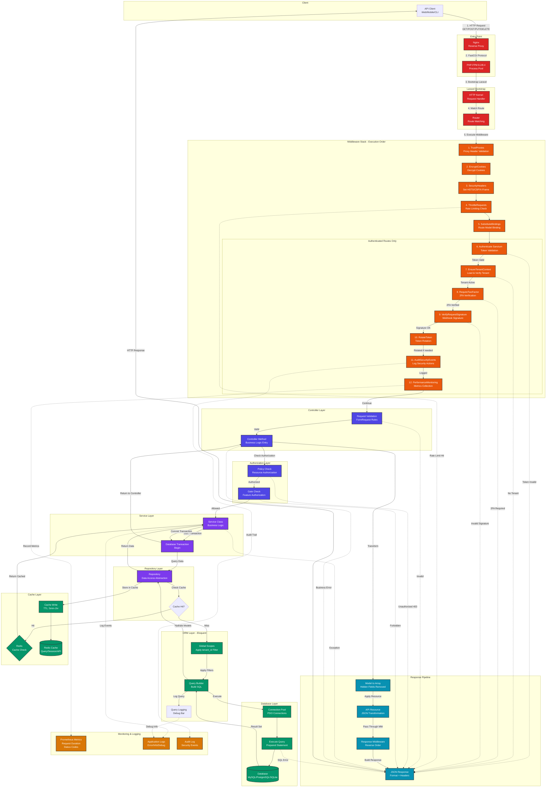
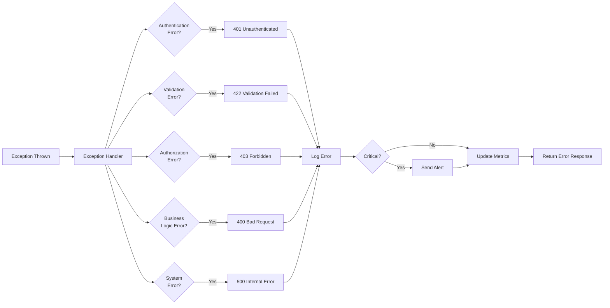

# CHOM Request Flow Architecture

This diagram shows the complete flow of an HTTP request through the CHOM application, from initial reception to response delivery.



## Request Flow Detailed Breakdown

### Phase 1: Request Reception (10-20ms)

```
1. Nginx Reverse Proxy
   - TLS termination
   - Static file serving (bypasses PHP)
   - Load balancing (if multiple PHP-FPM pools)
   - Request buffering

2. PHP-FPM Process Pool
   - Process manager: dynamic (min: 2, max: 10)
   - Request queuing if pool full
   - Process lifecycle management
```

### Phase 2: Laravel Bootstrap (5-15ms)

```php
3. HTTP Kernel (app/Http/Kernel.php)
   - Load application
   - Register middleware
   - Handle exceptions
   - Service provider booting

4. Router (routes/api.php)
   - Route matching: O(1) lookup via compiled routes
   - Parameter extraction
   - Route model binding preparation
```

### Phase 3: Middleware Execution (20-50ms)

#### Global Middleware (Always Executed)
```php
1. TrustProxies (2ms)
   - Validate X-Forwarded-* headers
   - Set trusted proxy IPs

2. EncryptCookies (3ms)
   - Decrypt incoming cookies
   - Prepare for encryption on response

3. SecurityHeaders (1ms)
   - Strict-Transport-Security: max-age=31536000
   - X-Content-Type-Options: nosniff
   - X-Frame-Options: DENY
   - Content-Security-Policy: default-src 'self'

4. ThrottleRequests (5ms)
   - Redis-based rate limiting
   - Key: {user_id}:{route}:{minute}
   - Limits: 5/min (auth), 60/min (api), 2/min (sensitive)

5. SubstituteBindings (8ms)
   - Route model binding
   - Fetch models by ID from route parameters
   - Applies global scopes (tenant filtering)
```

#### Authenticated Route Middleware
```php
6. Authenticate Sanctum (15ms)
   - Extract Bearer token from Authorization header
   - Query personal_access_tokens table
   - Verify token expiration
   - Load authenticated user
   - Check abilities/scopes

7. EnsureTenantContext (10ms)
   - Load user's current tenant
   - Verify tenant exists
   - Check tenant is active
   - Set tenant in request attributes
   - Make available to all downstream components

8. RequireTwoFactor (8ms)
   - Check if 2FA required for user role
   - Verify 2FA is enabled
   - Check session has 2FA verification
   - Validate verification timestamp (<24hrs)
   - Allow grace period for setup

9. VerifyRequestSignature (5ms)
   - For webhooks only (Stripe, etc.)
   - Calculate HMAC-SHA256 signature
   - Compare with header signature
   - Prevent replay attacks

10. RotateToken (12ms)
    - Check token age
    - If < 15min until expiry: create new token
    - Delete old token (after grace period)
    - Add X-New-Token header to response

11. AuditSecurityEvents (7ms)
    - Log security-relevant actions
    - Record: user, tenant, IP, action, resource
    - Calculate hash chain for integrity
    - Store in audit_logs table

12. PerformanceMonitoring (3ms)
    - Start request timer
    - Increment request counter
    - Track route-specific metrics
    - Prepared for response-time recording
```

### Phase 4: Controller & Authorization (10-30ms)

```php
// Request Validation (10ms)
- Run FormRequest rules
- Validate input types, formats, constraints
- Custom validation rules
- Early return on failure (422 response)

// Controller Method (5ms)
- Extract validated data
- Prepare for service call
- Handle method-specific logic

// Policy Check (8ms)
- Load applicable policy (e.g., SitePolicy)
- Run policy method (e.g., update())
- Check: user role, tenant ownership, resource status
- Return: authorize or deny (403)

// Gate Check (7ms)
- Feature-level authorization
- Check: subscriptions, tier limits, feature flags
- Example: Can user create more sites?
```

### Phase 5: Service Layer Execution (30-100ms)

```php
// Service Class (Variable duration)
class SiteService {
    public function createSite(array $data): Site {
        // 1. Business validation (5ms)
        $this->validateBusinessRules($data);

        // 2. Start database transaction (2ms)
        DB::beginTransaction();

        try {
            // 3. Create site record (15ms)
            $site = $this->repository->create($data);

            // 4. Allocate VPS (20ms)
            $vps = $this->vpsService->allocate($site);

            // 5. Dispatch background job (5ms)
            DeploySiteJob::dispatch($site);

            // 6. Update cached statistics (10ms)
            $site->tenant->updateCachedStats();

            // 7. Commit transaction (8ms)
            DB::commit();

            return $site;
        } catch (Exception $e) {
            DB::rollBack();
            throw $e;
        }
    }
}
```

### Phase 6: Repository & Database (20-80ms)

```php
// Repository Layer (10ms)
- Abstraction over Eloquent
- Caching logic
- Query optimization

// Cache Check (5ms)
$cacheKey = "sites:tenant:{$tenantId}:list";
if (Cache::has($cacheKey)) {
    return Cache::get($cacheKey); // ~2ms from Redis
}

// Global Scopes (8ms)
- Automatically applied to all queries
- tenant_id filter
- soft delete filter
- Example: WHERE tenant_id = '{current_tenant_id}'

// Query Builder (15ms)
- Build SQL with parameter binding
- Apply eager loading (with relations)
- Apply query scopes
- Log query to debugbar

// Connection Pool (5ms)
- Reuse existing PDO connection
- Or establish new connection (100ms if cold)

// Execute Query (30ms average)
SELECT * FROM sites
WHERE tenant_id = ?
  AND deleted_at IS NULL
ORDER BY created_at DESC
LIMIT 20;

// Hydrate Models (20ms)
- Convert result rows to Eloquent models
- Cast attributes (dates, booleans, encrypted fields)
- Load relationships

// Cache Write (3ms)
Cache::put($cacheKey, $sites, 300); // 5 min TTL
```

### Phase 7: Response Construction (10-20ms)

```php
// Model to Array (5ms)
- Remove hidden fields (passwords, keys)
- Apply casts
- Include relationships

// API Resource Transformation (8ms)
class SiteResource extends JsonResource {
    public function toArray($request) {
        return [
            'id' => $this->id,
            'domain' => $this->domain,
            'type' => $this->site_type,
            'status' => $this->status,
            'ssl_enabled' => $this->ssl_enabled,
            'url' => $this->getUrl(),
            'created_at' => $this->created_at->toIso8601String(),
        ];
    }
}

// Response Middleware (Reverse Order) (5ms)
- Execute middleware terminate() methods
- PerformanceMonitoring: record duration
- AuditSecurityEvents: finalize log entry

// JSON Response (2ms)
- Wrap in standard envelope
- Add response headers
- Set status code
```

### Phase 8: Response Delivery

```php
// Response Format
{
    "success": true,
    "data": { /* resource */ },
    "meta": {
        "total": 15,
        "per_page": 20,
        "current_page": 1
    }
}

// Headers
Content-Type: application/json
X-New-Token: {rotated_token} // if token rotation occurred
X-RateLimit-Limit: 60
X-RateLimit-Remaining: 55
X-Request-ID: uuid

// Nginx sends to client
- Gzip compression
- Keep-alive connection
- Response buffering
```

## Error Handling Flow



## Performance Benchmarks

### Typical Request Timings
```
Metric                          Cold Start    Warm (Cached)
─────────────────────────────────────────────────────────────
Total Request Time              250-400ms     80-150ms
├─ Nginx + PHP-FPM             10-20ms       10-20ms
├─ Laravel Bootstrap           15-30ms       5-15ms
├─ Middleware Stack            50-80ms       20-50ms
├─ Authorization               15-25ms       10-20ms
├─ Database Query              50-120ms      2-5ms (cached)
├─ Business Logic              30-80ms       30-80ms
└─ Response Construction       10-20ms       10-20ms

Database Queries per Request    2-8 queries   0-2 queries (cached)
Memory Usage                    25-35 MB      20-30 MB
CPU Time                        100-200ms     50-100ms
```

### Optimization Strategies Applied

1. **Query Optimization**
   - Eager loading relationships (N+1 prevention)
   - Index optimization on tenant_id, status, created_at
   - Cached aggregates for counts/sums

2. **Caching Strategy**
   - Redis for session, query, API response caching
   - Cache warming for frequently accessed data
   - TTL: 5 min (dynamic), 1 hour (static)

3. **Connection Pooling**
   - Redis: persistent connections
   - Database: PDO connection reuse
   - SSH: connection pool for VPS management

4. **Global Scopes Optimization**
   - Tenant filtering at database level
   - Prevents full table scans
   - Indexed columns for fast lookups

5. **Background Processing**
   - Long-running tasks queued (deployment, backups)
   - Immediate response to client
   - Status polling for completion
