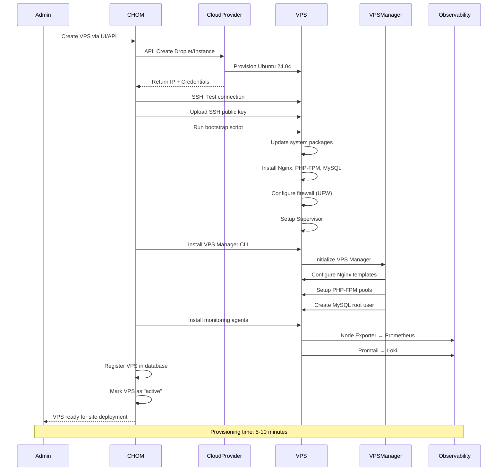
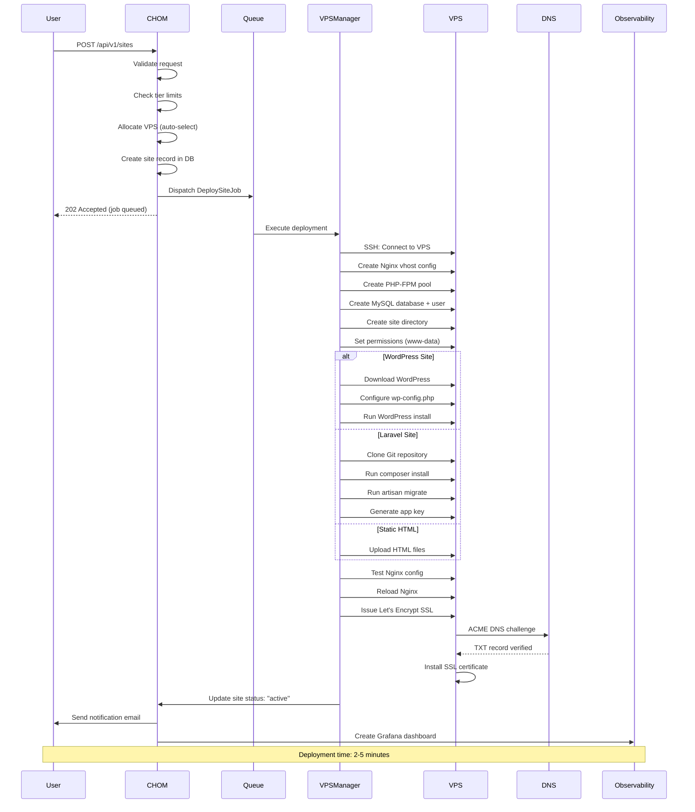
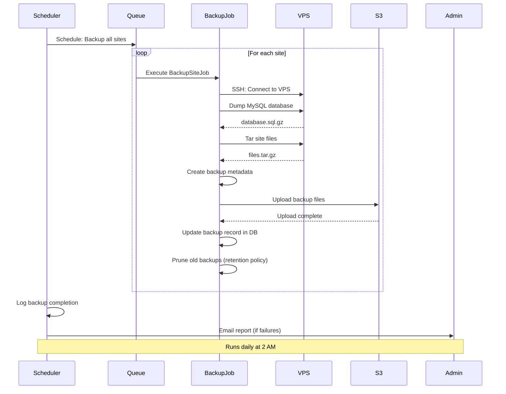

# CHOM Deployment Architecture

This diagram illustrates the complete deployment architecture including VPS provisioning, infrastructure setup, and monitoring integration.

```mermaid
graph TB
    subgraph "Control Plane Server"
        subgraph "CHOM Application"
            APP[Laravel 12 Application<br/>Nginx + PHP-FPM 8.2]
            QUEUE_WORKER[Queue Workers<br/>Background Jobs]
            SCHEDULER[Task Scheduler<br/>Cron Jobs]
        end

        subgraph "Data Storage"
            DB[(PostgreSQL/MySQL<br/>Primary Database)]
            REDIS[(Redis 7<br/>Cache + Queue + Sessions)]
            FILES[Local Storage<br/>Backups/Keys/Uploads]
        end

        subgraph "Deployment Tools"
            DEPLOYER[Deploy Script<br/>deploy-enhanced.sh]
            GIT[Git Repository<br/>Version Control]
            COMPOSER[Composer<br/>PHP Dependencies]
            NPM[NPM<br/>Asset Building]
        end
    end

    subgraph "Managed VPS Fleet"
        subgraph "VPS Provisioning"
            VPS_NEW[New VPS<br/>Fresh Ubuntu 24.04]
            VPS_MANAGER[VPS Manager CLI<br/>Deployment Tool]
            BOOTSTRAP[Bootstrap Script<br/>Initial Setup]
        end

        subgraph "VPS 1 - Shared Hosting"
            subgraph "System Services"
                NGINX1[Nginx<br/>Web Server + Reverse Proxy]
                PHP_FPM1[PHP-FPM 8.2/8.4<br/>Process Pools per Site]
                MYSQL1[MySQL 8.0<br/>Database Server]
                SUPERVISOR1[Supervisor<br/>Process Management]
            end

            subgraph "Monitoring Agents"
                NODE_EXP1[Node Exporter<br/>:9100]
                NGINX_EXP1[Nginx Exporter<br/>:9113]
                MYSQL_EXP1[MySQL Exporter<br/>:9104]
                PROMTAIL1[Promtail<br/>Log Shipper]
            end

            subgraph "Customer Sites"
                SITE1A[Site 1<br/>WordPress]
                SITE1B[Site 2<br/>Laravel]
                SITE1C[Site 3<br/>Static HTML]
            end
        end

        subgraph "VPS 2 - Shared Hosting"
            NGINX2[Nginx + Sites]
            PHP_FPM2[PHP-FPM]
            MYSQL2[MySQL]
            EXPORTERS2[Exporters<br/>Node/Nginx/MySQL]
            PROMTAIL2[Promtail]
        end

        subgraph "VPS 3 - Dedicated Hosting"
            NGINX3[Nginx + Site]
            PHP_FPM3[PHP-FPM]
            MYSQL3[MySQL]
            EXPORTERS3[Exporters]
            PROMTAIL3[Promtail]
        end
    end

    subgraph "Observability Stack Server"
        subgraph "Metrics"
            PROMETHEUS[Prometheus<br/>:9090<br/>Metrics Collection + Storage]
            PROM_CONFIG[prometheus.yml<br/>Scrape Configs<br/>Alert Rules]
        end

        subgraph "Logs"
            LOKI[Loki<br/>:3100<br/>Log Aggregation + Storage]
            LOKI_CONFIG[loki-config.yml<br/>Retention Policies]
        end

        subgraph "Visualization"
            GRAFANA[Grafana<br/>:3000<br/>Dashboards + Alerts]
            DASHBOARDS[Pre-built Dashboards<br/>Per-Site/Per-VPS/Fleet]
        end

        subgraph "Alerting"
            ALERTMANAGER[AlertManager<br/>:9093<br/>Alert Routing]
            ALERT_CONFIG[alert-rules.yml<br/>Thresholds + Routes]
        end
    end

    subgraph "External Services"
        CLOUD_PROVIDER[Cloud Provider<br/>DigitalOcean/Linode/Vultr]
        STRIPE_API[Stripe API<br/>Billing + Webhooks]
        EMAIL_SVC[SMTP Service<br/>SendGrid/SES]
        DNS_PROVIDER[DNS Provider<br/>Domain Management]
        S3_STORAGE[S3/Object Storage<br/>Off-site Backups]
    end

    subgraph "Administrator"
        ADMIN[DevOps Admin]
        MONITORING[Monitoring Dashboard<br/>Grafana]
    end

    %% Deployment Flow
    ADMIN -->|1. Run deploy-enhanced.sh| DEPLOYER
    DEPLOYER -->|2. Pull latest code| GIT
    GIT -->|3. Install dependencies| COMPOSER
    COMPOSER -->|4. Build assets| NPM
    NPM -->|5. Run migrations| DB
    DB -->|6. Cache configs| REDIS
    REDIS -->|7. Restart services| APP
    APP -->|8. Deploy complete| ADMIN

    %% VPS Provisioning Flow
    ADMIN -->|Create VPS via API| CLOUD_PROVIDER
    CLOUD_PROVIDER -->|Provision server| VPS_NEW
    VPS_NEW -->|Register in CHOM| APP
    APP -->|SSH + Run bootstrap| BOOTSTRAP
    BOOTSTRAP -->|Install VPS Manager| VPS_MANAGER
    VPS_MANAGER -->|Setup LEMP stack| NGINX1
    VPS_MANAGER -->|Configure services| PHP_FPM1
    VPS_MANAGER -->|Install MySQL| MYSQL1
    VPS_MANAGER -->|Setup monitoring| NODE_EXP1
    VPS_MANAGER -->|Configure Promtail| PROMTAIL1
    VPS_MANAGER -->|Ready for sites| APP

    %% Site Deployment Flow
    APP -->|Deploy site command| QUEUE_WORKER
    QUEUE_WORKER -->|SSH connection| VPS_MANAGER
    VPS_MANAGER -->|Create vhost| NGINX1
    VPS_MANAGER -->|Setup PHP pool| PHP_FPM1
    VPS_MANAGER -->|Create database| MYSQL1
    VPS_MANAGER -->|Deploy files| SITE1A
    VPS_MANAGER -->|Issue SSL cert| NGINX1
    VPS_MANAGER -->|Reload Nginx| NGINX1
    NGINX1 -->|Serve traffic| SITE1A

    %% Monitoring Flow
    NODE_EXP1 -->|Scrape :9100/metrics| PROMETHEUS
    NGINX_EXP1 -->|Scrape :9113/metrics| PROMETHEUS
    MYSQL_EXP1 -->|Scrape :9104/metrics| PROMETHEUS
    EXPORTERS2 -->|Metrics| PROMETHEUS
    EXPORTERS3 -->|Metrics| PROMETHEUS

    PROMTAIL1 -->|Ship logs| LOKI
    PROMTAIL2 -->|Ship logs| LOKI
    PROMTAIL3 -->|Ship logs| LOKI

    PROMETHEUS -->|Query metrics| GRAFANA
    LOKI -->|Query logs| GRAFANA
    PROMETHEUS -->|Evaluate rules| PROM_CONFIG
    PROM_CONFIG -->|Fire alerts| ALERTMANAGER
    ALERTMANAGER -->|Route notifications| EMAIL_SVC
    ALERTMANAGER -->|Route to Slack/PagerDuty| ADMIN

    %% Application Integration
    APP -->|Query metrics API| PROMETHEUS
    APP -->|Query logs API| LOKI
    APP -->|Create dashboards API| GRAFANA

    %% Scheduled Tasks
    SCHEDULER -->|Health checks| QUEUE_WORKER
    SCHEDULER -->|Backup sites| QUEUE_WORKER
    SCHEDULER -->|SSL renewal| QUEUE_WORKER
    SCHEDULER -->|Usage metering| DB
    QUEUE_WORKER -->|Execute backups| VPS_MANAGER
    VPS_MANAGER -->|Backup files/DB| SITE1A
    SITE1A -->|Upload backup| S3_STORAGE

    %% External Integrations
    APP <-->|API + Webhooks| STRIPE_API
    APP -->|Send emails| EMAIL_SVC
    APP -->|DNS challenges| DNS_PROVIDER

    %% Admin Monitoring
    ADMIN -->|View dashboards| GRAFANA
    GRAFANA -->|Display metrics| MONITORING
    ALERTMANAGER -->|Alert notifications| MONITORING

    %% Data Persistence
    APP --> DB
    APP --> REDIS
    APP --> FILES
    PROMETHEUS -.->|Store metrics| FILES
    LOKI -.->|Store logs| FILES

    %% Styling
    classDef control fill:#4f46e5,stroke:#333,stroke-width:2px,color:#fff
    classDef vps fill:#0891b2,stroke:#333,stroke-width:2px,color:#fff
    classDef observability fill:#ea580c,stroke:#333,stroke-width:2px,color:#fff
    classDef external fill:#7c3aed,stroke:#333,stroke-width:2px,color:#fff
    classDef admin fill:#dc2626,stroke:#333,stroke-width:2px,color:#fff
    classDef storage fill:#059669,stroke:#333,stroke-width:2px,color:#fff

    class APP,QUEUE_WORKER,SCHEDULER,DEPLOYER,GIT,COMPOSER,NPM control
    class VPS_NEW,VPS_MANAGER,BOOTSTRAP,NGINX1,NGINX2,NGINX3,PHP_FPM1,PHP_FPM2,PHP_FPM3,MYSQL1,MYSQL2,MYSQL3,SUPERVISOR1 vps
    class SITE1A,SITE1B,SITE1C vps
    class PROMETHEUS,LOKI,GRAFANA,ALERTMANAGER,NODE_EXP1,NGINX_EXP1,MYSQL_EXP1,PROMTAIL1,EXPORTERS2,EXPORTERS3,PROMTAIL2,PROMTAIL3 observability
    class CLOUD_PROVIDER,STRIPE_API,EMAIL_SVC,DNS_PROVIDER,S3_STORAGE external
    class ADMIN,MONITORING admin
    class DB,REDIS,FILES storage
```



## Deployment Architecture Overview

### Infrastructure Layers

#### 1. Control Plane Server
Single server running the CHOM Laravel application that manages the entire fleet.

```yaml
Server Specifications:
  - OS: Ubuntu 24.04 LTS
  - CPU: 4+ cores
  - RAM: 8+ GB
  - Storage: 100+ GB SSD
  - Network: 100+ Mbps

Software Stack:
  - Nginx: Reverse proxy + static files
  - PHP-FPM 8.2: Application server
  - PostgreSQL/MySQL: Primary database
  - Redis 7: Cache + Queue + Sessions
  - Supervisor: Process management (queue workers)

Services Running:
  - Laravel Application (port 80/443)
  - Queue Workers (4-8 processes)
  - Task Scheduler (cron)
  - Redis Server (port 6379)
  - Database Server (port 5432/3306)
```

#### 2. Managed VPS Fleet
Multiple VPS servers hosting customer sites, managed via SSH by CHOM.

```yaml
VPS Types:
  Shared VPS:
    - Hosts: 10-50 sites
    - Allocation: Dynamic based on capacity
    - Isolation: PHP-FPM pools per site
    - Use case: Starter/Pro tier customers

  Dedicated VPS:
    - Hosts: 1 site
    - Allocation: Reserved for single tenant
    - Isolation: Full server resources
    - Use case: Enterprise tier customers

Standard VPS Specs:
  - OS: Ubuntu 24.04 LTS
  - CPU: 2-4 cores
  - RAM: 4-8 GB
  - Storage: 50-200 GB SSD
  - Network: 1-5 TB bandwidth

Software Stack (LEMP):
  - Nginx: Web server + virtual hosts
  - PHP-FPM: Multiple versions (8.2, 8.4)
  - MySQL 8.0: Database server
  - Supervisor: Process management
  - Certbot: SSL certificate management

Monitoring Agents:
  - Node Exporter: System metrics
  - Nginx Exporter: Web server metrics
  - MySQL Exporter: Database metrics
  - Promtail: Log shipping to Loki
```

#### 3. Observability Stack Server
Dedicated server running the Mentat observability platform.

```yaml
Server Specifications:
  - OS: Ubuntu 24.04 LTS
  - CPU: 4+ cores
  - RAM: 16+ GB (metrics storage)
  - Storage: 500+ GB SSD (time-series data)
  - Network: 100+ Mbps

Services Running:
  - Prometheus (port 9090): Metrics collection
  - Loki (port 3100): Log aggregation
  - Grafana (port 3000): Visualization
  - AlertManager (port 9093): Alert routing

Data Retention:
  - Metrics: 30-90 days (configurable per tenant)
  - Logs: 7-30 days (configurable per tenant)
  - Backups: Daily snapshots to S3
```

## Deployment Workflows

### 1. Control Plane Deployment

```bash
# /home/calounx/repositories/mentat/chom/deploy/deploy-enhanced.sh

Deployment Steps:
1. Pre-deployment checks
   - Verify server connectivity
   - Check disk space (>2GB free)
   - Validate environment variables
   - Test database connection

2. Application update
   - Create backup of current deployment
   - Pull latest code from Git repository
   - Install Composer dependencies (production)
   - Install NPM dependencies
   - Build frontend assets (Vite)

3. Database migration
   - Run pending migrations
   - No automatic rollback (manual intervention)
   - Seed data if first deployment

4. Cache & configuration
   - Clear all caches (config, route, view)
   - Rebuild optimized cache files
   - Generate route cache for performance
   - Optimize autoloader

5. Service restart
   - Reload PHP-FPM
   - Restart queue workers (zero downtime)
   - Restart task scheduler
   - Clear Redis cache (optional)

6. Post-deployment verification
   - Health check endpoint test
   - Database connectivity check
   - Redis connectivity check
   - Queue worker status check

7. Rollback (if failure)
   - Restore previous deployment
   - Rollback database migrations
   - Restart services
   - Alert administrator

Deployment Time: 3-5 minutes
Downtime: ~10 seconds (service restart)
```

### 2. VPS Provisioning Workflow



### 3. Site Deployment Workflow



### 4. Backup Workflow



## Infrastructure Automation

### Server Provisioning Scripts

```bash
# Bootstrap script run on new VPS
#!/bin/bash

# 1. System update
apt-get update && apt-get upgrade -y

# 2. Install base packages
apt-get install -y \
    nginx \
    php8.2-fpm php8.2-cli php8.2-mysql php8.2-xml php8.2-mbstring \
    mysql-server \
    git curl wget unzip \
    certbot python3-certbot-nginx \
    supervisor \
    ufw

# 3. Configure firewall
ufw allow 22/tcp   # SSH
ufw allow 80/tcp   # HTTP
ufw allow 443/tcp  # HTTPS
ufw allow 9100/tcp # Node Exporter
ufw --force enable

# 4. Install VPS Manager CLI
wget https://github.com/mentat/vpsmanager/releases/latest/vpsmanager.phar
chmod +x vpsmanager.phar
mv vpsmanager.phar /usr/local/bin/vpsmanager

# 5. Initialize VPS Manager
vpsmanager init \
    --nginx-template=/etc/nginx/sites-available/site.template \
    --php-version=8.2 \
    --mysql-version=8.0

# 6. Install monitoring agents
# Node Exporter for system metrics
wget https://github.com/prometheus/node_exporter/releases/latest/download/node_exporter-linux-amd64.tar.gz
tar -xzf node_exporter-linux-amd64.tar.gz
mv node_exporter /usr/local/bin/
# Create systemd service for Node Exporter
cat > /etc/systemd/system/node_exporter.service <<EOF
[Unit]
Description=Node Exporter
[Service]
ExecStart=/usr/local/bin/node_exporter
[Install]
WantedBy=multi-user.target
EOF
systemctl enable node_exporter
systemctl start node_exporter

# Promtail for log shipping
wget https://github.com/grafana/loki/releases/latest/download/promtail-linux-amd64.zip
unzip promtail-linux-amd64.zip
mv promtail-linux-amd64 /usr/local/bin/promtail
# Configure Promtail to ship logs to Loki
cat > /etc/promtail-config.yml <<EOF
server:
  http_listen_port: 9080
positions:
  filename: /tmp/positions.yaml
clients:
  - url: http://loki.example.com:3100/loki/api/v1/push
scrape_configs:
  - job_name: system
    static_configs:
      - targets:
          - localhost
        labels:
          job: varlogs
          __path__: /var/log/*.log
EOF
systemctl enable promtail
systemctl start promtail

# 7. Harden security
# Disable password authentication for SSH
sed -i 's/#PasswordAuthentication yes/PasswordAuthentication no/' /etc/ssh/sshd_config
systemctl restart sshd

# 8. Complete
echo "VPS provisioning complete"
```

### Continuous Deployment

```yaml
# .github/workflows/deploy.yml
name: Deploy CHOM

on:
  push:
    branches: [main, production]

jobs:
  deploy:
    runs-on: ubuntu-latest
    steps:
      - name: Checkout code
        uses: actions/checkout@v3

      - name: Setup SSH key
        run: |
          mkdir -p ~/.ssh
          echo "${{ secrets.SSH_PRIVATE_KEY }}" > ~/.ssh/id_rsa
          chmod 600 ~/.ssh/id_rsa

      - name: Run deployment script
        run: |
          ssh deploy@chom.example.com 'bash -s' < deploy/deploy-enhanced.sh

      - name: Verify deployment
        run: |
          curl -f https://chom.example.com/health || exit 1

      - name: Notify on failure
        if: failure()
        run: |
          curl -X POST ${{ secrets.SLACK_WEBHOOK }} \
            -d '{"text":"CHOM deployment failed"}'
```

## Scaling Strategies

### Horizontal Scaling

```
VPS Fleet Scaling:
┌─────────────────────────────────────────────────┐
│ Auto-scaling Trigger (70% capacity)             │
├─────────────────────────────────────────────────┤
│ 1. Detect capacity threshold reached            │
│ 2. Provision new VPS via cloud API              │
│ 3. Bootstrap VPS with standard stack            │
│ 4. Register in CHOM database                    │
│ 5. Start accepting site deployments             │
└─────────────────────────────────────────────────┘

Control Plane Scaling:
┌─────────────────────────────────────────────────┐
│ Load Balancing (if needed)                      │
├─────────────────────────────────────────────────┤
│ 1. Deploy multiple CHOM instances               │
│ 2. Shared database + Redis cluster              │
│ 3. Load balancer (Nginx/HAProxy)                │
│ 4. Session affinity not required (stateless)    │
└─────────────────────────────────────────────────┘
```

### Vertical Scaling

```
Database Scaling:
- Initial: 8 GB RAM, 4 CPU cores
- Growth: 32 GB RAM, 16 CPU cores
- Read replicas for reporting queries

Redis Scaling:
- Initial: 4 GB RAM
- Growth: 16 GB RAM
- Redis Cluster for distributed cache

VPS Upgrade Path:
- Start: 2 CPU, 4 GB RAM, 50 GB disk
- Mid: 4 CPU, 8 GB RAM, 100 GB disk
- Large: 8 CPU, 16 GB RAM, 200 GB disk
```

## Disaster Recovery

### Backup Strategy

```yaml
Control Plane Backups:
  Database:
    - Frequency: Every 6 hours
    - Retention: 30 days
    - Storage: S3 with versioning
    - Method: pg_dump with compression

  Application Files:
    - Frequency: Daily
    - Retention: 7 days
    - Includes: .env, storage, uploads
    - Excludes: vendor, node_modules

  Redis:
    - Frequency: Daily snapshot
    - Retention: 7 days
    - RDB persistence enabled

VPS Backups:
  Customer Sites:
    - Frequency: Daily (configurable per tier)
    - Retention: 7-90 days (tier-dependent)
    - Storage: S3 with lifecycle policies
    - Includes: Files + Database dumps

  VPS Snapshots:
    - Frequency: Weekly
    - Retention: 4 weeks
    - Provider: Cloud provider snapshots
    - Recovery: Full VPS restore
```

### High Availability Setup (Optional)

```
┌──────────────────────────────────────────────┐
│ Load Balancer (Nginx/HAProxy)               │
├──────────────────────────────────────────────┤
│ CHOM Instance 1 (Active)                     │
│ CHOM Instance 2 (Active)                     │
├──────────────────────────────────────────────┤
│ Database Primary + Replica (Streaming)      │
├──────────────────────────────────────────────┤
│ Redis Sentinel (3 nodes for quorum)         │
└──────────────────────────────────────────────┘

Benefits:
- Zero downtime deployments
- Automatic failover (< 30s)
- Distributed load
- Geographic redundancy
```
