# CHOM Database Schema

This diagram illustrates the complete database schema including all tables, relationships, and tenant isolation structure.

```mermaid
erDiagram
    organizations ||--o{ users : "has many"
    organizations ||--o{ tenants : "has many"
    organizations ||--o| subscriptions : "has one"
    organizations ||--o{ invoices : "has many"
    organizations ||--o{ audit_logs : "has many"

    users ||--o| organizations : "belongs to"
    users ||--o{ operations : "initiates"
    users ||--o{ personal_access_tokens : "has many"

    tenants ||--o| organizations : "belongs to"
    tenants ||--o{ sites : "has many"
    tenants ||--o{ vps_allocations : "has many"
    tenants ||--o{ usage_records : "has many"
    tenants ||--o{ operations : "tracks"
    tenants ||--o| tier_limits : "has limits"

    sites ||--o| tenants : "belongs to"
    sites ||--o| vps_servers : "hosted on"
    sites ||--o{ site_backups : "has backups"

    vps_servers ||--o{ sites : "hosts"
    vps_servers ||--o{ vps_allocations : "has allocations"

    vps_allocations ||--o| tenants : "allocated to"
    vps_allocations ||--o| vps_servers : "allocated from"

    site_backups ||--o| sites : "backup of"

    subscriptions ||--o| organizations : "belongs to"

    invoices ||--o| organizations : "belongs to"
    invoices ||--o| subscriptions : "related to"

    usage_records ||--o| tenants : "belongs to"

    operations ||--o| users : "initiated by"
    operations ||--o| tenants : "belongs to"

    audit_logs ||--o| organizations : "belongs to"

    tier_limits ||--o{ tenants : "applies to"

    organizations {
        uuid id PK
        string name
        string slug UK
        string billing_email
        string stripe_customer_id "Encrypted"
        timestamp created_at
        timestamp updated_at
    }

    users {
        uuid id PK
        uuid organization_id FK
        string name
        string email UK
        string password "Hashed"
        enum role "owner,admin,member,viewer"
        boolean two_factor_enabled
        text two_factor_secret "Encrypted"
        json two_factor_backup_codes "Encrypted"
        timestamp two_factor_confirmed_at
        timestamp password_confirmed_at
        timestamp ssh_key_rotated_at
        timestamp email_verified_at
        timestamp created_at
        timestamp updated_at
    }

    tenants {
        uuid id PK
        uuid organization_id FK
        string name
        string slug UK
        enum tier "starter,pro,enterprise"
        enum status "active,suspended,cancelled"
        json settings
        integer metrics_retention_days
        integer cached_storage_mb
        integer cached_sites_count
        timestamp cached_at
        timestamp created_at
        timestamp updated_at
    }

    sites {
        uuid id PK
        uuid tenant_id FK "Tenant Isolation"
        uuid vps_id FK
        string domain UK
        enum site_type "wordpress,laravel,html"
        string php_version "8.2,8.4"
        boolean ssl_enabled
        timestamp ssl_expires_at
        enum status "deploying,active,suspended,failed"
        string document_root
        string db_name
        string db_user
        integer storage_used_mb
        json settings
        timestamp created_at
        timestamp updated_at
        timestamp deleted_at "Soft Delete"
    }

    vps_servers {
        uuid id PK
        string hostname
        string ip_address UK
        enum provider "digitalocean,linode,vultr,custom"
        string provider_id
        string region
        integer spec_cpu
        integer spec_memory_mb
        integer spec_disk_gb
        enum status "provisioning,active,maintenance,decommissioned"
        enum allocation_type "shared,dedicated"
        string vpsmanager_version
        boolean observability_configured
        string ssh_key_id
        text ssh_private_key "Encrypted"
        text ssh_public_key "Encrypted"
        timestamp key_rotated_at
        timestamp last_health_check_at
        enum health_status "healthy,degraded,unhealthy,unknown"
        timestamp created_at
        timestamp updated_at
    }

    vps_allocations {
        uuid id PK
        uuid vps_id FK
        uuid tenant_id FK
        integer memory_mb_allocated
        integer disk_gb_allocated
        timestamp allocated_at
        timestamp released_at
        timestamp created_at
        timestamp updated_at
    }

    site_backups {
        uuid id PK
        uuid site_id FK
        enum type "full,database,files"
        string storage_path
        integer size_mb
        enum status "pending,completed,failed,restored"
        text error_message
        json metadata
        timestamp completed_at
        timestamp expires_at
        timestamp created_at
        timestamp updated_at
    }

    subscriptions {
        uuid id PK
        uuid organization_id FK
        enum tier "starter,pro,enterprise"
        enum status "active,trialing,past_due,cancelled"
        string stripe_subscription_id
        timestamp trial_ends_at
        timestamp ends_at
        timestamp created_at
        timestamp updated_at
    }

    invoices {
        uuid id PK
        uuid organization_id FK
        uuid subscription_id FK
        string stripe_invoice_id
        decimal amount_total
        decimal amount_paid
        enum status "draft,open,paid,void,uncollectible"
        timestamp due_date
        timestamp paid_at
        string invoice_url
        timestamp created_at
        timestamp updated_at
    }

    usage_records {
        uuid id PK
        uuid tenant_id FK
        enum resource_type "sites,storage,bandwidth"
        integer quantity
        decimal unit_price
        decimal total_price
        date recorded_date
        timestamp created_at
        timestamp updated_at
    }

    operations {
        uuid id PK
        uuid tenant_id FK "Tenant Isolation"
        uuid user_id FK
        enum type "site_deploy,site_update,site_delete,backup_create,backup_restore"
        enum status "pending,running,completed,failed"
        json parameters
        text output
        text error_message
        timestamp started_at
        timestamp completed_at
        timestamp created_at
        timestamp updated_at
    }

    audit_logs {
        uuid id PK
        uuid organization_id FK
        uuid user_id FK
        string action
        string resource_type
        uuid resource_id
        json metadata
        string ip_address
        string user_agent
        string previous_hash "Hash Chain"
        string hash "SHA-256"
        timestamp created_at
    }

    tier_limits {
        string tier PK "starter,pro,enterprise"
        integer max_sites "-1 = unlimited"
        integer max_storage_gb "-1 = unlimited"
        integer max_bandwidth_gb "-1 = unlimited"
        integer backups_retention_days
        boolean staging_environments
        boolean white_label
        boolean priority_support
        timestamp created_at
        timestamp updated_at
    }

    personal_access_tokens {
        bigint id PK
        string tokenable_type
        uuid tokenable_id FK
        string name
        string token UK "Hashed"
        json abilities
        timestamp last_used_at
        timestamp expires_at
        timestamp created_at
        timestamp updated_at
    }
```



## Database Schema Overview

### Multi-Tenancy Architecture

CHOM implements a **hybrid multi-tenancy model** with three levels:

```
Organization (Billing Entity)
    └── Tenant (Isolation Unit)
            └── Sites (Resources)
```

#### Tenant Isolation Implementation

```php
// Global Scope automatically applied to all queries
Site::all(); // WHERE tenant_id = '{current_tenant_id}'

// Defined in Site model
protected static function booted(): void {
    static::addGlobalScope('tenant', function ($builder) {
        if (auth()->check() && auth()->user()->currentTenant()) {
            $builder->where('tenant_id', auth()->user()->currentTenant()->id);
        }
    });
}
```

### Core Tables

#### 1. Organizations Table
```sql
-- Billing and top-level entity
-- Links to Stripe for subscription management
CREATE TABLE organizations (
    id UUID PRIMARY KEY,
    name VARCHAR(255) NOT NULL,
    slug VARCHAR(255) UNIQUE NOT NULL,
    billing_email VARCHAR(255) NOT NULL,
    stripe_customer_id VARCHAR(255), -- Encrypted in app layer
    created_at TIMESTAMP NOT NULL,
    updated_at TIMESTAMP NOT NULL,
    INDEX idx_slug (slug),
    INDEX idx_stripe_customer (stripe_customer_id)
);
```

#### 2. Users Table
```sql
-- User accounts with role-based access
-- 2FA fields for enhanced security
CREATE TABLE users (
    id UUID PRIMARY KEY,
    organization_id UUID NOT NULL,
    name VARCHAR(255) NOT NULL,
    email VARCHAR(255) UNIQUE NOT NULL,
    password VARCHAR(255) NOT NULL, -- bcrypt hashed
    role ENUM('owner', 'admin', 'member', 'viewer') NOT NULL DEFAULT 'member',
    two_factor_enabled BOOLEAN NOT NULL DEFAULT FALSE,
    two_factor_secret TEXT, -- Encrypted with APP_KEY
    two_factor_backup_codes JSON, -- Encrypted array
    two_factor_confirmed_at TIMESTAMP,
    password_confirmed_at TIMESTAMP, -- Step-up auth
    ssh_key_rotated_at TIMESTAMP,
    email_verified_at TIMESTAMP,
    created_at TIMESTAMP NOT NULL,
    updated_at TIMESTAMP NOT NULL,
    FOREIGN KEY (organization_id) REFERENCES organizations(id) ON DELETE CASCADE,
    INDEX idx_email (email),
    INDEX idx_organization_role (organization_id, role),
    INDEX idx_2fa_enabled (two_factor_enabled)
);
```

#### 3. Tenants Table
```sql
-- Tenant isolation unit
-- Cached aggregates for performance
CREATE TABLE tenants (
    id UUID PRIMARY KEY,
    organization_id UUID NOT NULL,
    name VARCHAR(255) NOT NULL,
    slug VARCHAR(255) UNIQUE NOT NULL,
    tier ENUM('starter', 'pro', 'enterprise') NOT NULL DEFAULT 'starter',
    status ENUM('active', 'suspended', 'cancelled') NOT NULL DEFAULT 'active',
    settings JSON,
    metrics_retention_days INTEGER NOT NULL DEFAULT 30,
    cached_storage_mb INTEGER NOT NULL DEFAULT 0, -- Performance optimization
    cached_sites_count INTEGER NOT NULL DEFAULT 0, -- Performance optimization
    cached_at TIMESTAMP, -- Cache freshness
    created_at TIMESTAMP NOT NULL,
    updated_at TIMESTAMP NOT NULL,
    FOREIGN KEY (organization_id) REFERENCES organizations(id) ON DELETE CASCADE,
    INDEX idx_slug (slug),
    INDEX idx_organization (organization_id),
    INDEX idx_tier (tier),
    INDEX idx_status (status)
);
```

#### 4. Sites Table
```sql
-- Customer sites with tenant isolation
-- Global scope automatically filters by tenant_id
CREATE TABLE sites (
    id UUID PRIMARY KEY,
    tenant_id UUID NOT NULL, -- CRITICAL: Tenant isolation
    vps_id UUID NOT NULL,
    domain VARCHAR(255) UNIQUE NOT NULL,
    site_type ENUM('wordpress', 'laravel', 'html') NOT NULL,
    php_version VARCHAR(10) NOT NULL DEFAULT '8.2',
    ssl_enabled BOOLEAN NOT NULL DEFAULT FALSE,
    ssl_expires_at TIMESTAMP,
    status ENUM('deploying', 'active', 'suspended', 'failed') NOT NULL DEFAULT 'deploying',
    document_root VARCHAR(255),
    db_name VARCHAR(255),
    db_user VARCHAR(255),
    storage_used_mb INTEGER NOT NULL DEFAULT 0,
    settings JSON,
    created_at TIMESTAMP NOT NULL,
    updated_at TIMESTAMP NOT NULL,
    deleted_at TIMESTAMP, -- Soft delete
    FOREIGN KEY (tenant_id) REFERENCES tenants(id) ON DELETE CASCADE,
    FOREIGN KEY (vps_id) REFERENCES vps_servers(id) ON DELETE RESTRICT,
    INDEX idx_tenant (tenant_id), -- CRITICAL: Performance for tenant queries
    INDEX idx_vps (vps_id),
    INDEX idx_domain (domain),
    INDEX idx_status (status),
    INDEX idx_ssl_expiry (ssl_expires_at),
    INDEX idx_deleted (deleted_at)
);
```

#### 5. VPS Servers Table
```sql
-- Managed VPS fleet
-- SSH keys encrypted at rest
CREATE TABLE vps_servers (
    id UUID PRIMARY KEY,
    hostname VARCHAR(255) NOT NULL,
    ip_address VARCHAR(45) UNIQUE NOT NULL, -- IPv4/IPv6
    provider ENUM('digitalocean', 'linode', 'vultr', 'custom') NOT NULL,
    provider_id VARCHAR(255),
    region VARCHAR(100),
    spec_cpu INTEGER NOT NULL,
    spec_memory_mb INTEGER NOT NULL,
    spec_disk_gb INTEGER NOT NULL,
    status ENUM('provisioning', 'active', 'maintenance', 'decommissioned') NOT NULL,
    allocation_type ENUM('shared', 'dedicated') NOT NULL DEFAULT 'shared',
    vpsmanager_version VARCHAR(20),
    observability_configured BOOLEAN NOT NULL DEFAULT FALSE,
    ssh_key_id VARCHAR(255),
    ssh_private_key TEXT, -- Encrypted with APP_KEY
    ssh_public_key TEXT, -- Encrypted with APP_KEY
    key_rotated_at TIMESTAMP,
    last_health_check_at TIMESTAMP,
    health_status ENUM('healthy', 'degraded', 'unhealthy', 'unknown') NOT NULL DEFAULT 'unknown',
    created_at TIMESTAMP NOT NULL,
    updated_at TIMESTAMP NOT NULL,
    INDEX idx_ip (ip_address),
    INDEX idx_status (status),
    INDEX idx_allocation (allocation_type),
    INDEX idx_health (health_status),
    INDEX idx_provider (provider, region)
);
```

#### 6. VPS Allocations Table
```sql
-- Tracks resource allocation to tenants
-- Many-to-many relationship: VPS ↔ Tenant
CREATE TABLE vps_allocations (
    id UUID PRIMARY KEY,
    vps_id UUID NOT NULL,
    tenant_id UUID NOT NULL,
    memory_mb_allocated INTEGER NOT NULL,
    disk_gb_allocated INTEGER NOT NULL,
    allocated_at TIMESTAMP NOT NULL,
    released_at TIMESTAMP,
    created_at TIMESTAMP NOT NULL,
    updated_at TIMESTAMP NOT NULL,
    FOREIGN KEY (vps_id) REFERENCES vps_servers(id) ON DELETE CASCADE,
    FOREIGN KEY (tenant_id) REFERENCES tenants(id) ON DELETE CASCADE,
    INDEX idx_vps (vps_id),
    INDEX idx_tenant (tenant_id),
    INDEX idx_active (vps_id, tenant_id, released_at), -- Active allocations
    UNIQUE KEY unique_active_allocation (vps_id, tenant_id, released_at)
);
```

#### 7. Site Backups Table
```sql
-- Backup records and metadata
-- Supports full, database-only, or files-only backups
CREATE TABLE site_backups (
    id UUID PRIMARY KEY,
    site_id UUID NOT NULL,
    type ENUM('full', 'database', 'files') NOT NULL,
    storage_path VARCHAR(500) NOT NULL, -- S3 path or local
    size_mb INTEGER NOT NULL,
    status ENUM('pending', 'completed', 'failed', 'restored') NOT NULL,
    error_message TEXT,
    metadata JSON, -- Backup details, checksums
    completed_at TIMESTAMP,
    expires_at TIMESTAMP, -- Retention policy
    created_at TIMESTAMP NOT NULL,
    updated_at TIMESTAMP NOT NULL,
    FOREIGN KEY (site_id) REFERENCES sites(id) ON DELETE CASCADE,
    INDEX idx_site (site_id),
    INDEX idx_status (status),
    INDEX idx_expires (expires_at),
    INDEX idx_created (created_at)
);
```

#### 8. Audit Logs Table
```sql
-- Immutable audit trail with hash chain
-- Tamper-evident logging for compliance
CREATE TABLE audit_logs (
    id UUID PRIMARY KEY,
    organization_id UUID NOT NULL,
    user_id UUID,
    action VARCHAR(255) NOT NULL,
    resource_type VARCHAR(100),
    resource_id UUID,
    metadata JSON,
    ip_address VARCHAR(45),
    user_agent TEXT,
    previous_hash VARCHAR(64), -- SHA-256 of previous entry
    hash VARCHAR(64) NOT NULL, -- SHA-256 of current entry
    created_at TIMESTAMP NOT NULL,
    FOREIGN KEY (organization_id) REFERENCES organizations(id) ON DELETE CASCADE,
    FOREIGN KEY (user_id) REFERENCES users(id) ON DELETE SET NULL,
    INDEX idx_organization (organization_id),
    INDEX idx_user (user_id),
    INDEX idx_action (action),
    INDEX idx_resource (resource_type, resource_id),
    INDEX idx_created (created_at),
    INDEX idx_hash (hash) -- Verify integrity
);
```

### Security Features in Schema

#### 1. Encrypted Fields
```php
// Laravel automatically encrypts these fields using APP_KEY
protected $casts = [
    // Users table
    'two_factor_secret' => 'encrypted',
    'two_factor_backup_codes' => 'encrypted:array',

    // VPS Servers table
    'ssh_private_key' => 'encrypted',
    'ssh_public_key' => 'encrypted',
];
```

#### 2. Tenant Isolation via Foreign Keys
```sql
-- Cascading deletes ensure data cleanup
FOREIGN KEY (tenant_id) REFERENCES tenants(id) ON DELETE CASCADE

-- Restrict prevents accidental deletion
FOREIGN KEY (vps_id) REFERENCES vps_servers(id) ON DELETE RESTRICT
```

#### 3. Hash Chain for Audit Integrity
```php
// Each audit log links to previous entry via hash
$auditLog = AuditLog::create([
    'action' => 'site.deploy',
    'previous_hash' => AuditLog::latest()->first()?->hash,
    'hash' => hash('sha256', $data . $previousHash),
]);

// Verification
function verifyAuditChain() {
    $logs = AuditLog::orderBy('created_at')->get();
    foreach ($logs as $log) {
        $expected = hash('sha256', $log->data . $log->previous_hash);
        if ($expected !== $log->hash) {
            throw new IntegrityException('Audit log tampered');
        }
    }
}
```

### Performance Optimizations

#### 1. Cached Aggregates
```sql
-- Tenants table stores cached statistics
cached_storage_mb INTEGER NOT NULL DEFAULT 0,
cached_sites_count INTEGER NOT NULL DEFAULT 0,
cached_at TIMESTAMP

-- Updated automatically via model events
Site::saved(function ($site) {
    $site->tenant->updateCachedStats();
});
```

#### 2. Strategic Indexes
```sql
-- Most common query patterns
INDEX idx_tenant (tenant_id) -- Tenant isolation queries
INDEX idx_organization_role (organization_id, role) -- User lookup
INDEX idx_ssl_expiry (ssl_expires_at) -- SSL renewal cron
INDEX idx_active_allocations (vps_id, tenant_id, released_at) -- VPS capacity
```

#### 3. Soft Deletes
```sql
-- Sites can be recovered within retention period
deleted_at TIMESTAMP

-- Queries automatically exclude soft-deleted
SELECT * FROM sites WHERE deleted_at IS NULL
```

### Data Relationships

#### Organization → Tenant → Sites
```
1 Organization (Billing)
  ├── N Tenants (Isolation units)
  │     ├── N Sites (Resources)
  │     ├── N VPS Allocations
  │     └── N Usage Records
  ├── N Users (Team members)
  ├── 1 Subscription
  └── N Invoices
```

#### VPS Server ↔ Sites (Many-to-Many via Allocations)
```
1 VPS Server
  ├── N VPS Allocations
  │     └── 1 Tenant
  └── N Sites (direct hosting)

Shared VPS: Multiple tenants
Dedicated VPS: Single tenant
```

### Migration Strategy

```php
// Example migration structure
Schema::create('sites', function (Blueprint $table) {
    $table->uuid('id')->primary();
    $table->foreignUuid('tenant_id')
          ->constrained()
          ->onDelete('cascade'); // Tenant isolation
    $table->foreignUuid('vps_id')
          ->constrained('vps_servers')
          ->onDelete('restrict'); // Prevent VPS deletion with sites
    $table->string('domain')->unique();
    // ... additional columns
    $table->timestamps();
    $table->softDeletes();

    // Performance indexes
    $table->index('tenant_id');
    $table->index('vps_id');
    $table->index('status');
});
```

### Query Examples

```php
// Tenant-scoped query (automatic via global scope)
$sites = Site::where('status', 'active')->get();
// SELECT * FROM sites WHERE tenant_id = '{current_tenant_id}' AND status = 'active'

// VPS capacity check
$availableMemory = VpsServer::where('status', 'active')
    ->withSum('allocations', 'memory_mb_allocated')
    ->having('allocations_sum_memory_mb_allocated', '<', DB::raw('spec_memory_mb'))
    ->get();

// User permissions check
$canDeploy = auth()->user()->isAdmin() &&
             auth()->user()->currentTenant()->canCreateSite();

// Audit log integrity verification
$lastLog = AuditLog::latest()->first();
$expectedHash = hash('sha256', json_encode($lastLog->only([
    'action', 'resource_type', 'resource_id', 'metadata', 'previous_hash'
])));
if ($expectedHash !== $lastLog->hash) {
    throw new IntegrityException('Audit log compromised');
}
```

### Schema Statistics

```
Total Tables: 13
- Core entities: 9
- Support tables: 4 (tier_limits, personal_access_tokens, cache, jobs)

Relationships:
- One-to-Many: 18
- Many-to-Many: 2 (via vps_allocations)

Indexes: 45+ strategic indexes for performance
Foreign Keys: 20+ for referential integrity
Encrypted Fields: 4 (2FA secrets, SSH keys)
Soft Deletes: 1 (sites table)
```
