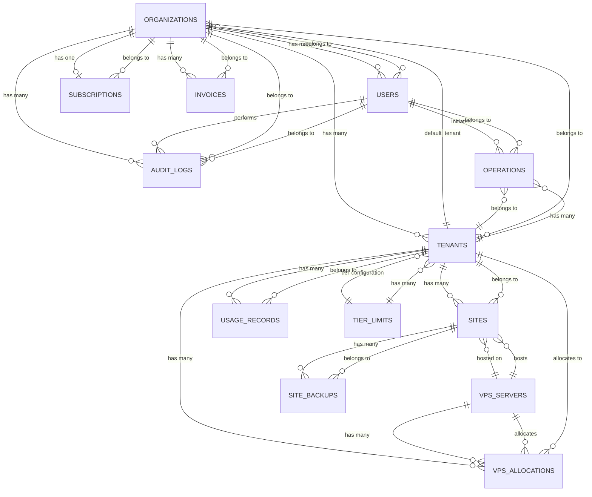

# CHOM Database Schema Documentation

**Generated:** 2026-01-02
**Version:** 1.0
**Database:** PostgreSQL (production), SQLite (testing)

---

## Table of Contents

1. [Schema Overview](#schema-overview)
2. [Entity Relationship Diagram](#entity-relationship-diagram)
3. [Table Definitions](#table-definitions)
4. [Relationships](#relationships)
5. [Indexes & Constraints](#indexes--constraints)
6. [Data Types & Enums](#data-types--enums)
7. [Security Features](#security-features)

---

## Schema Overview

### Database Architecture

The CHOM platform uses a **multi-tenant architecture** with the following key design principles:

- **Organization-based Billing:** Organizations are the billing root
- **Tenant Isolation:** Tenants provide application-level data isolation
- **UUID Primary Keys:** All tables use UUID v7 for distributed ID generation
- **Soft Deletes:** Sites support soft deletion for data recovery
- **Global Scopes:** Automatic tenant filtering on scoped models
- **Encrypted Secrets:** SSH keys and 2FA secrets encrypted at rest

### Multi-Tenancy Model

```
Organization (Billing Entity)
    └── Tenants (1 or more - Application Isolation)
        └── Sites (User Applications)
            └── Backups
```

**Isolation Levels:**
1. **Organization Level:** Billing, users, subscription
2. **Tenant Level:** Sites, VPS allocations, operations, usage
3. **No Isolation:** VPS servers (shared infrastructure)

---

## Entity Relationship Diagram

### Visual Schema (Mermaid Diagram)



### ASCII Schema Diagram

```
┌─────────────────┐
│  ORGANIZATIONS  │ (Billing Root)
└────────┬────────┘
         │
    ┌────┴────────────────────────────────────┐
    │                                         │
    ▼                                         ▼
┌─────────┐                              ┌──────────────┐
│  USERS  │                              │   TENANTS    │ (Isolation Boundary)
└─────────┘                              └──────┬───────┘
    │                                           │
    │                                      ┌────┴──────────────────┐
    │                                      │                       │
    ▼                                      ▼                       ▼
┌────────────┐                        ┌─────────┐          ┌──────────────┐
│ OPERATIONS │                        │  SITES  │          │ VPS_ALLOCATIONS│
└────────────┘                        └────┬────┘          └──────┬───────┘
                                           │                      │
                                           ▼                      ▼
                                    ┌──────────────┐      ┌──────────────┐
                                    │ SITE_BACKUPS │      │ VPS_SERVERS  │
                                    └──────────────┘      └──────────────┘
```

---

## Table Definitions

### 1. organizations

**Purpose:** Billing and organizational root entity

| Column | Type | Nullable | Default | Description |
|--------|------|----------|---------|-------------|
| id | UUID | NO | - | Primary key |
| name | VARCHAR(255) | NO | - | Organization name |
| slug | VARCHAR(255) | NO | - | URL-friendly identifier |
| billing_email | VARCHAR(255) | NO | - | Stripe billing email |
| stripe_customer_id | VARCHAR(255) | YES | - | Stripe customer ID (HIDDEN) |
| default_tenant_id | UUID | YES | - | FK to tenants |
| created_at | TIMESTAMP | NO | now() | Creation timestamp |
| updated_at | TIMESTAMP | NO | now() | Last update timestamp |

**Indexes:**
- PRIMARY KEY: id
- FOREIGN KEY: default_tenant_id → tenants(id)

**Constraints:**
- UNIQUE: slug

---

### 2. users

**Purpose:** User authentication and authorization

| Column | Type | Nullable | Default | Description |
|--------|------|----------|---------|-------------|
| id | UUID | NO | - | Primary key |
| organization_id | UUID | NO | - | FK to organizations |
| name | VARCHAR(255) | NO | - | Full name |
| email | VARCHAR(255) | NO | - | Email (unique) |
| password | VARCHAR(255) | NO | - | Hashed password (HIDDEN) |
| role | ENUM | NO | 'member' | owner, admin, member, viewer |
| email_verified_at | TIMESTAMP | YES | - | Email verification time |
| remember_token | VARCHAR(100) | YES | - | Session token (HIDDEN) |
| two_factor_enabled | BOOLEAN | NO | false | 2FA status |
| two_factor_secret | TEXT | YES | - | TOTP secret (ENCRYPTED, HIDDEN) |
| two_factor_backup_codes | TEXT | YES | - | Recovery codes (ENCRYPTED, HIDDEN) |
| two_factor_confirmed_at | TIMESTAMP | YES | - | 2FA setup confirmation |
| password_confirmed_at | TIMESTAMP | YES | - | Recent password confirmation |
| ssh_key_rotated_at | TIMESTAMP | YES | - | Last key rotation |
| created_at | TIMESTAMP | NO | now() | Creation timestamp |
| updated_at | TIMESTAMP | NO | now() | Last update timestamp |

**Indexes:**
- PRIMARY KEY: id
- UNIQUE: email
- FOREIGN KEY: organization_id → organizations(id)
- INDEX: organization_id
- INDEX: role

**Constraints:**
- CHECK: role IN ('owner', 'admin', 'member', 'viewer')

**Security:**
- password: Hashed (bcrypt)
- two_factor_secret: Encrypted (AES-256-CBC)
- two_factor_backup_codes: Encrypted array

---

### 3. tenants

**Purpose:** Multi-tenant application isolation

| Column | Type | Nullable | Default | Description |
|--------|------|----------|---------|-------------|
| id | UUID | NO | - | Primary key |
| organization_id | UUID | NO | - | FK to organizations |
| name | VARCHAR(255) | NO | - | Tenant name |
| slug | VARCHAR(255) | NO | - | URL-friendly identifier |
| tier | VARCHAR(50) | NO | 'starter' | Subscription tier |
| status | ENUM | NO | 'active' | active, suspended, deleted |
| settings | JSON | YES | - | Configuration settings |
| metrics_retention_days | INTEGER | NO | 30 | Metrics retention policy |
| cached_storage_mb | BIGINT | NO | 0 | Cached total storage (5-min TTL) |
| cached_sites_count | INTEGER | NO | 0 | Cached site count (5-min TTL) |
| cached_at | TIMESTAMP | YES | - | Cache timestamp |
| created_at | TIMESTAMP | NO | now() | Creation timestamp |
| updated_at | TIMESTAMP | NO | now() | Last update timestamp |

**Indexes:**
- PRIMARY KEY: id
- FOREIGN KEY: organization_id → organizations(id)
- INDEX: organization_id
- INDEX: tier
- INDEX: status

**Constraints:**
- CHECK: status IN ('active', 'suspended', 'deleted')

**Performance:**
- Cached aggregates refresh every 5 minutes
- settings stored as JSON for flexibility

---

### 4. sites

**Purpose:** Hosted applications (WordPress, Laravel, HTML)

| Column | Type | Nullable | Default | Description |
|--------|------|----------|---------|-------------|
| id | UUID | NO | - | Primary key |
| tenant_id | UUID | NO | - | FK to tenants |
| vps_id | UUID | NO | - | FK to vps_servers |
| domain | VARCHAR(253) | NO | - | Domain name (max DNS length) |
| site_type | ENUM | NO | 'wordpress' | wordpress, html, laravel |
| php_version | VARCHAR(10) | NO | '8.2' | PHP version |
| ssl_enabled | BOOLEAN | NO | false | SSL/TLS enabled |
| ssl_expires_at | TIMESTAMP | YES | - | Certificate expiration |
| status | ENUM | NO | 'creating' | creating, active, disabled, failed, deleting |
| document_root | VARCHAR(500) | YES | - | File system path (HIDDEN) |
| db_name | VARCHAR(64) | YES | - | Database name (HIDDEN) |
| db_user | VARCHAR(32) | YES | - | Database user (HIDDEN) |
| storage_used_mb | BIGINT | NO | 0 | Storage usage in MB |
| settings | JSON | YES | - | Site-specific configuration |
| created_at | TIMESTAMP | NO | now() | Creation timestamp |
| updated_at | TIMESTAMP | NO | now() | Last update timestamp |
| deleted_at | TIMESTAMP | YES | - | Soft delete timestamp |

**Indexes:**
- PRIMARY KEY: id
- UNIQUE: (tenant_id, domain) - Same domain allowed in different tenants
- FOREIGN KEY: tenant_id → tenants(id) CASCADE ON DELETE
- FOREIGN KEY: vps_id → vps_servers(id)
- INDEX: vps_id
- INDEX: status
- INDEX: domain
- INDEX: (tenant_id, status) - Composite for common queries

**Constraints:**
- CHECK: site_type IN ('wordpress', 'html', 'laravel')
- CHECK: status IN ('creating', 'active', 'disabled', 'failed', 'deleting')

**Features:**
- Soft deletes enabled (deleted_at)
- Global scope for tenant isolation
- Unique domain per tenant

---

### 5. site_backups

**Purpose:** Site backup metadata and tracking

| Column | Type | Nullable | Default | Description |
|--------|------|----------|---------|-------------|
| id | UUID | NO | - | Primary key |
| site_id | UUID | NO | - | FK to sites |
| filename | VARCHAR(255) | NO | - | Backup filename |
| backup_type | ENUM | NO | 'full' | full, database, files |
| status | ENUM | NO | 'pending' | pending, running, completed, failed |
| storage_path | VARCHAR(500) | YES | - | S3/storage path (HIDDEN) |
| size_bytes | BIGINT | YES | - | Backup size in bytes |
| size_mb | INTEGER | YES | - | Backup size in MB |
| checksum | VARCHAR(64) | YES | - | SHA-256 checksum (HIDDEN) |
| retention_days | INTEGER | NO | 30 | Retention policy |
| expires_at | TIMESTAMP | YES | - | Expiration timestamp |
| completed_at | TIMESTAMP | YES | - | Completion timestamp |
| error_message | TEXT | YES | - | Error details if failed |
| created_at | TIMESTAMP | NO | now() | Creation timestamp |
| updated_at | TIMESTAMP | NO | now() | Last update timestamp |

**Indexes:**
- PRIMARY KEY: id
- FOREIGN KEY: site_id → sites(id)
- INDEX: site_id
- INDEX: status
- INDEX: expires_at

**Constraints:**
- CHECK: backup_type IN ('full', 'database', 'files')
- CHECK: status IN ('pending', 'running', 'completed', 'failed')

---

### 6. vps_servers

**Purpose:** Infrastructure servers hosting sites

| Column | Type | Nullable | Default | Description |
|--------|------|----------|---------|-------------|
| id | UUID | NO | - | Primary key |
| hostname | VARCHAR(255) | NO | - | Server hostname (unique) |
| ip_address | VARCHAR(45) | NO | - | IPv4 or IPv6 address |
| provider | VARCHAR(50) | NO | - | hetzner, digitalocean, vultr, custom |
| provider_id | VARCHAR(255) | YES | - | Provider's server ID (HIDDEN) |
| region | VARCHAR(50) | YES | - | Geographic region |
| spec_cpu | INTEGER | NO | - | CPU cores |
| spec_memory_mb | INTEGER | NO | - | RAM in MB |
| spec_disk_gb | INTEGER | NO | - | Disk space in GB |
| status | ENUM | NO | 'provisioning' | provisioning, active, maintenance, failed, decommissioned |
| allocation_type | ENUM | NO | 'shared' | shared, dedicated |
| vpsmanager_version | VARCHAR(20) | YES | - | VPS manager version |
| observability_configured | BOOLEAN | NO | false | Monitoring enabled |
| ssh_key_id | UUID | YES | - | SSH key identifier (HIDDEN) |
| ssh_private_key | TEXT | YES | - | Private SSH key (ENCRYPTED, HIDDEN) |
| ssh_public_key | TEXT | YES | - | Public SSH key (ENCRYPTED, HIDDEN) |
| key_rotated_at | TIMESTAMP | YES | - | Last key rotation |
| last_health_check_at | TIMESTAMP | YES | - | Last health check |
| health_status | ENUM | NO | 'unknown' | healthy, degraded, unhealthy, unknown |
| created_at | TIMESTAMP | NO | now() | Creation timestamp |
| updated_at | TIMESTAMP | NO | now() | Last update timestamp |

**Indexes:**
- PRIMARY KEY: id
- UNIQUE: hostname
- INDEX: provider
- INDEX: status
- INDEX: health_status

**Constraints:**
- CHECK: status IN ('provisioning', 'active', 'maintenance', 'failed', 'decommissioned')
- CHECK: allocation_type IN ('shared', 'dedicated')
- CHECK: health_status IN ('healthy', 'degraded', 'unhealthy', 'unknown')

**Security:**
- ssh_private_key: Encrypted (AES-256-CBC)
- ssh_public_key: Encrypted (AES-256-CBC)
- Keys hidden from JSON serialization

---

### 7. vps_allocations

**Purpose:** Track VPS resource allocation to tenants

| Column | Type | Nullable | Default | Description |
|--------|------|----------|---------|-------------|
| id | UUID | NO | - | Primary key |
| vps_id | UUID | NO | - | FK to vps_servers |
| tenant_id | UUID | NO | - | FK to tenants |
| sites_allocated | INTEGER | NO | 0 | Number of sites allocated |
| storage_mb_allocated | INTEGER | NO | 0 | Storage allocated in MB |
| memory_mb_allocated | INTEGER | NO | 0 | Memory allocated in MB |
| created_at | TIMESTAMP | NO | now() | Creation timestamp |
| updated_at | TIMESTAMP | NO | now() | Last update timestamp |

**Indexes:**
- PRIMARY KEY: id
- FOREIGN KEY: vps_id → vps_servers(id)
- FOREIGN KEY: tenant_id → tenants(id)
- INDEX: vps_id
- INDEX: tenant_id

**Features:**
- Global scope for tenant isolation
- Enables HasManyThrough relationship (Tenant → VPS Servers)

---

### 8. subscriptions

**Purpose:** Stripe subscription tracking

| Column | Type | Nullable | Default | Description |
|--------|------|----------|---------|-------------|
| id | UUID | NO | - | Primary key |
| organization_id | UUID | NO | - | FK to organizations |
| stripe_subscription_id | VARCHAR(255) | YES | - | Stripe subscription ID (HIDDEN) |
| stripe_price_id | VARCHAR(255) | YES | - | Stripe price ID (HIDDEN) |
| tier | VARCHAR(50) | NO | 'starter' | starter, pro, enterprise |
| status | ENUM | NO | 'active' | active, trialing, past_due, cancelled, incomplete |
| trial_ends_at | TIMESTAMP | YES | - | Trial expiration |
| current_period_start | TIMESTAMP | YES | - | Billing period start |
| current_period_end | TIMESTAMP | YES | - | Billing period end |
| cancelled_at | TIMESTAMP | YES | - | Cancellation timestamp |
| created_at | TIMESTAMP | NO | now() | Creation timestamp |
| updated_at | TIMESTAMP | NO | now() | Last update timestamp |

**Indexes:**
- PRIMARY KEY: id
- FOREIGN KEY: organization_id → organizations(id)
- INDEX: organization_id
- INDEX: status

**Constraints:**
- CHECK: status IN ('active', 'trialing', 'past_due', 'cancelled', 'incomplete')

---

### 9. invoices

**Purpose:** Invoice tracking and history

| Column | Type | Nullable | Default | Description |
|--------|------|----------|---------|-------------|
| id | UUID | NO | - | Primary key |
| organization_id | UUID | NO | - | FK to organizations |
| stripe_invoice_id | VARCHAR(255) | YES | - | Stripe invoice ID (HIDDEN) |
| amount_cents | INTEGER | NO | - | Amount in cents |
| currency | VARCHAR(3) | NO | 'usd' | Currency code (ISO 4217) |
| status | ENUM | NO | 'open' | open, paid, void, uncollectible |
| paid_at | TIMESTAMP | YES | - | Payment timestamp |
| period_start | DATE | YES | - | Billing period start |
| period_end | DATE | YES | - | Billing period end |
| created_at | TIMESTAMP | NO | now() | Creation timestamp |
| updated_at | TIMESTAMP | NO | now() | Last update timestamp |

**Indexes:**
- PRIMARY KEY: id
- FOREIGN KEY: organization_id → organizations(id)
- INDEX: organization_id
- INDEX: status

**Constraints:**
- CHECK: status IN ('open', 'paid', 'void', 'uncollectible')

---

### 10. operations

**Purpose:** Async operation tracking and queueing

| Column | Type | Nullable | Default | Description |
|--------|------|----------|---------|-------------|
| id | UUID | NO | - | Primary key |
| tenant_id | UUID | NO | - | FK to tenants |
| user_id | UUID | NO | - | FK to users |
| operation_type | VARCHAR(50) | NO | - | site.create, backup.create, etc. |
| target_type | VARCHAR(50) | YES | - | Polymorphic type |
| target_id | UUID | YES | - | Polymorphic ID |
| status | ENUM | NO | 'pending' | pending, running, completed, failed, cancelled |
| input_data | JSON | YES | - | Operation input parameters |
| output_data | JSON | YES | - | Operation results |
| error_message | TEXT | YES | - | Error details if failed |
| started_at | TIMESTAMP | YES | - | Start timestamp |
| completed_at | TIMESTAMP | YES | - | Completion timestamp |
| created_at | TIMESTAMP | NO | now() | Creation timestamp |
| updated_at | TIMESTAMP | NO | now() | Last update timestamp |

**Indexes:**
- PRIMARY KEY: id
- FOREIGN KEY: tenant_id → tenants(id)
- FOREIGN KEY: user_id → users(id)
- INDEX: tenant_id
- INDEX: user_id
- INDEX: status
- INDEX: operation_type

**Constraints:**
- CHECK: status IN ('pending', 'running', 'completed', 'failed', 'cancelled')

**Features:**
- Global scope for tenant isolation
- Polymorphic target support
- JSON storage for flexible data

---

### 11. usage_records

**Purpose:** Usage-based billing metrics

| Column | Type | Nullable | Default | Description |
|--------|------|----------|---------|-------------|
| id | UUID | NO | - | Primary key |
| tenant_id | UUID | NO | - | FK to tenants |
| metric_type | VARCHAR(50) | NO | - | storage, bandwidth, sites, etc. |
| quantity | DECIMAL(10,2) | NO | - | Usage quantity |
| unit_price | DECIMAL(10,4) | YES | - | Price per unit |
| period_start | DATE | NO | - | Measurement period start |
| period_end | DATE | NO | - | Measurement period end |
| stripe_usage_record_id | VARCHAR(255) | YES | - | Stripe usage record ID (HIDDEN) |
| created_at | TIMESTAMP | NO | now() | Creation timestamp |
| updated_at | TIMESTAMP | NO | now() | Last update timestamp |

**Indexes:**
- PRIMARY KEY: id
- FOREIGN KEY: tenant_id → tenants(id)
- INDEX: tenant_id
- INDEX: metric_type
- INDEX: period_start

**Features:**
- Global scope for tenant isolation
- Decimal precision for accurate billing

---

### 12. audit_logs

**Purpose:** Security audit trail with hash chain

| Column | Type | Nullable | Default | Description |
|--------|------|----------|---------|-------------|
| id | UUID | NO | - | Primary key |
| organization_id | UUID | YES | - | FK to organizations |
| user_id | UUID | YES | - | FK to users |
| action | VARCHAR(100) | NO | - | Action identifier |
| severity | ENUM | NO | 'medium' | low, medium, high, critical |
| resource_type | VARCHAR(50) | YES | - | Affected resource type |
| resource_id | UUID | YES | - | Affected resource ID |
| ip_address | VARCHAR(45) | NO | - | Client IP address |
| user_agent | TEXT | YES | - | Client user agent |
| metadata | JSON | YES | - | Additional context |
| hash | VARCHAR(64) | YES | - | SHA-256 hash for chain integrity |
| created_at | TIMESTAMP | NO | now() | Creation timestamp |
| updated_at | TIMESTAMP | NO | now() | Last update timestamp |

**Indexes:**
- PRIMARY KEY: id
- FOREIGN KEY: organization_id → organizations(id)
- FOREIGN KEY: user_id → users(id)
- INDEX: organization_id
- INDEX: user_id
- INDEX: action
- INDEX: severity
- INDEX: created_at

**Constraints:**
- CHECK: severity IN ('low', 'medium', 'high', 'critical')

**Security:**
- Hash chain prevents tampering
- Each log entry hashed with previous hash
- Verification method: AuditLog::verifyHashChain()

---

### 13. tier_limits

**Purpose:** Subscription tier configuration

| Column | Type | Nullable | Default | Description |
|--------|------|----------|---------|-------------|
| tier | VARCHAR(50) | NO | - | Primary key (starter, pro, enterprise) |
| name | VARCHAR(100) | NO | - | Display name |
| max_sites | INTEGER | NO | - | Site limit (-1 = unlimited) |
| max_storage_gb | INTEGER | NO | - | Storage limit GB (-1 = unlimited) |
| max_bandwidth_gb | INTEGER | NO | - | Bandwidth limit GB (-1 = unlimited) |
| backup_retention_days | INTEGER | NO | 7 | Backup retention |
| support_level | VARCHAR(50) | NO | 'email' | email, chat, priority |
| dedicated_ip | BOOLEAN | NO | false | Dedicated IP enabled |
| staging_environments | BOOLEAN | NO | false | Staging envs enabled |
| white_label | BOOLEAN | NO | false | White labeling enabled |
| api_rate_limit_per_hour | INTEGER | NO | 100 | API rate limit (-1 = unlimited) |
| price_monthly_cents | INTEGER | NO | - | Monthly price in cents |
| created_at | TIMESTAMP | NO | now() | Creation timestamp |
| updated_at | TIMESTAMP | NO | now() | Last update timestamp |

**Indexes:**
- PRIMARY KEY: tier

**Performance:**
- Cached for 1 hour (TierLimit::getCached())
- Auto-invalidation on update

**Default Tiers:**
- starter: 5 sites, 10 GB, basic support
- pro: 25 sites, 100 GB, priority support
- enterprise: unlimited, dedicated resources

---

## Relationships

### Organization Relationships

```php
Organization
├── hasMany(User) - Organization users
├── hasMany(Tenant) - Organization tenants
├── hasOne(Subscription) - Billing subscription
├── hasMany(Invoice) - Invoice history
├── hasMany(AuditLog) - Security audit trail
├── belongsTo(Tenant as defaultTenant) - Primary tenant
└── hasOne(User with role=owner) - Organization owner
```

### Tenant Relationships

```php
Tenant
├── belongsTo(Organization) - Parent organization
├── hasMany(Site) - Hosted sites
├── hasMany(VpsAllocation) - Resource allocations
├── hasMany(Operation) - Operations queue
├── hasMany(UsageRecord) - Usage tracking
├── hasManyThrough(VpsServer via VpsAllocation) - Allocated servers
└── hasOne(TierLimit) - Tier configuration
```

### Site Relationships

```php
Site
├── belongsTo(Tenant) - Parent tenant
├── belongsTo(VpsServer) - Hosting server
└── hasMany(SiteBackup) - Backup history
```

### User Relationships

```php
User
├── belongsTo(Organization) - Parent organization
└── hasMany(Operation) - User operations
```

### VPS Server Relationships

```php
VpsServer
├── hasMany(Site) - Hosted sites
├── hasMany(VpsAllocation) - Allocations
└── hasManyThrough(Tenant via VpsAllocation) - Tenants using this server
```

---

## Indexes & Constraints

### Primary Keys
All tables use UUID primary keys for distributed ID generation and horizontal scaling.

### Foreign Keys with Cascade

| From Table | To Table | On Delete |
|------------|----------|-----------|
| sites.tenant_id | tenants.id | CASCADE |
| users.organization_id | organizations.id | RESTRICT |
| tenants.organization_id | organizations.id | RESTRICT |
| sites.vps_id | vps_servers.id | RESTRICT |

### Unique Constraints

| Table | Columns | Purpose |
|-------|---------|---------|
| users | email | Prevent duplicate accounts |
| sites | (tenant_id, domain) | Unique domain per tenant |
| vps_servers | hostname | Unique server identification |
| organizations | slug | URL-friendly unique identifier |

### Performance Indexes

| Table | Columns | Type | Purpose |
|-------|---------|------|---------|
| sites | (tenant_id, status) | Composite | Common filtering |
| operations | (tenant_id, status) | Composite | Queue queries |
| audit_logs | created_at | Single | Time-based queries |
| sites | domain | Single | Domain lookups |

---

## Data Types & Enums

### User Roles
```sql
'owner'    -- Full organizational control
'admin'    -- Administrative privileges
'member'   -- Site management
'viewer'   -- Read-only access
```

### Site Status
```sql
'creating'  -- Provisioning in progress
'active'    -- Live and operational
'disabled'  -- Temporarily disabled
'failed'    -- Provisioning failed
'deleting'  -- Deletion in progress
```

### VPS Server Status
```sql
'provisioning'    -- Server setup
'active'          -- Operational
'maintenance'     -- Scheduled maintenance
'failed'          -- Provisioning failed
'decommissioned'  -- Retired
```

### Health Status
```sql
'healthy'    -- All checks passing
'degraded'   -- Partial functionality
'unhealthy'  -- Critical issues
'unknown'    -- No data available
```

### Subscription Status
```sql
'active'      -- Currently active
'trialing'    -- In trial period
'past_due'    -- Payment overdue
'cancelled'   -- Cancelled by user
'incomplete'  -- Setup incomplete
```

---

## Security Features

### Encryption at Rest

**Encrypted Fields:**
- `users.two_factor_secret` - TOTP secret
- `users.two_factor_backup_codes` - Recovery codes
- `vps_servers.ssh_private_key` - SSH private key
- `vps_servers.ssh_public_key` - SSH public key

**Encryption Method:**
- Algorithm: AES-256-CBC
- Authentication: HMAC-SHA-256
- Key: Laravel APP_KEY
- Implementation: Laravel encrypted cast

### Hidden Fields

Fields excluded from JSON serialization:
- All password fields
- Stripe customer/subscription/invoice IDs
- SSH keys and secrets
- Database credentials
- File system paths

### Hash Chain (AuditLog)

```php
hash(SHA-256) = previous_hash + log_data + timestamp
```

Each audit log entry is cryptographically linked to the previous entry, creating a tamper-proof chain.

### Password Security

- Hashing: bcrypt (cost factor 10)
- Password confirmation: 10-minute TTL
- SSH key rotation: 90-day policy

---

## Performance Optimizations

### Cached Aggregates

**Tenant Statistics (5-minute TTL):**
- cached_sites_count
- cached_storage_mb

**Tier Limits (1-hour TTL):**
- TierLimit::getCached($tier)
- Auto-invalidation on update

### Eager Loading

Prevent N+1 queries with eager loading:
```php
Site::with('tenant', 'vpsServer', 'backups')->get();
Tenant::with('sites.backups', 'organization')->get();
```

### Database Indexes

- Foreign keys automatically indexed
- Composite indexes for common query patterns
- Partial indexes for status filtering

---

## Migration Files

| Order | File | Description |
|-------|------|-------------|
| 1 | `0001_01_01_000000_create_users_table.php` | Base users table |
| 2 | `0001_01_01_000001_create_cache_table.php` | Cache storage |
| 3 | `0001_01_01_000002_create_jobs_table.php` | Queue jobs |
| 4 | `2024_01_01_000001_create_organizations_table.php` | Organizations |
| 5 | `2024_01_01_000002_create_tenants_table.php` | Tenants |
| 6 | `2024_01_01_000003_add_default_tenant_foreign_key.php` | Org → Tenant FK |
| 7 | `2024_01_01_000003_modify_users_table.php` | User enhancements |
| 8 | `2024_01_01_000004_create_vps_servers_table.php` | VPS servers |
| 9 | `2024_01_01_000005_create_vps_allocations_table.php` | VPS allocations |
| 10 | `2024_01_01_000006_create_sites_table.php` | Sites |
| 11 | `2024_01_01_000007_create_site_backups_table.php` | Backups |
| 12 | `2024_01_01_000008_create_subscriptions_table.php` | Subscriptions |
| 13 | `2024_01_01_000009_create_usage_records_table.php` | Usage tracking |
| 14 | `2024_01_01_000010_create_invoices_table.php` | Invoices |
| 15 | `2024_01_01_000011_create_operations_table.php` | Operations queue |
| 16 | `2024_01_01_000012_create_audit_logs_table.php` | Audit logs |
| 17 | `2024_01_01_000013_create_tier_limits_table.php` | Tier configuration |
| 18 | `2024_01_01_000014_fix_foreign_key_constraints.php` | Constraint fixes |
| 19 | `2025_01_01_000000_add_critical_performance_indexes.php` | Performance indexes |
| 20 | `2025_01_01_000001_add_cached_aggregates_to_tenants.php` | Cached stats |
| 21 | `2025_01_01_000002_encrypt_ssh_keys_in_vps_servers.php` | Key encryption |
| 22 | `2025_01_01_000003_add_key_rotation_to_vps_servers_table.php` | Key rotation |
| 23 | `2025_01_01_000004_add_audit_log_hash_chain.php` | Hash chain |
| 24 | `2025_01_01_000005_add_security_fields_to_users_table.php` | 2FA fields |
| 25 | `2026_01_01_110421_create_personal_access_tokens_table.php` | API tokens |

---

## Database Statistics

**Total Tables:** 15
**Total Indexes:** 40+
**Encrypted Fields:** 4
**Hidden Fields:** 15+
**Global Scopes:** 4 (Site, VpsAllocation, Operation, UsageRecord)
**Soft Deletes:** 1 (Site)

---

**Documentation Version:** 1.0
**Last Updated:** 2026-01-02
**Database Engine:** PostgreSQL 14+ (production), SQLite (testing)
