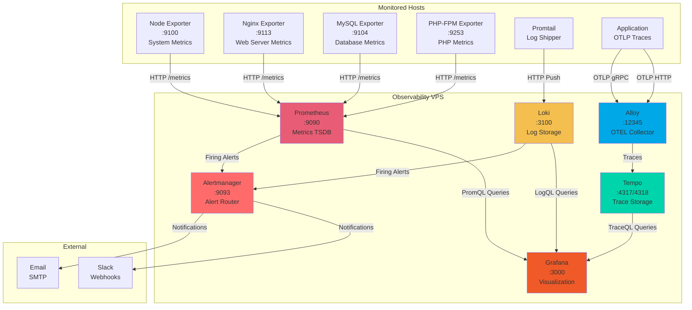

# Observability Stack

**Monitor all your servers from one place.** Get alerts before problems become outages.

This is a production-ready observability platform that installs directly on Debian/Ubuntu—no Docker, no Kubernetes, no complexity. Just run one command and you'll have:

- 📊 **Metrics** — CPU, memory, disk, network, database, web server
- 📝 **Logs** — All your logs in one searchable place
- 🔍 **Traces** — See requests flow through your systems
- 🚨 **Alerts** — Email notifications when things go wrong

## Quick Deploy (Fresh VPS)

```bash
# On a fresh Debian 13 VPS, run:
curl -sSL https://raw.githubusercontent.com/calounx/mentat/master/observability-stack/deploy/bootstrap.sh | sudo bash
```

This interactive installer will guide you through setting up either:
- **Observability VPS** — The central monitoring server
- **VPSManager** — A Laravel app with full LEMP stack + monitoring
- **Monitored Host** — Just the exporters for existing servers

See [deploy/README.md](deploy/README.md) for the full deployment guide.

---

## Stack Components

| Component | Purpose | Port |
|-----------|---------|------|
| **Prometheus** | Metrics collection & alerting | 9090 |
| **Loki** | Log aggregation | 3100 |
| **Tempo** | Distributed tracing | 4317/4318 |
| **Grafana** | Visualization & dashboards | 3000 |
| **Alertmanager** | Alert routing | 9093 |
| **Alloy** | OpenTelemetry collector | 12345 |

### Component Interaction & Data Flow



**Data Flow Explanation:**

1. **Metrics Collection**: Prometheus scrapes exporters on monitored hosts every 15-60s
2. **Log Aggregation**: Promtail ships logs from monitored hosts to Loki in real-time
3. **Trace Collection**: Applications send traces via OTLP to Alloy, which forwards to Tempo
4. **Alerting**: Prometheus/Loki evaluate rules and send alerts to Alertmanager
5. **Visualization**: Grafana queries all data sources to build dashboards

## Manual Installation

If you prefer manual setup or already have the repo cloned:

```bash
git clone https://github.com/calounx/mentat.git
cd mentat/observability-stack

# Option 1: Use interactive installer (recommended)
sudo ./deploy/install.sh

# Option 2: Use legacy scripts
cp config/global.yaml.example config/global.yaml
nano config/global.yaml
sudo ./scripts/setup-observability.sh
```

## Available Modules

```
modules/_core/
├── prometheus/        # Metrics server (v3.x)
├── loki/              # Log aggregation (v3.x)
├── tempo/             # Distributed tracing
├── alloy/             # OpenTelemetry collector
├── promtail/          # Log shipper
├── node_exporter/     # System metrics
├── nginx_exporter/    # Nginx metrics
├── mysqld_exporter/   # MySQL/MariaDB metrics
├── phpfpm_exporter/   # PHP-FPM metrics
└── fail2ban_exporter/ # Fail2ban metrics
```

## Pre-built Alert Rules

Ready-to-use alert rules in `prometheus/alerts/`:

| File | Coverage |
|------|----------|
| `node-alerts.yaml` | CPU, memory, disk, network, hardware |
| `prometheus-alerts.yaml` | Self-monitoring, TSDB, scraping |
| `loki-alerts.yaml` | Ingestion, storage, promtail |
| `nginx-alerts.yaml` | Availability, connections, SSL |
| `mysql-alerts.yaml` | Connections, replication, slow queries |
| `application-alerts.yaml` | HTTP, PHP-FPM, containers, fail2ban |
| `tempo-alerts.yaml` | Traces, spans, storage |
| `alloy-alerts.yaml` | Pipelines, components, resources |

## Dashboard Library

Pre-built dashboards in `grafana/dashboards/library/`:

- **Node Exporter Full** - Comprehensive system metrics
- **Nginx Overview** - Web server monitoring
- **MySQL Overview** - Database with replication status
- **Loki Overview** - Log aggregation metrics
- **Prometheus Self-Monitoring** - Prometheus health
- **Tempo Overview** - Distributed tracing
- **Alloy Overview** - Telemetry collector pipelines

## SLO/SLI Framework

Service Level Objectives with multi-window burn rate alerting:

```
slo/slo-config.yaml              # SLO definitions
prometheus/rules/sli-*.yaml      # Recording rules
prometheus/rules/slo-*.yaml      # Alerting rules
grafana/dashboards/slo-*.json    # Error budget dashboards
```

## Module Management

```bash
# List modules
./scripts/module-manager.sh list

# Install module
./scripts/module-manager.sh install node_exporter

# Check status
./scripts/module-manager.sh status

# Auto-detect services
./scripts/auto-detect.sh
```

## Upgrade System

```bash
# Check versions
./scripts/upgrade-orchestrator.sh --status

# Upgrade all (dry-run first)
./scripts/upgrade-orchestrator.sh --all --dry-run
./scripts/upgrade-orchestrator.sh --all

# Upgrade by phase
./scripts/upgrade-orchestrator.sh --phase exporters
./scripts/upgrade-orchestrator.sh --phase prometheus
./scripts/upgrade-orchestrator.sh --phase loki

# Rollback
./scripts/upgrade-orchestrator.sh --rollback
```

## Directory Structure

```
observability-stack/
├── config/
│   ├── global.yaml           # Global settings
│   ├── versions.yaml         # Component versions
│   └── hosts/                # Per-host configs
├── modules/_core/            # Installable modules
├── prometheus/
│   ├── alerts/               # Alert rules library
│   └── rules/                # Recording rules
├── grafana/
│   └── dashboards/
│       ├── library/          # Pre-built dashboards
│       └── slo-overview.json
├── slo/                      # SLO definitions
├── scripts/
│   ├── lib/                  # Shared libraries
│   └── tools/                # Validation tools
└── tests/                    # Test suites
```

## Documentation

- [QUICK_START.md](QUICK_START.md) - Installation guide
- [SECURITY.md](SECURITY.md) - Security practices
- [CONTRIBUTING.md](CONTRIBUTING.md) - Contribution guidelines
- [docs/upgrade/](docs/upgrade/) - Upgrade documentation
- [docs/SECRETS.md](docs/SECRETS.md) - Secrets management

## Standalone Deployment

Build a self-contained deployment package:

```bash
./build.sh
# Creates dist/observability-stack-<version>.tar.gz
```

## Health Check

```bash
./scripts/health-check.sh
```

## License

MIT
