# Vanilla Debian 13 Deployment

Single-command deployment for fresh Debian 13 VPS instances.

## Quick Start

### Option 1: Bootstrap Script (Recommended)

**Important:** The installer requires interactive input and must be run as root directly, not piped to bash.

```bash
# On a fresh Debian 13 VPS, download and run the bootstrap script
wget https://raw.githubusercontent.com/calounx/mentat/master/observability-stack/deploy/bootstrap.sh
chmod +x bootstrap.sh
sudo ./bootstrap.sh
```

**Note:** Do NOT use `curl ... | sudo bash` as this prevents interactive prompts from working correctly.

### Option 2: Manual Clone

```bash
git clone https://github.com/calounx/mentat.git
cd mentat/observability-stack
sudo ./deploy/install.sh
```

## Architecture

### Deployment Architecture

```mermaid
graph TB
    subgraph "VPS 1: Observability VPS<br/>(Central Monitoring)"
        PROM[Prometheus<br/>:9090<br/>Metrics Storage]
        LOKI[Loki<br/>:3100<br/>Log Storage]
        TEMPO[Tempo<br/>:4317/4318<br/>Trace Storage]
        GRAF[Grafana<br/>:3000<br/>Dashboards]
        ALERT[Alertmanager<br/>:9093]
        NGINX_OBS[Nginx<br/>Reverse Proxy + SSL]
    end

    subgraph "VPS 2: VPSManager<br/>(Laravel Application)"
        subgraph "Application Stack"
            NGINX_APP[Nginx<br/>Web Server]
            PHP[PHP 8.2-FPM<br/>Laravel]
            MARIA[MariaDB<br/>Database]
            REDIS[Redis<br/>Cache/Queue]
            SUPER[Supervisor<br/>Queue Workers]
        end

        subgraph "Monitoring Agents"
            NE_VPS[Node Exporter<br/>:9100]
            NGINX_EXP_VPS[Nginx Exporter<br/>:9113]
            MYSQL_EXP_VPS[MySQL Exporter<br/>:9104]
            PHP_EXP_VPS[PHP-FPM Exporter<br/>:9253]
            PROMTAIL_VPS[Promtail<br/>Log Shipper]
        end
    end

    subgraph "VPS 3: Monitored Host<br/>(Existing Server)"
        SERVICE[Existing<br/>Services]
        NE_MON[Node Exporter<br/>:9100]
        NGINX_EXP_MON[Nginx Exporter<br/>:9113]
        PROMTAIL_MON[Promtail<br/>Log Shipper]
    end

    subgraph "VPS 4+: Additional Hosts"
        MORE[More Monitored<br/>Servers...]
    end

    %% Connections from VPSManager
    NE_VPS -->|Metrics| PROM
    NGINX_EXP_VPS -->|Metrics| PROM
    MYSQL_EXP_VPS -->|Metrics| PROM
    PHP_EXP_VPS -->|Metrics| PROM
    PROMTAIL_VPS -->|Logs| LOKI
    PHP -->|Traces OTLP| TEMPO

    %% Connections from Monitored Host
    NE_MON -->|Metrics| PROM
    NGINX_EXP_MON -->|Metrics| PROM
    PROMTAIL_MON -->|Logs| LOKI

    %% Additional hosts
    MORE -.->|Metrics/Logs| PROM
    MORE -.->|Metrics/Logs| LOKI

    %% Observability VPS internal
    PROM --> GRAF
    LOKI --> GRAF
    TEMPO --> GRAF
    PROM --> ALERT

    %% User access
    USER([User]) -->|HTTPS| NGINX_OBS
    NGINX_OBS --> GRAF

    style PROM fill:#e85d75
    style LOKI fill:#f4bf4f
    style TEMPO fill:#00d4aa
    style GRAF fill:#f05a28
    style PHP fill:#777bb4
    style MARIA fill:#003545
```



**Three Deployment Roles:**

1. **Observability VPS**: Central monitoring server (Prometheus, Loki, Grafana)
2. **VPSManager**: Full Laravel application with LEMP stack + monitoring agents
3. **Monitored Host**: Existing servers with exporters only

You can deploy multiple Monitored Hosts and VPSManagers—they all report back to the central Observability VPS.

## Installation Roles

### 1. Observability VPS

Installs the full monitoring stack:
- **Prometheus** - Metrics collection
- **Loki** - Log aggregation
- **Tempo** - Distributed tracing
- **Grafana** - Visualization
- **Alertmanager** - Alert routing
- **Nginx** - Reverse proxy with SSL

**Requirements:**
- Debian 13
- 1-2 vCPU
- 2GB RAM (minimum 1GB)
- 20GB disk

**Installation time:** 15-20 minutes

### 2. VPSManager (Laravel Application)

Deploys a complete Laravel application with full monitoring:

**Application Stack:**
- **Nginx** - Web server with optimized config
- **PHP 8.2-FPM** - With all Laravel extensions
- **MariaDB** - Database with secure defaults
- **Redis** - Cache, sessions, queues
- **Supervisor** - Queue worker management
- **Let's Encrypt** - Automatic SSL

**Monitoring:**
- **Node Exporter** - System metrics
- **Nginx Exporter** - Web server metrics
- **MySQL Exporter** - Database metrics
- **PHP-FPM Exporter** - PHP process metrics
- **Promtail** - Log shipping

**Requirements:**
- Debian 13
- 2+ vCPU
- 4GB RAM
- 40GB disk

**Installation time:** 25-35 minutes

### 3. Monitored Host

Installs exporters based on detected services:
- **Node Exporter** - System metrics (always)
- **Promtail** - Log shipping (always)
- **Nginx Exporter** - If nginx detected
- **MySQL Exporter** - If mysql/mariadb detected
- **PHP-FPM Exporter** - If php-fpm detected
- **Fail2ban Exporter** - If fail2ban detected

**Requirements:**
- Debian 13 (or compatible)
- 512MB RAM
- Network access to Observability VPS

**Installation time:** 3-5 minutes

## Configuration

The installer prompts for:

### Observability VPS
- VPS IP address (auto-detected)
- Domain for Grafana (optional, enables SSL)
- Let's Encrypt email (if using domain)
- Grafana admin password
- Data retention periods
- SMTP settings for alerts (optional)

### VPSManager
- Observability VPS IP address
- This host's IP and name
- GitHub repository URL for your Laravel app
- Branch to deploy (default: main)
- Domain for the application
- Let's Encrypt email
- PHP version (default: 8.2)

### Monitored Host
- Observability VPS IP address
- This host's IP and name

## Post-Installation

### On Observability VPS

1. Access Grafana:
   - With domain: `https://your-domain.com`
   - Without domain: `http://VPS_IP:3000`

2. Import dashboards from library:
   - Go to Dashboards → Import
   - Select from `/opt/observability-stack/grafana/dashboards/library/`

### On VPSManager

1. Your Laravel app is deployed at `https://your-domain.com`

2. Database credentials are saved:
   ```bash
   cat /root/.credentials/mysql
   ```

3. Copy target file to Observability VPS:
   ```bash
   scp /tmp/HOSTNAME-targets.yaml root@OBSERVABILITY_IP:/etc/prometheus/targets/
   ```

4. Manage queue workers:
   ```bash
   supervisorctl status
   supervisorctl restart vpsmanager-worker:*
   ```

### On Monitored Host

1. Copy target file to Observability VPS:
   ```bash
   scp /tmp/HOSTNAME-targets.yaml root@OBSERVABILITY_IP:/etc/prometheus/targets/
   ```

2. Verify in Grafana:
   - Check Prometheus targets
   - Query logs in Explore

## Firewall Rules

### Observability VPS
| Port | Service | Access |
|------|---------|--------|
| 22 | SSH | Anywhere |
| 80 | HTTP | Anywhere |
| 443 | HTTPS | Anywhere |
| 3100 | Loki | Monitored hosts |
| 4317/4318 | OTLP | Monitored hosts |

### VPSManager
| Port | Service | Access |
|------|---------|--------|
| 22 | SSH | Anywhere |
| 80 | HTTP | Anywhere |
| 443 | HTTPS | Anywhere |
| 9100 | node_exporter | Observability VPS only |
| 9104 | mysqld_exporter | Observability VPS only |
| 9113 | nginx_exporter | Observability VPS only |
| 9253 | phpfpm_exporter | Observability VPS only |

### Monitored Host
| Port | Service | Access |
|------|---------|--------|
| 22 | SSH | Anywhere |
| 9100 | node_exporter | Observability VPS only |
| 9104 | mysqld_exporter | Observability VPS only |
| 9113 | nginx_exporter | Observability VPS only |
| 9191 | fail2ban_exporter | Observability VPS only |
| 9253 | phpfpm_exporter | Observability VPS only |

## Troubleshooting

### Check service status
```bash
systemctl status prometheus loki grafana-server
```

### View logs
```bash
journalctl -u prometheus -f
journalctl -u loki -f
```

### Test connectivity
```bash
# From observability VPS to monitored host
curl http://MONITORED_IP:9100/metrics
```

### Verify firewall
```bash
ufw status
```

## Directory Structure

```
/opt/observability-stack/
├── config/
│   ├── global.yaml          # Generated config
│   └── hosts/               # Host configs
├── deploy/
│   ├── bootstrap.sh         # Entry point
│   ├── install.sh           # Interactive installer
│   ├── lib/                 # Shared functions
│   └── roles/               # Role-specific installers
├── grafana/dashboards/      # Dashboard library
├── prometheus/alerts/       # Alert rules
└── .installation            # Installation metadata
```
