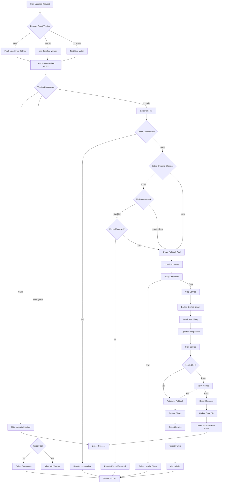

# Dynamic Version Management System - Comprehensive Architecture

## Executive Summary

This document extends the existing version management architecture with dynamic upgrade capabilities, safety mechanisms, and rollback functionality. The system eliminates manual version updates while ensuring production stability through intelligent upgrade decisions and comprehensive safety checks.

## Table of Contents

1. [Architecture Overview](#architecture-overview)
2. [Service Boundaries](#service-boundaries)
3. [API Design](#api-design)
4. [Database Schema](#database-schema)
5. [Upgrade Workflow](#upgrade-workflow)
6. [Safety Checks](#safety-checks)
7. [Rollback Mechanism](#rollback-mechanism)
8. [Technology Stack](#technology-stack)
9. [Performance Optimization](#performance-optimization)
10. [Security Patterns](#security-patterns)

---

## Architecture Overview

### System Context Diagram

```
┌──────────────────────────────────────────────────────────────────────┐
│                    Dynamic Version Management System                  │
├──────────────────────────────────────────────────────────────────────┤
│                                                                        │
│  ┌────────────────────────────────────────────────────────────────┐  │
│  │              Version Discovery & Resolution Layer              │  │
│  │  ┌──────────┐  ┌──────────┐  ┌──────────┐  ┌──────────┐      │  │
│  │  │ GitHub   │  │ GitLab   │  │ Direct   │  │ Custom   │      │  │
│  │  │   API    │  │   API    │  │   URLs   │  │ Registry │      │  │
│  │  └────┬─────┘  └────┬─────┘  └────┬─────┘  └────┬─────┘      │  │
│  └───────┼─────────────┼─────────────┼─────────────┼────────────┘  │
│          │             │             │             │                 │
│          └─────────────┴─────────────┴─────────────┘                 │
│                              │                                        │
│  ┌───────────────────────────▼────────────────────────────────────┐ │
│  │           Version Resolution & Strategy Engine                 │ │
│  │  • Latest Strategy   • Pinned Strategy   • LTS Strategy        │ │
│  │  • Range Strategy    • Locked Strategy   • Custom Policies     │ │
│  └───────────────────────────┬────────────────────────────────────┘ │
│                              │                                        │
│  ┌───────────────────────────▼────────────────────────────────────┐ │
│  │              Upgrade Decision & Safety Engine                  │ │
│  │  ┌──────────────┐  ┌──────────────┐  ┌──────────────┐        │ │
│  │  │ Compatibility│  │ Breaking     │  │  Security    │        │ │
│  │  │   Checker    │  │Change Detector│  │   Scanner    │        │ │
│  │  └──────────────┘  └──────────────┘  └──────────────┘        │ │
│  └───────────────────────────┬────────────────────────────────────┘ │
│                              │                                        │
│  ┌───────────────────────────▼────────────────────────────────────┐ │
│  │              Version State & History Manager                   │ │
│  │  • Installed Versions  • Upgrade History  • Rollback Points    │ │
│  └───────────────────────────┬────────────────────────────────────┘ │
│                              │                                        │
│  ┌───────────────────────────▼────────────────────────────────────┐ │
│  │              Download & Verification Layer                     │ │
│  │  • Checksum Verification  • GPG Signature  • Archive Integrity │ │
│  └───────────────────────────┬────────────────────────────────────┘ │
│                              │                                        │
│  ┌───────────────────────────▼────────────────────────────────────┐ │
│  │              Installation & Rollback Executor                  │ │
│  │  • Atomic Install  • Service Management  • Rollback Handler    │ │
│  └────────────────────────────────────────────────────────────────┘ │
│                                                                        │
└────────────────────────────────────────────────────────────────────────┘
                                   │
                                   ▼
                    ┌──────────────────────────────┐
                    │  State Storage & Cache       │
                    │  • Version Cache (15min)     │
                    │  • State DB (SQLite)         │
                    │  • Binary Archives           │
                    │  • Rollback Snapshots        │
                    └──────────────────────────────┘
```

---

## Service Boundaries

### 1. Version Discovery Service
**Responsibility:** Fetch version information from upstream sources

**Inputs:**
- Component name
- Repository identifier
- Version constraints

**Outputs:**
- Available versions list
- Release metadata
- Download URLs
- Checksums

**State:** Read-only cache of version information

**API Contract:**
```bash
discover_versions <component>
  → Returns: JSON array of version objects

get_latest_version <component> [constraint]
  → Returns: Single version string

get_release_metadata <component> <version>
  → Returns: JSON object with download URLs, checksums, changelog
```

### 2. Upgrade Decision Engine
**Responsibility:** Determine if upgrade is safe and recommended

**Inputs:**
- Current installed version
- Available versions
- Compatibility matrix
- Breaking change database
- Security advisories

**Outputs:**
- Upgrade recommendation (yes/no/manual)
- Risk level (low/medium/high)
- Required actions
- Rollback plan

**State:** Stateless (uses injected dependencies)

**Decision Logic:**
```bash
# Upgrade decision flowchart
Input: current_version, target_version

1. Version Comparison
   ├─ Same version → SKIP
   ├─ Downgrade → REJECT (unless forced)
   └─ Upgrade → Continue

2. Breaking Change Detection
   ├─ Major version bump → HIGH_RISK
   ├─ Minor version bump → MEDIUM_RISK
   └─ Patch version bump → LOW_RISK

3. Compatibility Check
   ├─ Check dependency versions
   ├─ Verify architecture compatibility
   └─ Check minimum requirements

4. Security Advisory Check
   ├─ Known vulnerabilities in target → REJECT
   └─ Security fix in target → RECOMMEND

5. Risk Assessment
   ├─ LOW_RISK + Compatible → AUTO_APPROVE
   ├─ MEDIUM_RISK + Compatible → RECOMMEND
   ├─ HIGH_RISK → MANUAL_APPROVAL
   └─ Incompatible → REJECT

Output: UpgradeDecision {
  approved: bool,
  risk_level: string,
  requires_manual: bool,
  safety_checks_passed: bool,
  warnings: []string,
  rollback_plan: RollbackPlan
}
```

### 3. Version State Manager
**Responsibility:** Track installed versions and upgrade history

**Database Schema:** (See Database Schema section)

**API Contract:**
```bash
record_installation <component> <version>
  → Stores: installation record with metadata

get_installed_version <component>
  → Returns: Currently installed version

get_upgrade_history <component> [limit]
  → Returns: List of previous upgrades

create_rollback_point <component> <version>
  → Stores: Snapshot for rollback

list_rollback_points <component>
  → Returns: Available rollback versions
```

### 4. Installation Executor
**Responsibility:** Perform atomic installation/upgrade

**Workflow:**
```bash
1. Pre-flight Checks
   ├─ Verify binary checksum
   ├─ Check available disk space
   └─ Verify service state

2. Create Rollback Point
   ├─ Backup current binary
   ├─ Backup configuration
   └─ Record current state

3. Atomic Installation
   ├─ Download to temp location
   ├─ Verify integrity
   ├─ Stop service (if running)
   ├─ Move binary to install location
   ├─ Set permissions
   ├─ Update configuration (if needed)
   └─ Start service

4. Post-Installation Validation
   ├─ Service health check
   ├─ Metrics endpoint check
   └─ Version verification

5. On Failure → Automatic Rollback
   ├─ Restore previous binary
   ├─ Restore configuration
   ├─ Restart service
   └─ Record failure
```

---

## API Design

### Core API Functions

#### Version Discovery API

```bash
#===============================================================================
# DYNAMIC VERSION DISCOVERY
#===============================================================================

# Discover all available versions for a component
# Usage: discover_versions <component> [include_prereleases]
# Returns: JSON array of version objects
# Example output:
#   [
#     {"version": "1.8.0", "release_date": "2024-01-15", "prerelease": false},
#     {"version": "1.7.0", "release_date": "2023-12-01", "prerelease": false}
#   ]
discover_versions() {
    local component="$1"
    local include_prereleases="${2:-false}"

    # Implementation details...
}

# Get latest version matching constraints
# Usage: get_latest_version <component> [constraint]
# Example: get_latest_version "node_exporter" ">=1.7.0 <2.0.0"
# Returns: version string (e.g., "1.7.0")
get_latest_version() {
    local component="$1"
    local constraint="${2:-}"

    # Implementation details...
}

# Get detailed release metadata
# Usage: get_release_metadata <component> <version>
# Returns: JSON object with release details
get_release_metadata() {
    local component="$1"
    local version="$2"

    # Implementation details...
}

# Fetch changelog between versions
# Usage: get_changelog <component> <from_version> <to_version>
# Returns: Formatted changelog text
get_changelog() {
    local component="$1"
    local from_version="$2"
    local to_version="$3"

    # Implementation details...
}
```

#### Upgrade Decision API

```bash
#===============================================================================
# UPGRADE SAFETY & DECISION ENGINE
#===============================================================================

# Check if upgrade is safe and recommended
# Usage: check_upgrade_safety <component> <current_version> <target_version>
# Returns: JSON decision object
# Exit codes: 0=safe, 1=unsafe, 2=manual_review_required
check_upgrade_safety() {
    local component="$1"
    local current_version="$2"
    local target_version="$3"

    # Decision object structure:
    # {
    #   "approved": true,
    #   "risk_level": "low|medium|high",
    #   "requires_manual": false,
    #   "safety_checks": [
    #     {"check": "compatibility", "passed": true},
    #     {"check": "breaking_changes", "passed": true}
    #   ],
    #   "warnings": [],
    #   "upgrade_notes": "..."
    # }
}

# Detect breaking changes between versions
# Usage: detect_breaking_changes <component> <from_version> <to_version>
# Returns: JSON array of breaking changes
detect_breaking_changes() {
    local component="$1"
    local from_version="$2"
    local to_version="$3"

    # Check multiple sources:
    # 1. CHANGELOG.md parsing
    # 2. GitHub release notes
    # 3. Known breaking change database
    # 4. Semantic version major bump
}

# Check component compatibility
# Usage: check_compatibility <component> <version>
# Returns: 0 if compatible, 1 otherwise
check_compatibility() {
    local component="$1"
    local version="$2"

    # Verify:
    # - Prometheus version compatibility
    # - Loki version compatibility (for promtail)
    # - Architecture compatibility
    # - Kernel version compatibility
    # - Dependency versions
}

# Assess upgrade risk level
# Usage: assess_upgrade_risk <component> <current> <target>
# Returns: "low", "medium", or "high"
assess_upgrade_risk() {
    local component="$1"
    local current="$2"
    local target="$3"

    # Risk factors:
    # - Version distance (patch/minor/major)
    # - Known issues in target version
    # - Breaking changes
    # - Security vulnerabilities
    # - Production criticality
}
```

#### Version State Management API

```bash
#===============================================================================
# VERSION STATE & HISTORY MANAGEMENT
#===============================================================================

# Record component installation
# Usage: record_installation <component> <version> <metadata_json>
record_installation() {
    local component="$1"
    local version="$2"
    local metadata="${3:-{}}"

    # Store in state database:
    # - component name
    # - version installed
    # - timestamp
    # - install method
    # - configuration snapshot
}

# Get currently installed version
# Usage: get_installed_version <component>
# Returns: version string or empty if not installed
get_installed_version() {
    local component="$1"

    # Priority order:
    # 1. Binary version (--version output)
    # 2. State database record
    # 3. Empty (not installed)
}

# Get upgrade history
# Usage: get_upgrade_history <component> [limit]
# Returns: JSON array of upgrade records
get_upgrade_history() {
    local component="$1"
    local limit="${2:-10}"

    # Returns array of:
    # [
    #   {
    #     "from_version": "1.6.0",
    #     "to_version": "1.7.0",
    #     "timestamp": "2024-01-15T10:30:00Z",
    #     "method": "auto|manual",
    #     "success": true,
    #     "rollback_available": true
    #   }
    # ]
}

# Create rollback point
# Usage: create_rollback_point <component> <version>
# Returns: rollback_point_id
create_rollback_point() {
    local component="$1"
    local version="$2"

    # Creates:
    # - Binary backup
    # - Configuration backup
    # - State snapshot
    # - Rollback metadata
}

# List available rollback points
# Usage: list_rollback_points <component>
# Returns: JSON array of rollback points
list_rollback_points() {
    local component="$1"

    # Returns available versions that can be rolled back to
}

# Execute rollback
# Usage: execute_rollback <component> <rollback_point_id>
# Returns: 0 on success, 1 on failure
execute_rollback() {
    local component="$1"
    local rollback_point_id="$2"

    # Atomic rollback process:
    # 1. Stop service
    # 2. Restore binary
    # 3. Restore configuration
    # 4. Start service
    # 5. Validate health
    # 6. Update state database
}
```

#### Upgrade Execution API

```bash
#===============================================================================
# UPGRADE EXECUTION & ORCHESTRATION
#===============================================================================

# Perform component upgrade
# Usage: upgrade_component <component> [target_version] [options]
# Options: --force, --dry-run, --skip-safety-checks, --no-rollback
# Returns: 0 on success, non-zero on failure
upgrade_component() {
    local component="$1"
    local target_version="${2:-latest}"
    local options="${3:-}"

    # Workflow:
    # 1. Resolve target version
    # 2. Get current version
    # 3. Safety checks (unless --skip-safety-checks)
    # 4. Create rollback point (unless --no-rollback)
    # 5. Download and verify binary
    # 6. Perform atomic upgrade
    # 7. Validate installation
    # 8. On failure: automatic rollback
}

# Upgrade all components
# Usage: upgrade_all_components [options]
upgrade_all_components() {
    local options="${1:-}"

    # Upgrades all installed components
    # - Respects dependency order
    # - Stops on first critical failure
    # - Generates upgrade report
}

# Check for available upgrades
# Usage: check_upgrades [component]
# Returns: JSON report of available upgrades
check_upgrades() {
    local component="${1:-all}"

    # Returns:
    # {
    #   "node_exporter": {
    #     "current": "1.6.0",
    #     "latest": "1.7.0",
    #     "upgrade_recommended": true,
    #     "risk_level": "low"
    #   }
    # }
}

# Dry-run upgrade (simulation)
# Usage: dry_run_upgrade <component> [target_version]
dry_run_upgrade() {
    local component="$1"
    local target_version="${2:-latest}"

    # Simulates upgrade without making changes:
    # - Shows what would be upgraded
    # - Displays safety check results
    # - Shows upgrade plan
    # - Estimates downtime
}
```

---

## Database Schema

### State Database (SQLite)

Location: `/var/lib/observability-stack/state.db`

#### Table: `installed_components`

```sql
CREATE TABLE installed_components (
    id INTEGER PRIMARY KEY AUTOINCREMENT,
    component TEXT NOT NULL UNIQUE,
    version TEXT NOT NULL,
    installed_at TIMESTAMP DEFAULT CURRENT_TIMESTAMP,
    install_method TEXT, -- 'auto', 'manual', 'force'
    binary_path TEXT,
    config_path TEXT,
    service_name TEXT,
    checksum TEXT,
    metadata JSON, -- Additional component-specific data
    CONSTRAINT unique_component UNIQUE(component)
);

CREATE INDEX idx_component ON installed_components(component);
CREATE INDEX idx_version ON installed_components(version);
```

#### Table: `upgrade_history`

```sql
CREATE TABLE upgrade_history (
    id INTEGER PRIMARY KEY AUTOINCREMENT,
    component TEXT NOT NULL,
    from_version TEXT,
    to_version TEXT NOT NULL,
    upgraded_at TIMESTAMP DEFAULT CURRENT_TIMESTAMP,
    upgrade_method TEXT, -- 'auto', 'manual', 'force'
    success BOOLEAN NOT NULL,
    error_message TEXT,
    downtime_seconds INTEGER,
    rollback_point_id INTEGER,
    changelog TEXT,
    FOREIGN KEY (component) REFERENCES installed_components(component)
);

CREATE INDEX idx_component_history ON upgrade_history(component, upgraded_at DESC);
CREATE INDEX idx_success ON upgrade_history(success);
```

#### Table: `rollback_points`

```sql
CREATE TABLE rollback_points (
    id INTEGER PRIMARY KEY AUTOINCREMENT,
    component TEXT NOT NULL,
    version TEXT NOT NULL,
    created_at TIMESTAMP DEFAULT CURRENT_TIMESTAMP,
    binary_backup_path TEXT NOT NULL,
    config_backup_path TEXT,
    state_snapshot JSON,
    expires_at TIMESTAMP, -- Auto-cleanup old rollback points
    size_bytes INTEGER,
    FOREIGN KEY (component) REFERENCES installed_components(component)
);

CREATE INDEX idx_rollback_component ON rollback_points(component, created_at DESC);
CREATE INDEX idx_expires ON rollback_points(expires_at);
```

#### Table: `version_cache`

```sql
CREATE TABLE version_cache (
    id INTEGER PRIMARY KEY AUTOINCREMENT,
    component TEXT NOT NULL,
    cache_key TEXT NOT NULL,
    cache_value TEXT,
    cached_at TIMESTAMP DEFAULT CURRENT_TIMESTAMP,
    ttl INTEGER NOT NULL,
    expires_at TIMESTAMP,
    CONSTRAINT unique_cache UNIQUE(component, cache_key)
);

CREATE INDEX idx_cache_lookup ON version_cache(component, cache_key);
CREATE INDEX idx_cache_expires ON version_cache(expires_at);
```

#### Table: `compatibility_matrix`

```sql
CREATE TABLE compatibility_matrix (
    id INTEGER PRIMARY KEY AUTOINCREMENT,
    component TEXT NOT NULL,
    version_constraint TEXT NOT NULL,
    requires_component TEXT NOT NULL,
    requires_version_constraint TEXT NOT NULL,
    reason TEXT,
    added_at TIMESTAMP DEFAULT CURRENT_TIMESTAMP
);

CREATE INDEX idx_compat_component ON compatibility_matrix(component);
```

#### Table: `breaking_changes`

```sql
CREATE TABLE breaking_changes (
    id INTEGER PRIMARY KEY AUTOINCREMENT,
    component TEXT NOT NULL,
    from_version TEXT NOT NULL,
    to_version TEXT NOT NULL,
    change_type TEXT, -- 'api', 'config', 'behavior', 'removal'
    description TEXT NOT NULL,
    migration_guide TEXT,
    severity TEXT, -- 'low', 'medium', 'high', 'critical'
    source TEXT, -- 'changelog', 'release_notes', 'manual'
    added_at TIMESTAMP DEFAULT CURRENT_TIMESTAMP
);

CREATE INDEX idx_breaking_component ON breaking_changes(component);
CREATE INDEX idx_breaking_versions ON breaking_changes(component, from_version, to_version);
```

---

## Upgrade Workflow

### End-to-End Upgrade Flow



### Detailed Workflow Steps

#### Step 1: Pre-Upgrade Validation

```bash
pre_upgrade_validation() {
    local component="$1"
    local target_version="$2"

    # 1. Check prerequisites
    check_system_resources || return 1
    check_network_connectivity || return 1

    # 2. Validate target version
    validate_version "$target_version" || return 1

    # 3. Check current state
    local current_version
    current_version=$(get_installed_version "$component")

    # 4. Prevent downgrade (unless forced)
    if [[ "$FORCE_DOWNGRADE" != "true" ]]; then
        local comparison
        comparison=$(compare_versions "$target_version" "$current_version")
        if [[ "$comparison" == "-1" ]]; then
            log_error "Downgrade not allowed: $current_version -> $target_version"
            return 1
        fi
    fi

    # 5. Check compatibility
    check_compatibility "$component" "$target_version" || return 1

    return 0
}
```

#### Step 2: Safety Checks

```bash
run_safety_checks() {
    local component="$1"
    local current_version="$2"
    local target_version="$3"

    local safety_report="/tmp/safety-check-${component}.json"

    # Initialize report
    cat > "$safety_report" <<EOF
{
  "component": "$component",
  "current_version": "$current_version",
  "target_version": "$target_version",
  "checks": [],
  "overall_result": "pending"
}
EOF

    # Check 1: Breaking Changes
    local breaking_changes
    breaking_changes=$(detect_breaking_changes "$component" "$current_version" "$target_version")
    if [[ -n "$breaking_changes" ]]; then
        jq --arg changes "$breaking_changes" \
           '.checks += [{"name": "breaking_changes", "result": "found", "details": $changes}]' \
           "$safety_report" > "${safety_report}.tmp"
        mv "${safety_report}.tmp" "$safety_report"
    fi

    # Check 2: Compatibility
    if check_compatibility "$component" "$target_version"; then
        jq '.checks += [{"name": "compatibility", "result": "pass"}]' \
           "$safety_report" > "${safety_report}.tmp"
        mv "${safety_report}.tmp" "$safety_report"
    else
        jq '.checks += [{"name": "compatibility", "result": "fail"}]' \
           "$safety_report" > "${safety_report}.tmp"
        mv "${safety_report}.tmp" "$safety_report"
        return 1
    fi

    # Check 3: Security Advisories
    check_security_advisories "$component" "$target_version"

    # Check 4: Disk Space
    check_disk_space || return 1

    # Overall result
    jq '.overall_result = "pass"' "$safety_report" > "${safety_report}.tmp"
    mv "${safety_report}.tmp" "$safety_report"

    return 0
}
```

#### Step 3: Atomic Installation

```bash
atomic_upgrade() {
    local component="$1"
    local target_version="$2"
    local rollback_point_id="$3"

    # Use temporary directory for atomic operations
    local temp_dir
    temp_dir=$(mktemp -d "/tmp/${component}-upgrade.XXXXXX")

    # Cleanup on exit
    trap "rm -rf '$temp_dir'" EXIT

    # Download binary
    local download_url
    download_url=$(get_download_url "$component" "$target_version")

    if ! download_component "$component" "$target_version" "$temp_dir"; then
        log_error "Download failed"
        return 1
    fi

    # Verify checksum
    if ! verify_checksum "$temp_dir/${component}" "$target_version"; then
        log_error "Checksum verification failed"
        return 1
    fi

    # Stop service gracefully
    if ! stop_service "$component"; then
        log_error "Failed to stop service"
        return 1
    fi

    # Move binary atomically
    local install_path
    install_path=$(get_install_path "$component")

    # Use atomic move (same filesystem)
    if ! mv -f "$temp_dir/${component}" "$install_path"; then
        log_error "Failed to install binary"
        # Attempt to restart old version
        start_service "$component"
        return 1
    fi

    # Set permissions
    chmod 755 "$install_path"

    # Update configuration if needed
    if ! update_configuration "$component" "$target_version"; then
        log_warn "Configuration update failed, but continuing"
    fi

    # Start service
    if ! start_service "$component"; then
        log_error "Failed to start service - initiating rollback"
        execute_rollback "$component" "$rollback_point_id"
        return 1
    fi

    # Health check
    if ! wait_for_healthy "$component" 30; then
        log_error "Service failed health check - initiating rollback"
        execute_rollback "$component" "$rollback_point_id"
        return 1
    fi

    return 0
}
```

#### Step 4: Post-Upgrade Validation

```bash
post_upgrade_validation() {
    local component="$1"
    local target_version="$2"

    # 1. Verify binary version
    local actual_version
    actual_version=$(get_binary_version "$component")

    if [[ "$actual_version" != "$target_version" ]]; then
        log_error "Version mismatch: expected $target_version, got $actual_version"
        return 1
    fi

    # 2. Check service status
    if ! systemctl is-active "$component" >/dev/null 2>&1; then
        log_error "Service is not active"
        return 1
    fi

    # 3. Check metrics endpoint
    if ! check_metrics_endpoint "$component"; then
        log_error "Metrics endpoint check failed"
        return 1
    fi

    # 4. Verify Prometheus scraping
    if ! verify_prometheus_scrape "$component"; then
        log_warn "Prometheus scrape verification failed (may take time)"
    fi

    return 0
}
```

---

## Safety Checks

### Compatibility Verification

```bash
check_compatibility() {
    local component="$1"
    local version="$2"

    # Load compatibility matrix from config
    local compat_file="config/versions.yaml"

    # Extract compatibility requirements
    local requirements
    requirements=$(yq eval ".components.${component}.compatible_with // {}" "$compat_file")

    if [[ "$requirements" == "{}" ]]; then
        # No compatibility requirements
        return 0
    fi

    # Check each requirement
    local failed=false

    while IFS= read -r line; do
        if [[ -z "$line" ]]; then continue; fi

        local req_component
        local req_constraint
        req_component=$(echo "$line" | cut -d: -f1)
        req_constraint=$(echo "$line" | cut -d: -f2-)

        # Get installed version of required component
        local installed_version
        installed_version=$(get_installed_version "$req_component")

        if [[ -z "$installed_version" ]]; then
            log_error "Required component not installed: $req_component"
            failed=true
            continue
        fi

        # Check if version satisfies constraint
        if ! version_satisfies "$installed_version" "$req_constraint"; then
            log_error "Incompatible $req_component version: $installed_version does not satisfy $req_constraint"
            failed=true
        fi
    done <<< "$(echo "$requirements" | grep -v '^{' | grep -v '^}' | sed 's/^ *//')"

    if [[ "$failed" == "true" ]]; then
        return 1
    fi

    return 0
}
```

### Breaking Change Detection

```bash
detect_breaking_changes() {
    local component="$1"
    local from_version="$2"
    local to_version="$3"

    local changes=()

    # 1. Check database of known breaking changes
    local db_changes
    db_changes=$(query_breaking_changes_db "$component" "$from_version" "$to_version")
    if [[ -n "$db_changes" ]]; then
        changes+=("$db_changes")
    fi

    # 2. Parse CHANGELOG for breaking changes
    local changelog
    changelog=$(get_changelog "$component" "$from_version" "$to_version")

    if echo "$changelog" | grep -qi "breaking change\|BREAKING:"; then
        local breaking_sections
        breaking_sections=$(echo "$changelog" | grep -A5 -i "breaking")
        changes+=("$breaking_sections")
    fi

    # 3. Check for major version bump
    parse_version "$from_version"
    local from_major="$PARSED_MAJOR"
    parse_version "$to_version"
    local to_major="$PARSED_MAJOR"

    if [[ "$to_major" -gt "$from_major" ]]; then
        changes+=("Major version change: $from_major.x -> $to_major.x (likely contains breaking changes)")
    fi

    # Return all detected changes
    if [[ ${#changes[@]} -gt 0 ]]; then
        printf '%s\n' "${changes[@]}"
        return 0
    fi

    return 1
}
```

### Security Advisory Check

```bash
check_security_advisories() {
    local component="$1"
    local version="$2"

    # Check GitHub Security Advisories
    local repo
    repo=$(get_github_repo "$component")

    if [[ -z "$repo" ]]; then
        log_warn "No GitHub repo configured for $component"
        return 0
    fi

    # Fetch security advisories (requires GitHub API)
    local advisories_url="https://api.github.com/repos/${repo}/security-advisories"
    local advisories
    advisories=$(curl -s -H "Accept: application/vnd.github+json" "$advisories_url")

    # Check if target version has known vulnerabilities
    local vulnerable
    vulnerable=$(echo "$advisories" | jq -r --arg ver "$version" \
        '.[] | select(.affected_range | contains($ver)) | .summary')

    if [[ -n "$vulnerable" ]]; then
        log_error "Target version $version has known security vulnerabilities:"
        echo "$vulnerable"
        return 1
    fi

    return 0
}
```

### Resource Availability Check

```bash
check_system_resources() {
    # Check disk space
    local required_space_mb=500
    local available_space_mb
    available_space_mb=$(df /usr/local/bin | awk 'NR==2 {print int($4/1024)}')

    if [[ "$available_space_mb" -lt "$required_space_mb" ]]; then
        log_error "Insufficient disk space: ${available_space_mb}MB available, ${required_space_mb}MB required"
        return 1
    fi

    # Check memory
    local required_mem_mb=100
    local available_mem_mb
    available_mem_mb=$(free -m | awk 'NR==2 {print $7}')

    if [[ "$available_mem_mb" -lt "$required_mem_mb" ]]; then
        log_warn "Low available memory: ${available_mem_mb}MB"
    fi

    return 0
}
```

---

## Rollback Mechanism

### Rollback Architecture

```
Rollback Point Creation:
┌─────────────────────────────────────────────┐
│ 1. Snapshot Current State                  │
│    ├─ Binary:  /usr/local/bin/component    │
│    ├─ Config:  /etc/component/config.yaml  │
│    ├─ Service: systemd unit file           │
│    └─ Metadata: version, timestamp, etc.   │
├─────────────────────────────────────────────┤
│ 2. Store in Rollback Directory             │
│    /var/lib/observability-stack/rollback/  │
│    └── node_exporter/                       │
│        ├── 1.7.0/                          │
│        │   ├── binary                      │
│        │   ├── config.yaml                 │
│        │   └── metadata.json               │
│        └── 1.6.0/ (previous)               │
├─────────────────────────────────────────────┤
│ 3. Record in Database                      │
│    rollback_points table                    │
└─────────────────────────────────────────────┘

Rollback Execution:
┌─────────────────────────────────────────────┐
│ 1. Stop Current Service                     │
├─────────────────────────────────────────────┤
│ 2. Restore Binary                           │
│    ├─ Copy from rollback directory         │
│    └─ Set permissions                       │
├─────────────────────────────────────────────┤
│ 3. Restore Configuration                    │
│    └─ Merge or replace config files        │
├─────────────────────────────────────────────┤
│ 4. Restart Service                          │
│    └─ systemctl restart component          │
├─────────────────────────────────────────────┤
│ 5. Validate Health                          │
│    ├─ Service status check                 │
│    ├─ Metrics endpoint check               │
│    └─ Version verification                  │
├─────────────────────────────────────────────┤
│ 6. Update State Database                    │
│    └─ Record rollback in upgrade_history   │
└─────────────────────────────────────────────┘
```

### Rollback Implementation

```bash
#===============================================================================
# ROLLBACK POINT MANAGEMENT
#===============================================================================

create_rollback_point() {
    local component="$1"
    local version="$2"

    local rollback_dir="/var/lib/observability-stack/rollback/${component}/${version}"
    mkdir -p "$rollback_dir"

    # Get component paths
    local binary_path
    local config_path
    binary_path=$(get_install_path "$component")
    config_path=$(get_config_path "$component")

    # Backup binary
    if [[ -f "$binary_path" ]]; then
        cp -p "$binary_path" "${rollback_dir}/binary"
        log_info "Backed up binary: $binary_path"
    else
        log_error "Binary not found: $binary_path"
        return 1
    fi

    # Backup configuration
    if [[ -f "$config_path" ]]; then
        cp -p "$config_path" "${rollback_dir}/config.yaml"
        log_info "Backed up config: $config_path"
    fi

    # Create metadata file
    cat > "${rollback_dir}/metadata.json" <<EOF
{
  "component": "$component",
  "version": "$version",
  "created_at": "$(date -u +%Y-%m-%dT%H:%M:%SZ)",
  "binary_path": "$binary_path",
  "config_path": "$config_path",
  "checksum": "$(sha256sum "$binary_path" | cut -d' ' -f1)"
}
EOF

    # Record in database
    local rollback_id
    rollback_id=$(sqlite3 "$STATE_DB" <<SQL
INSERT INTO rollback_points (
    component, version, created_at,
    binary_backup_path, config_backup_path,
    state_snapshot, expires_at
) VALUES (
    '$component', '$version', datetime('now'),
    '${rollback_dir}/binary', '${rollback_dir}/config.yaml',
    '$(cat "${rollback_dir}/metadata.json")',
    datetime('now', '+30 days')
);
SELECT last_insert_rowid();
SQL
)

    log_success "Created rollback point: $rollback_id"
    echo "$rollback_id"
    return 0
}

#===============================================================================
# ROLLBACK EXECUTION
#===============================================================================

execute_rollback() {
    local component="$1"
    local rollback_point_id="$2"

    log_info "Initiating rollback for $component (point: $rollback_point_id)"

    # Get rollback point details
    local rollback_info
    rollback_info=$(sqlite3 "$STATE_DB" -json <<SQL
SELECT * FROM rollback_points WHERE id = $rollback_point_id;
SQL
)

    if [[ -z "$rollback_info" ]]; then
        log_error "Rollback point not found: $rollback_point_id"
        return 1
    fi

    local version
    local binary_backup_path
    local config_backup_path

    version=$(echo "$rollback_info" | jq -r '.[0].version')
    binary_backup_path=$(echo "$rollback_info" | jq -r '.[0].binary_backup_path')
    config_backup_path=$(echo "$rollback_info" | jq -r '.[0].config_backup_path')

    # Stop service
    log_info "Stopping service..."
    if ! stop_service "$component"; then
        log_error "Failed to stop service"
        return 1
    fi

    # Restore binary
    log_info "Restoring binary from $binary_backup_path"
    local install_path
    install_path=$(get_install_path "$component")

    if ! cp -f "$binary_backup_path" "$install_path"; then
        log_error "Failed to restore binary"
        return 1
    fi

    chmod 755 "$install_path"

    # Restore configuration
    if [[ -f "$config_backup_path" ]]; then
        log_info "Restoring configuration from $config_backup_path"
        local config_path
        config_path=$(get_config_path "$component")
        cp -f "$config_backup_path" "$config_path"
    fi

    # Start service
    log_info "Starting service..."
    if ! start_service "$component"; then
        log_error "Failed to start service after rollback"
        return 1
    fi

    # Validate
    if ! wait_for_healthy "$component" 30; then
        log_error "Service failed health check after rollback"
        return 1
    fi

    # Verify version
    local actual_version
    actual_version=$(get_binary_version "$component")

    if [[ "$actual_version" != "$version" ]]; then
        log_warn "Version mismatch after rollback: expected $version, got $actual_version"
    fi

    # Record rollback in history
    sqlite3 "$STATE_DB" <<SQL
UPDATE upgrade_history
SET success = 0,
    error_message = 'Rolled back to version $version'
WHERE component = '$component'
  AND to_version != '$version'
  AND upgraded_at = (
      SELECT MAX(upgraded_at) FROM upgrade_history WHERE component = '$component'
  );

INSERT INTO upgrade_history (
    component, from_version, to_version,
    upgrade_method, success, error_message
) VALUES (
    '$component', '$actual_version', '$version',
    'rollback', 1, 'Automatic rollback executed'
);
SQL

    log_success "Rollback completed successfully to version $version"
    return 0
}

#===============================================================================
# ROLLBACK CLEANUP
#===============================================================================

cleanup_old_rollback_points() {
    local component="$1"
    local keep_count="${2:-3}"  # Keep last 3 rollback points

    # Get old rollback point IDs
    local old_points
    old_points=$(sqlite3 "$STATE_DB" <<SQL
SELECT id, binary_backup_path, config_backup_path
FROM rollback_points
WHERE component = '$component'
ORDER BY created_at DESC
LIMIT -1 OFFSET $keep_count;
SQL
)

    if [[ -z "$old_points" ]]; then
        log_info "No old rollback points to clean up"
        return 0
    fi

    # Delete old rollback points
    while IFS='|' read -r point_id binary_path config_path; do
        log_info "Cleaning up rollback point: $point_id"

        # Delete files
        rm -f "$binary_path" "$config_path"

        # Delete metadata directory if empty
        local rollback_dir
        rollback_dir=$(dirname "$binary_path")
        if [[ -d "$rollback_dir" ]] && [[ -z "$(ls -A "$rollback_dir")" ]]; then
            rmdir "$rollback_dir"
        fi

        # Delete from database
        sqlite3 "$STATE_DB" "DELETE FROM rollback_points WHERE id = $point_id;"
    done <<< "$old_points"

    log_success "Cleaned up old rollback points for $component"
}
```

---

## Technology Stack

### Core Technologies

| Component | Technology | Rationale |
|-----------|-----------|-----------|
| **Scripting Language** | Bash 5.0+ | Native to Linux, no dependencies, excellent for system automation |
| **State Database** | SQLite 3 | Embedded, zero-config, ACID compliant, perfect for local state |
| **Configuration** | YAML | Human-readable, widely supported, existing ecosystem |
| **HTTP Client** | curl | Universal, reliable, supports timeouts and retries |
| **JSON Processing** | jq | Industry standard for JSON manipulation in shell |
| **YAML Processing** | yq (mikefarah) | YAML equivalent of jq, compatible syntax |
| **Caching** | File-based + SQLite | Simple, fast, no external dependencies |

### External Dependencies

**Required:**
- curl (HTTP requests)
- jq (JSON processing)
- yq (YAML processing)
- sqlite3 (state management)
- systemctl (service management)
- sha256sum (checksum verification)

**Optional:**
- gpg (signature verification)
- git (for GitHub API token management)

### Version Requirements

```bash
# Minimum versions
BASH_VERSION_MIN="5.0"
JQ_VERSION_MIN="1.6"
YQ_VERSION_MIN="4.0"
SQLITE_VERSION_MIN="3.30"
CURL_VERSION_MIN="7.68"
```

---

## Performance Optimization

### Caching Strategy

```bash
# Three-tier caching system

# Tier 1: Memory Cache (session lifetime)
declare -A VERSION_MEMORY_CACHE=()

get_from_memory_cache() {
    local key="$1"
    echo "${VERSION_MEMORY_CACHE[$key]:-}"
}

set_memory_cache() {
    local key="$1"
    local value="$2"
    VERSION_MEMORY_CACHE[$key]="$value"
}

# Tier 2: File Cache (15 minutes TTL)
get_from_file_cache() {
    local component="$1"
    local cache_key="$2"

    local cache_file="${VERSION_CACHE_DIR}/${component}/${cache_key}.json"

    if [[ ! -f "$cache_file" ]]; then
        return 1
    fi

    # Check TTL
    local cache_time
    cache_time=$(stat -c %Y "$cache_file")
    local current_time
    current_time=$(date +%s)
    local age=$((current_time - cache_time))

    if [[ $age -gt $VERSION_CACHE_TTL ]]; then
        return 1
    fi

    cat "$cache_file"
}

set_file_cache() {
    local component="$1"
    local cache_key="$2"
    local value="$3"

    local cache_dir="${VERSION_CACHE_DIR}/${component}"
    mkdir -p "$cache_dir"

    echo "$value" > "${cache_dir}/${cache_key}.json"
}

# Tier 3: Database Cache (24 hours TTL)
get_from_db_cache() {
    local component="$1"
    local cache_key="$2"

    sqlite3 "$STATE_DB" <<SQL
SELECT cache_value
FROM version_cache
WHERE component = '$component'
  AND cache_key = '$cache_key'
  AND datetime('now') < expires_at;
SQL
}

set_db_cache() {
    local component="$1"
    local cache_key="$2"
    local value="$3"
    local ttl="${4:-$VERSION_CACHE_MAX_AGE}"

    sqlite3 "$STATE_DB" <<SQL
INSERT OR REPLACE INTO version_cache (
    component, cache_key, cache_value,
    cached_at, ttl, expires_at
) VALUES (
    '$component', '$cache_key', '$value',
    datetime('now'), $ttl, datetime('now', '+${ttl} seconds')
);
SQL
}
```

### Parallel Resolution

```bash
# Resolve multiple component versions in parallel
resolve_versions_parallel() {
    local components=("$@")
    local pids=()
    local results_dir
    results_dir=$(mktemp -d)

    # Start parallel resolution
    for component in "${components[@]}"; do
        (
            version=$(resolve_version "$component")
            echo "$version" > "${results_dir}/${component}.version"
        ) &
        pids+=($!)
    done

    # Wait for all to complete
    local failed=0
    for pid in "${pids[@]}"; do
        if ! wait "$pid"; then
            ((failed++))
        fi
    done

    # Collect results
    declare -A versions
    for component in "${components[@]}"; do
        if [[ -f "${results_dir}/${component}.version" ]]; then
            versions[$component]=$(cat "${results_dir}/${component}.version")
        fi
    done

    rm -rf "$results_dir"

    if [[ $failed -gt 0 ]]; then
        log_warn "$failed component(s) failed to resolve"
    fi

    # Return as JSON
    (
        echo "{"
        local first=true
        for component in "${!versions[@]}"; do
            [[ "$first" == "false" ]] && echo ","
            echo "  \"$component\": \"${versions[$component]}\""
            first=false
        done
        echo "}"
    ) | jq -c .
}
```

### Rate Limit Optimization

```bash
# GitHub API rate limit handling
check_github_rate_limit() {
    local rate_limit_url="https://api.github.com/rate_limit"
    local headers=()

    if [[ -n "$GITHUB_TOKEN" ]]; then
        headers=(-H "Authorization: token $GITHUB_TOKEN")
    fi

    local response
    response=$(curl -s "${headers[@]}" "$rate_limit_url")

    local remaining
    local reset_time
    remaining=$(echo "$response" | jq -r '.rate.remaining')
    reset_time=$(echo "$response" | jq -r '.rate.reset')

    if [[ "$remaining" -lt 5 ]]; then
        local reset_in=$((reset_time - $(date +%s)))
        log_warn "GitHub API rate limit nearly exceeded: $remaining requests remaining"
        log_warn "Rate limit resets in $((reset_in / 60)) minutes"

        # Switch to cached/offline mode
        VERSION_OFFLINE_MODE=true
        return 1
    fi

    return 0
}

# Use conditional requests (ETags) to save rate limit
github_api_request_with_etag() {
    local url="$1"
    local etag_cache_key="$2"

    # Get cached ETag
    local cached_etag
    cached_etag=$(get_from_db_cache "github" "$etag_cache_key")

    local headers=()
    if [[ -n "$GITHUB_TOKEN" ]]; then
        headers+=(-H "Authorization: token $GITHUB_TOKEN")
    fi

    if [[ -n "$cached_etag" ]]; then
        headers+=(-H "If-None-Match: $cached_etag")
    fi

    # Make request
    local response
    local http_code
    response=$(curl -s -w "\n%{http_code}" "${headers[@]}" "$url")
    http_code=$(echo "$response" | tail -1)
    response=$(echo "$response" | sed '$d')

    if [[ "$http_code" == "304" ]]; then
        # Not modified - use cached response
        log_debug "Cache hit for $url"
        get_from_db_cache "github" "${etag_cache_key}_response"
        return 0
    elif [[ "$http_code" == "200" ]]; then
        # New response - cache it
        local new_etag
        new_etag=$(curl -sI "${headers[@]}" "$url" | grep -i "^etag:" | cut -d' ' -f2 | tr -d '\r')

        set_db_cache "github" "$etag_cache_key" "$new_etag" 3600
        set_db_cache "github" "${etag_cache_key}_response" "$response" 3600

        echo "$response"
        return 0
    else
        log_error "GitHub API request failed: HTTP $http_code"
        return 1
    fi
}
```

---

## Security Patterns

### Checksum Verification

```bash
# Always verify downloaded binaries
verify_checksum() {
    local file="$1"
    local component="$2"
    local version="$3"

    # Get checksum URL
    local checksum_url
    checksum_url=$(get_checksum_url "$component" "$version")

    if [[ -z "$checksum_url" ]]; then
        log_warn "No checksum available for $component $version"
        return 0  # Allow installation with warning
    fi

    # Download checksum file
    local checksum_file
    checksum_file=$(mktemp)

    if ! curl -sL "$checksum_url" -o "$checksum_file"; then
        log_error "Failed to download checksum file"
        rm -f "$checksum_file"
        return 1
    fi

    # Extract expected checksum
    local filename
    filename=$(basename "$file")

    local expected_checksum
    expected_checksum=$(grep "$filename" "$checksum_file" | awk '{print $1}')

    if [[ -z "$expected_checksum" ]]; then
        log_error "Checksum not found in checksum file"
        rm -f "$checksum_file"
        return 1
    fi

    # Calculate actual checksum
    local actual_checksum
    actual_checksum=$(sha256sum "$file" | awk '{print $1}')

    # Compare
    if [[ "$expected_checksum" != "$actual_checksum" ]]; then
        log_error "Checksum mismatch!"
        log_error "Expected: $expected_checksum"
        log_error "Actual:   $actual_checksum"
        rm -f "$checksum_file"
        return 1
    fi

    log_success "Checksum verified: $expected_checksum"
    rm -f "$checksum_file"
    return 0
}
```

### Secure Token Handling

```bash
# Never log or expose GitHub tokens
sanitize_url_for_logging() {
    local url="$1"

    # Remove tokens from URLs
    url=$(echo "$url" | sed 's/token=[^&]*/token=REDACTED/g')
    url=$(echo "$url" | sed 's/access_token=[^&]*/access_token=REDACTED/g')

    echo "$url"
}

# Read token from environment only
get_github_token() {
    if [[ -n "${GITHUB_TOKEN:-}" ]]; then
        echo "$GITHUB_TOKEN"
    elif [[ -f ~/.config/observability-stack/github-token" ]]; then
        # Read from secure file (600 permissions)
        cat ~/.config/observability-stack/github-token
    else
        echo ""
    fi
}
```

### Input Validation

```bash
# Sanitize all user inputs
sanitize_component_name() {
    local component="$1"

    # Allow only alphanumeric, underscore, hyphen
    if [[ ! "$component" =~ ^[a-zA-Z0-9_-]+$ ]]; then
        log_error "Invalid component name: $component"
        return 1
    fi

    echo "$component"
}

sanitize_version() {
    local version="$1"

    # Remove 'v' prefix if present
    version="${version#v}"

    # Validate semver format
    if ! validate_version "$version"; then
        log_error "Invalid version format: $version"
        return 1
    fi

    echo "$version"
}

# Prevent path traversal
sanitize_path() {
    local path="$1"

    # Remove ../ and other traversal attempts
    path=$(echo "$path" | sed 's/\.\.//g')

    # Ensure absolute path
    if [[ "${path:0:1}" != "/" ]]; then
        log_error "Path must be absolute: $path"
        return 1
    fi

    echo "$path"
}
```

---

## Configuration File Format

### Enhanced versions.yaml

```yaml
#===============================================================================
# DYNAMIC VERSION MANAGEMENT CONFIGURATION
#===============================================================================

global:
  # Version resolution strategy
  default_strategy: latest  # latest, pinned, lts, range, locked

  # GitHub API settings
  github_api:
    enabled: true
    timeout: 10
    cache_ttl: 900  # 15 minutes
    rate_limit_threshold: 10  # Switch to offline when < 10 requests remain

  # Cache configuration
  cache:
    enabled: true
    directory: ~/.cache/observability-stack/versions
    ttl: 900  # 15 minutes
    max_age: 86400  # 24 hours
    cleanup_interval: 86400  # Daily cleanup

  # State database
  state_db:
    path: /var/lib/observability-stack/state.db
    backup_enabled: true
    backup_retention_days: 30

  # Offline mode
  offline_mode: false

  # Safety settings
  safety:
    compatibility_check: true
    breaking_change_detection: true
    security_advisory_check: true
    require_checksum_verification: true

    # Upgrade policies
    auto_upgrade:
      enabled: false
      allowed_risk_levels: [low]  # low, medium, high
      exclude_components: []

    # Rollback settings
    rollback:
      auto_rollback_on_failure: true
      retention_count: 3  # Keep last 3 rollback points
      retention_days: 30
      max_size_mb: 1000

#===============================================================================
# COMPONENT CONFIGURATION
#===============================================================================

components:
  node_exporter:
    strategy: latest
    github_repo: prometheus/node_exporter
    fallback_version: "1.7.0"
    minimum_version: "1.5.0"

    # Download configuration
    download:
      archive_type: tar.gz
      archive_pattern: "node_exporter-{VERSION}.linux-amd64.tar.gz"
      binary_path_in_archive: "node_exporter-{VERSION}.linux-amd64/node_exporter"
      checksum_file: "sha256sums.txt"
      gpg_signature: false

    # Installation paths
    install:
      binary_path: /usr/local/bin/node_exporter
      config_path: /etc/node_exporter/config.yaml
      service_name: node_exporter

    # Version constraints
    constraints:
      architecture: linux-amd64
      exclude_prereleases: true
      version_pattern: "^v?[0-9]+\\.[0-9]+\\.[0-9]+$"

    # Compatibility requirements
    compatible_with:
      prometheus: ">=2.0.0"

    # Upgrade settings
    upgrade:
      auto_upgrade_enabled: false
      allowed_risk_levels: [low, medium]
      require_manual_approval_for_major: true

  promtail:
    strategy: latest
    github_repo: grafana/loki
    fallback_version: "2.9.3"
    minimum_version: "2.8.0"

    download:
      archive_type: zip
      archive_pattern: "promtail-linux-amd64.zip"
      binary_name: "promtail-linux-amd64"

    install:
      binary_path: /usr/local/bin/promtail
      config_path: /etc/promtail/promtail.yaml
      service_name: promtail

    # Strict compatibility with Loki
    compatible_with:
      loki: ">=2.9.0"

    upgrade:
      # Promtail should match Loki version
      sync_version_with: loki
      allowed_version_drift: 0.1.0  # Allow minor version difference

#===============================================================================
# ENVIRONMENT OVERRIDES
#===============================================================================

environments:
  production:
    # Production uses pinned versions for stability
    default_strategy: pinned
    offline_mode: true

    safety:
      auto_upgrade:
        enabled: false
      rollback:
        auto_rollback_on_failure: true
        retention_count: 5  # More rollback points in production

    component_overrides:
      node_exporter:
        strategy: pinned
        version: "1.7.0"

      promtail:
        strategy: pinned
        version: "2.9.3"

  staging:
    # Staging tests latest versions
    default_strategy: latest

    github_api:
      cache_ttl: 1800  # 30 minutes

    safety:
      auto_upgrade:
        enabled: true
        allowed_risk_levels: [low, medium]

  development:
    # Development uses bleeding edge
    default_strategy: latest

    github_api:
      cache_ttl: 300  # 5 minutes

    constraints:
      exclude_prereleases: false  # Allow pre-releases in dev

#===============================================================================
# UPGRADE POLICIES
#===============================================================================

upgrade_policies:
  # Notification settings
  notifications:
    enabled: true
    channels: [email, log]
    notify_on:
      - upgrade_available
      - upgrade_success
      - upgrade_failure
      - rollback_executed

  # Maintenance windows
  maintenance_windows:
    enabled: false
    windows:
      - day: sunday
        start_time: "02:00"
        end_time: "06:00"
        allowed_operations: [upgrade, rollback]

  # Version pinning
  pinned_versions:
    # Override versions for specific deployments
    # node_exporter: "1.6.0"

  # Excluded versions (known issues)
  excluded_versions:
    node_exporter:
      - version: "1.6.0"
        reason: "Known memory leak"
        issue_url: "https://github.com/prometheus/node_exporter/issues/..."

#===============================================================================
# BREAKING CHANGES DATABASE
#===============================================================================

breaking_changes:
  # Manually documented breaking changes
  - component: node_exporter
    from_version: "1.5.0"
    to_version: "2.0.0"
    change_type: flag_removal
    description: "Removed deprecated --collector.diskstats flag"
    migration_guide: "Use --collector.diskstats.ignored-devices instead"
    severity: high

  - component: promtail
    from_version: "2.8.0"
    to_version: "2.9.0"
    change_type: config_change
    description: "Changed pipeline stages syntax"
    migration_guide: "Update scrape_configs to use new syntax"
    severity: medium
```

---

## Deployment Checklist

### Pre-Deployment

- [ ] Install required dependencies (jq, yq, sqlite3, curl)
- [ ] Configure `config/versions.yaml` with appropriate strategy for environment
- [ ] Set GitHub token (optional, for higher rate limits): `export GITHUB_TOKEN=...`
- [ ] Initialize state database: `./scripts/init-state-db.sh`
- [ ] Verify network connectivity to GitHub API
- [ ] Test version resolution: `./scripts/check-versions.sh`

### Deployment

- [ ] Run initial version discovery: `./scripts/update-version-cache.sh`
- [ ] Verify versions: `./scripts/list-versions.sh`
- [ ] Create initial rollback points for existing installations
- [ ] Test upgrade on non-critical component first
- [ ] Monitor logs during upgrade
- [ ] Verify metrics collection after upgrade

### Post-Deployment

- [ ] Set up automated version checks (cron job)
- [ ] Configure notifications for upgrade availability
- [ ] Schedule rollback cleanup: `./scripts/cleanup-rollback-points.sh`
- [ ] Document any environment-specific version pins
- [ ] Test rollback procedure in staging

---

## Monitoring and Metrics

### Key Metrics to Track

```bash
# Version management metrics
version_resolution_duration_seconds{component="node_exporter"}
version_cache_hit_ratio{cache_type="memory|file|db"}
github_api_requests_total{result="success|failure|rate_limited"}
github_api_rate_limit_remaining

# Upgrade metrics
upgrade_attempts_total{component="",result="success|failure"}
upgrade_duration_seconds{component=""}
rollback_executions_total{component="",reason="health_check|manual"}
upgrade_downtime_seconds{component=""}

# Safety metrics
safety_check_failures_total{check_type="compatibility|breaking_change|security"}
breaking_changes_detected_total{component=""}
security_advisories_found_total{component=""}

# State metrics
installed_components_total
rollback_points_total{component=""}
upgrade_history_records_total
```

### Logging Best Practices

```bash
# Structured logging for better observability

log_upgrade_event() {
    local component="$1"
    local event_type="$2"
    local metadata="$3"

    # Log to JSON for easy parsing
    jq -nc \
        --arg ts "$(date -u +%Y-%m-%dT%H:%M:%SZ)" \
        --arg comp "$component" \
        --arg event "$event_type" \
        --argjson meta "$metadata" \
        '{
            timestamp: $ts,
            component: $comp,
            event: $event,
            metadata: $meta
        }'
}

# Example usage:
log_upgrade_event "node_exporter" "upgrade_started" \
    '{"from": "1.6.0", "to": "1.7.0", "risk": "low"}'
```

---

## Future Enhancements

### Phase 2: Advanced Features

1. **Multi-Source Version Discovery**
   - Support GitLab API
   - Support custom version registries
   - Support direct URL version detection

2. **Advanced Compatibility Testing**
   - Runtime compatibility tests
   - Automated integration testing post-upgrade
   - Performance regression detection

3. **Centralized Version Management**
   - Central version registry for organizations
   - Approval workflows for version changes
   - Policy-as-code for version constraints

4. **Enhanced Security**
   - GPG signature verification
   - CVE database integration
   - Automatic security patch application

5. **Observability Integration**
   - Prometheus metrics exporter
   - Grafana dashboard for version management
   - Alert rules for upgrade failures

### Phase 3: Automation

1. **Automated Upgrade Workflows**
   - Scheduled upgrade checks
   - Automated PR creation for version updates
   - Gradual rollout strategies (canary deployments)

2. **Intelligent Upgrade Decisions**
   - Machine learning for risk assessment
   - Historical success rate analysis
   - Dependency graph optimization

3. **Self-Healing**
   - Automatic rollback on anomaly detection
   - Health-based upgrade scheduling
   - Predictive failure prevention

---

## Conclusion

This dynamic version management system provides:

**Flexibility:**
- Multiple version strategies (latest, pinned, LTS, range)
- Environment-specific configuration
- Override mechanisms at multiple levels

**Reliability:**
- Comprehensive safety checks
- Automatic rollback on failure
- Compatibility verification
- Breaking change detection

**Performance:**
- Multi-tier caching (memory, file, database)
- Parallel version resolution
- Rate limit optimization
- Efficient GitHub API usage

**Security:**
- Checksum verification
- Security advisory checking
- Input validation
- Secure token handling

**Maintainability:**
- Centralized version configuration
- State tracking in database
- Comprehensive logging
- Upgrade history

The architecture is designed for production use with safety as the top priority, while remaining flexible enough to support different deployment strategies across development, staging, and production environments.

---

**Related Documents:**
- `/home/calounx/repositories/mentat/observability-stack/docs/VERSION_MANAGEMENT_ARCHITECTURE.md` - Core architecture
- `/home/calounx/repositories/mentat/observability-stack/config/versions.yaml` - Configuration reference
- `/home/calounx/repositories/mentat/observability-stack/scripts/lib/versions.sh` - Implementation library
